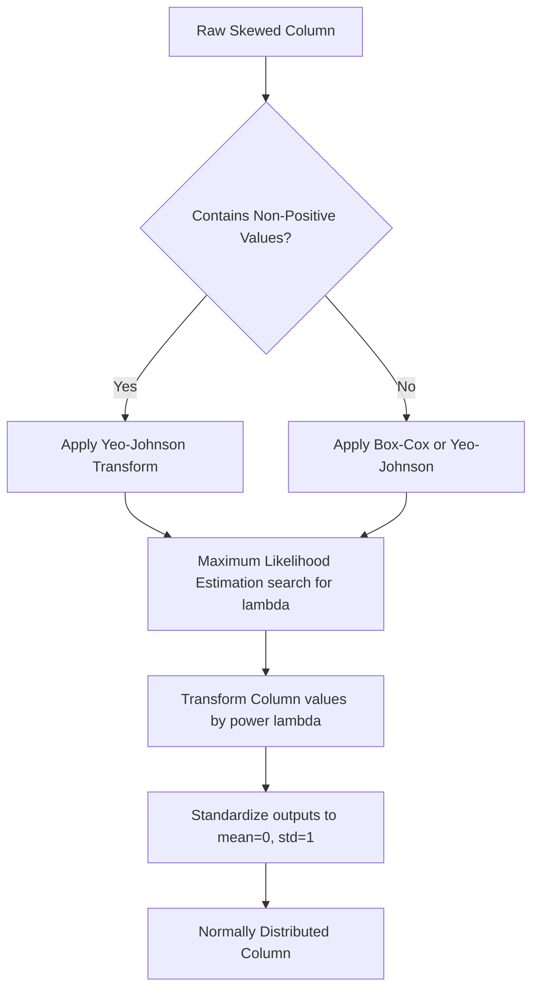

# Power Transformer: Box-Cox & Yeo-Johnson Transformations

[](https://colab.research.google.com/github/RiazML/machine-learning-notes/blob/main/notebooks/031_power_transformer.ipynb)

In machine learning, features often exhibit skewness or non-constant variance (heteroscedasticity). Many parametric algorithms (like Linear Regression, Logistic Regression, and linear SVMs) assume that numerical features are normally distributed and variance is homogeneous. When these assumptions are violated, models can suffer from sub-optimal coefficients and poor convergence.

**Power transformations** are a class of parametric monotonic transformations that stabilize variance and map data from skewed distributions to a normal (Gaussian) distribution.

---

## 1. Why Use Power Transformations?

- **Variance Stabilization**: They minimize heteroscedasticity (where the variance of errors differs across values of an independent variable).
- **Normality Assumption**: Linear models perform best when the target variable and error terms are normally distributed.
- **Compared to Function Transformations**: While standard mathematical transformations (like $\log(x)$ or $\sqrt{x}$) have fixed formulas, power transformations dynamically search for a parameter $\lambda$ that maximizes normality.

---

## 2. Mathematical Formulations

Power transformations estimate an optimal exponent parameter $\lambda$ using Maximum Likelihood Estimation (MLE). There are two primary variations:

### A. Box-Cox Transformation

Developed by George Box and David Cox (1964), this transformation is defined as:

$$
y^{(\lambda)} = \begin{cases}
\frac{x^\lambda - 1}{\lambda} & \text{if } \lambda \neq 0 \\
\log(x) & \text{if } \lambda = 0
\end{cases}
$$

> [!WARNING]
> The Box-Cox transformation requires the feature values to be strictly positive ($x > 0$). If the data contains zero or negative values, Box-Cox will raise a mathematical error.

### B. Yeo-Johnson Transformation

Developed by In-Kyeara Yeo and Richard Johnson (2000), this transformation modifies Box-Cox to support zero and negative values:

$$
y^{(\lambda)} = \begin{cases}
\frac{(x + 1)^\lambda - 1}{\lambda} & \text{if } \lambda \neq 0, x \geq 0 \\
\log(x + 1) & \text{if } \lambda = 0, x \geq 0 \\
-\frac{(-x + 1)^{2 - \lambda} - 1}{2 - \lambda} & \text{if } \lambda \neq 2, x < 0 \\
-\log(-x + 1) & \text{if } \lambda = 2, x < 0
\end{cases}
$$

---

## 3. PowerTransformer Workflow



---

## 4. Implementation Code

Below is a complete, runnable script generating a skewed, non-positive dataset (inspired by the concrete strength and aging dataset parameters), running transformations, and benchmarking a `LinearRegression` model.

```python
import numpy as np
import pandas as pd
from sklearn.model_selection import train_test_split, cross_val_score
from sklearn.preprocessing import PowerTransformer
from sklearn.linear_model import LinearRegression

# 1. Create a Mock Skewed Dataset with Non-Positive Values
np.random.seed(42)
n_samples = 250

# Log-normally distributed column (positive, right-skewed)
cement_factor = np.random.lognormal(mean=3.0, sigma=0.8, size=n_samples)

# Skewed column containing zero values
super_plasticizer = np.random.exponential(scale=10.0, size=n_samples)
# Inject zero values representing absence of plasticizer
zero_indices = np.random.choice(n_samples, size=50, replace=False)
super_plasticizer[zero_indices] = 0.0

# Target strength variable with some noise
strength = 2.5 * cement_factor + 1.2 * super_plasticizer + np.random.normal(0, 5, n_samples)

df = pd.DataFrame({
    'CementFactor': cement_factor,
    'SuperPlasticizer': super_plasticizer
})

X_train, X_test, y_train, y_test = train_test_split(df, strength, test_size=0.2, random_state=42)

print("Original Feature Skewness:")
print("CementFactor Skew:", X_train['CementFactor'].skew())
print("SuperPlasticizer Skew:", X_train['SuperPlasticizer'].skew())

# 2. Benchmark Model Before Transformation
model_raw = LinearRegression()
cv_raw = cross_val_score(model_raw, X_train, y_train, cv=5, scoring='r2')
print(f"\nLinear Regression CV R2 (Before Transformation): {cv_raw.mean():.4f}")

# 3. Apply Yeo-Johnson Transformation (Needed because SuperPlasticizer contains 0)
pt_yj = PowerTransformer(method='yeo-johnson', standardize=True)
X_train_yj = pt_yj.fit_transform(X_train)
X_test_yj = pt_yj.transform(X_test)

# Convert to DataFrame to check skewness
df_yj = pd.DataFrame(X_train_yj, columns=X_train.columns)
print(f"\nOptimal Lambdas Found (Yeo-Johnson): {pt_yj.lambdas_}")
print("CementFactor Skew (YJ):", df_yj['CementFactor'].skew())
print("SuperPlasticizer Skew (YJ):", df_yj['SuperPlasticizer'].skew())

# 4. Benchmark Model After Yeo-Johnson
model_yj = LinearRegression()
cv_yj = cross_val_score(model_yj, X_train_yj, y_train, cv=5, scoring='r2')
print(f"Linear Regression CV R2 (After Yeo-Johnson): {cv_yj.mean():.4f}")

# 5. Apply Box-Cox (Demonstrating requirement of positive values by shifting data)
# Shift features up by 1.0 to avoid 0 values for Box-Cox demonstration
X_train_shifted = X_train.copy()
X_train_shifted['SuperPlasticizer'] += 1.0
X_test_shifted = X_test.copy()
X_test_shifted['SuperPlasticizer'] += 1.0

pt_bc = PowerTransformer(method='box-cox', standardize=True)
X_train_bc = pt_bc.fit_transform(X_train_shifted)
df_bc = pd.DataFrame(X_train_bc, columns=X_train.columns)

print(f"\nOptimal Lambdas Found (Box-Cox, Shifted): {pt_bc.lambdas_}")
print("CementFactor Skew (Box-Cox):", df_bc['CementFactor'].skew())
print("SuperPlasticizer Skew (Box-Cox):", df_bc['SuperPlasticizer'].skew())
```

---

## 5. Key Highlights & Comparison

1. **Automatic Scaling**: The `standardize=True` parameter in [PowerTransformer](file:///Users/prime/Developer/ml/031_power_transformer.md#powertransformer) automatically centers and scales the transformed features to unit variance. This eliminates the need to chain a `StandardScaler` after transformation.
2. **Box-Cox vs. Yeo-Johnson Decision**:

    | Property | Box-Cox | Yeo-Johnson |
    | :--- | :--- | :--- |
    | **Input Domain** | Strictly Positive ($x > 0$) | All Real Numbers (includes Zero & Negatives) |
    | **Optimization Method** | MLE parameter search | MLE parameter search |
    | **Standard Default** | Needs data shifting if zeros present | Recommended first choice due to flexibility |

3. **Optimal Exponent ($\lambda$) Interpretation**:
    - $\lambda = 1.0$: No transformation (linear shift).
    - $\lambda = 0.5$: Square Root transformation.
    - $\lambda = 0.0$: Logarithmic transformation.
    - $\lambda = -1.0$: Reciprocal transformation.
