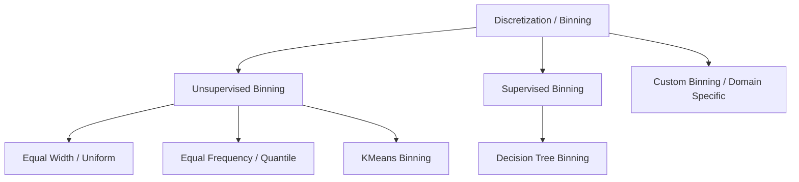

# Discretization: Binning & Binarization

[](https://colab.research.google.com/github/RiazML/machine-learning-notes/blob/main/notebooks/032_binning_and_binarization.ipynb)

In feature engineering, we often encounter numerical columns that contain complex, non-linear relationships or extreme outliers. Sometimes, converting these continuous numerical features into discrete categories makes the relationships easier for machine learning models to learn.

**Discretization** (also known as **binning**) is the process of partitioning continuous features into discrete intervals (bins). **Binarization** is a special case of discretization where features are thresholded into binary values (0 or 1).

---

## 1. Why Discretize Numerical Features?

- **Handling Outliers**: Outliers are grouped into the boundary bins (e.g., the last bin), preventing them from disproportionately pulling model weights.
- **Modeling Non-Linear Relationships**: In linear models, discretization allows the model to treat different ranges of a feature with independent weights (like separate step functions).
- **Improving Model Interpretability**: Grouping features (e.g., transforming `Age` into age bands: `Under 18`, `18-35`, `36-60`, `Over 60`) makes models easier for domain experts to evaluate.

---

## 2. Types of Binning (Discretization)

We classify binning strategies into **Unsupervised** and **Supervised** approaches:



### A. Equal Width Binning (Uniform)

Divides the range of the feature into $k$ intervals of equal size. The width of each bin is calculated as:

$$\text{Width} = \frac{\text{Max} - \text{Min}}{k}$$

The boundaries of the bins are:

$$\text{Boundary}_i = \text{Min} + i \times \text{Width} \quad \text{for } i \in \{0, 1, \dots, k\}$$

- **Best for**: Normally distributed data where we want to preserve range structure.
- **Limitation**: If the data is highly skewed or contains outliers, most samples will end up in a few bins, leaving others empty.

### B. Equal Frequency Binning (Quantile)

Divides the sorted values of the feature so that each of the $k$ intervals contains approximately the same number of samples (equal count). The boundaries are determined by the percentiles/quantiles of the empirical distribution:

$$\text{Boundary}_j = Q\left(\frac{j}{k}\right) \quad \text{for } j \in \{0, 1, \dots, k\}$$

- **Best for**: Skewed distributions. It spreads the samples uniformly across bins.
- **Limitation**: It disrupts the relative physical distance between feature values.

### C. KMeans Binning

Applies a 1D KMeans clustering algorithm to the feature values. The boundaries of the bins are set mid-way between the cluster centers (centroids) found by KMeans.

- **Best for**: Data that naturally groups into clusters or modes.

### D. Decision Tree Binning (Supervised)

Uses a decision tree of limited depth (e.g., `max_depth=2` or `3`) to predict the target variable using only the single feature. The threshold values (split points) chosen by the decision tree are used as the bin boundaries.

- **Best for**: Ensuring that the bin boundaries are optimized directly to maximize predictive association with the target label.

### E. Binarization

Binarization converts continuous features to binary indicator values using a hard threshold $\tau$:

$$
f(x) = \begin{cases}
0 & \text{if } x \leq \tau \\
1 & \text{if } x > \tau
\end{cases}
$$

- **Best for**: Creating indicator variables (e.g., converting continuous `PurchaseAmount` into `HasPurchased` where threshold $\tau = 0$).

---

## 3. Implementation Code

Below is the complete, runnable Python code demonstrating how to use Scikit-Learn's [KBinsDiscretizer](file:///Users/prime/Developer/ml/032_binning_and_binarization.md#kbinsdiscretizer) and [Binarizer](file:///Users/prime/Developer/ml/032_binning_and_binarization.md#binarizer) classes.

```python
import numpy as np
import pandas as pd
from sklearn.model_selection import train_test_split
from sklearn.preprocessing import KBinsDiscretizer, Binarizer
from sklearn.tree import DecisionTreeClassifier

# 1. Create a Mock Dataset (Age and Fare)
np.random.seed(42)
n_samples = 300

# Continuous uniform-like distribution
age = np.random.uniform(low=5, high=80, size=n_samples)
# Highly skewed lognormal distribution representing Fare
fare = np.random.lognormal(mean=3.5, sigma=1.0, size=n_samples)
# Target binary variable
y = np.where((age < 18) | (fare > 80), 1, 0)

df = pd.DataFrame({'Age': age, 'Fare': fare})
X_train, X_test, y_train, y_test = train_test_split(df, y, test_size=0.2, random_state=42)

print("Original Data Sample:")
print(X_train.head())

# 2. Equal Width Binning (Uniform)
# strategy='uniform' splits the feature range into equal intervals
kbd_uniform = KBinsDiscretizer(n_bins=4, encode='ordinal', strategy='uniform')
X_train_uniform = kbd_uniform.fit_transform(X_train[['Age']])
print("\nUniform (Equal Width) Bin Edges for Age:")
print(kbd_uniform.bin_edges_[0])

# 3. Equal Frequency Binning (Quantile)
# strategy='quantile' uses quantiles so bins have equal counts
kbd_quantile = KBinsDiscretizer(n_bins=4, encode='ordinal', strategy='quantile')
X_train_quantile = kbd_quantile.fit_transform(X_train[['Age']])
print("\nQuantile (Equal Frequency) Bin Edges for Age:")
print(kbd_quantile.bin_edges_[0])

# 4. KMeans Binning
# strategy='kmeans' partitions values into 1D clusters
kbd_kmeans = KBinsDiscretizer(n_bins=4, encode='ordinal', strategy='kmeans')
X_train_kmeans = kbd_kmeans.fit_transform(X_train[['Age']])
print("\nKMeans Bin Edges for Age:")
print(kbd_kmeans.bin_edges_[0])

# 5. Supervised Decision Tree Binning
# Train a shallow decision tree to find splitting thresholds
dt = DecisionTreeClassifier(max_depth=2, random_state=42)
dt.fit(X_train[['Age']], y_train)
# Tree thresholds will serve as bin edges
tree_thresholds = dt.tree_.threshold[dt.tree_.threshold != -2] # Exclude leaf node indicators
print("\nDecision Tree Bin Split Thresholds for Age:")
print(sorted(tree_thresholds))

# 6. Binarization (Thresholding)
# Convert Fare to binary: 1 if Fare > 50.0, else 0
binarizer = Binarizer(threshold=50.0)
X_train_fare_binarized = binarizer.fit_transform(X_train[['Fare']])
print("\nOriginal Fare vs Binarized Fare (First 5 Rows):")
for orig, bin_val in zip(X_train['Fare'].head(), X_train_fare_binarized[:5]):
    print(f"Original: {orig:6.2f} -> Binarized (Threshold 50): {bin_val[0]}")
```

---

## 4. Key Highlights & Settings

1. **Encode Argument (`encode`)**:
    - `encode='ordinal'`: Returns a single column containing the bin index integers (e.g. `0, 1, 2, 3`). This is the most common format.
    - `encode='onehot'`: Returns a sparse matrix representing the bin categories as one-hot encoded binary columns.
    - `encode='onehot-dense'`: Same as `onehot` but returns a dense numpy array.
2. **Choosing the Right Strategy**:
    - If you want to keep the relative distance and distribution structure of the numerical values, choose `strategy='uniform'`.
    - If you want to handle skewed features and guarantee that all bins have the same representation size, choose `strategy='quantile'`.
    - If the data naturally groups together in cluster pockets, choose `strategy='kmeans'`.
3. **Warning - Feature Loss**: Discretization discards variance information within each bin. Once you discretize a feature, the model cannot distinguish between a value near the lower boundary of a bin and a value near the upper boundary. Ensure this loss of precision is acceptable.
