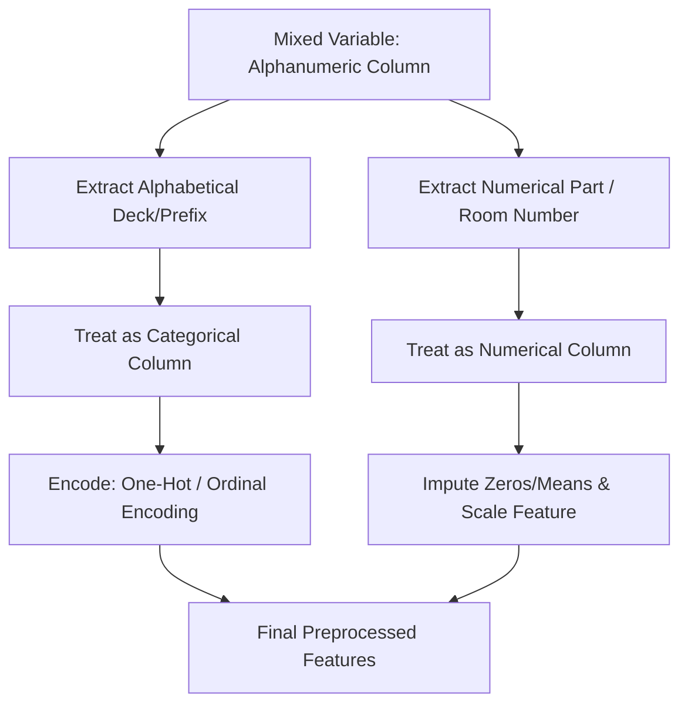

# Handling Mixed Variables

[](https://colab.research.google.com/github/RiazML/machine-learning-notes/blob/main/notebooks/033_handling_mixed_variables.ipynb)

In real-world datasets, features often contain a mixture of numeric and categorical values in the same column. These are known as **mixed variables**. Feeding raw mixed variables directly into machine learning models will cause errors, as algorithms cannot interpret alphanumeric values as continuous or categorical categories natively.

---

## 1. Common Examples of Mixed Variables

1. **Titanic Cabin Numbers**: Values like `C23`, `B96`, or `E36` contain a letter indicating the deck (categorical) and a number indicating the room (numerical).
2. **Titanic Ticket Numbers**: Values like `A/5 21171`, `PC 17599`, or simple digits `113803`.
3. **UK Postal Codes**: Values like `W10 2BX` or `SW1A 1AA` contain geographical codes and local delivery numbers.

---

## 2. Strategies for Handling Mixed Variables

To build models from mixed variables, we extract their separate elements using regular expressions:



### A. Extracting the Categorical (Character) Part

We isolate the letters or alphabetical prefixes which usually signify a class, sector, or category. In Python, this is done using:

- `df['column'].str.extract(r'([a-zA-Z]+)')`

### B. Extracting the Numerical (Digit) Part

We isolate the integers or digits which represent quantity, rank, or room numbers. In Python, this is done using:

- `df['column'].str.extract(r'(\d+)')`

---

## 3. Implementation Code

Below is the complete, runnable Python code demonstrating how to extract categorical prefixes and numeric components from mock Titanic-style `Cabin` and `Ticket` columns.

```python
import numpy as np
import pandas as pd
from sklearn.model_selection import train_test_split
from sklearn.compose import ColumnTransformer
from sklearn.impute import SimpleImputer
from sklearn.preprocessing import OneHotEncoder, StandardScaler
from sklearn.pipeline import Pipeline
from sklearn.ensemble import RandomForestClassifier

# 1. Generate Mock Mixed Variable Dataset
np.random.seed(42)
n_samples = 200

# Generating mixed Cabin numbers: deck letter + room number (some NaN values)
cabins = [
    np.random.choice(['A', 'B', 'C', 'D', 'E', np.nan]) +
    str(np.random.randint(10, 150)) if isinstance(np.random.choice(['A', 'B', 'C', 'D', 'E', np.nan]), str)
    else np.nan
    for _ in range(n_samples)
]

# Generating mixed Tickets: string prefix + ticket number or just ticket number
tickets = [
    np.random.choice(['A/5 ', 'PC ', 'STON/O ', '']) + str(np.random.randint(1000, 99999))
    for _ in range(n_samples)
]

y = np.random.choice([0, 1], size=n_samples)

df = pd.DataFrame({
    'Cabin': cabins,
    'Ticket': tickets
})

print("Original Data Sample with Mixed Variables:")
print(df.head(10))

# 2. Extract Features from Mixed Columns (Cabin & Ticket)
# Cabin: Extract deck letter (Categorical) and room number (Numerical)
df['Cabin_Deck'] = df['Cabin'].str.extract(r'([a-zA-Z]+)')[0]
df['Cabin_Num'] = pd.to_numeric(df['Cabin'].str.extract(r'(\d+)')[0])

# Ticket: Extract ticket prefix (Categorical) and ticket digits (Numerical)
df['Ticket_Prefix'] = df['Ticket'].str.extract(r'([a-zA-Z]+)')[0]
# Fill empty strings extracted as prefix with 'NUM' to represent digit-only tickets
df['Ticket_Prefix'] = df['Ticket_Prefix'].fillna('NUM')
df['Ticket_Num'] = pd.to_numeric(df['Ticket'].str.extract(r'(\d+)')[0])

# Drop original mixed columns
df_clean = df.drop(columns=['Cabin', 'Ticket'])

print("\nTransformed Dataset Sample:")
print(df_clean.head(10))

# 3. Create Pipeline for Model Training
X_train, X_test, y_train, y_test = train_test_split(df_clean, y, test_size=0.2, random_state=42)

# Define sub-pipelines for categorical and numerical features
num_cols = ['Cabin_Num', 'Ticket_Num']
cat_cols = ['Cabin_Deck', 'Ticket_Prefix']

num_pipeline = Pipeline([
    ('imputer', SimpleImputer(strategy='median')),
    ('scaler', StandardScaler())
])

cat_pipeline = Pipeline([
    ('imputer', SimpleImputer(strategy='constant', fill_value='Missing')),
    ('ohe', OneHotEncoder(handle_unknown='ignore', sparse_output=False))
])

preprocessor = ColumnTransformer(
    transformers=[
        ('num', num_pipeline, num_cols),
        ('cat', cat_pipeline, cat_cols)
    ]
)

clf = Pipeline([
    ('preprocessor', preprocessor),
    ('model', RandomForestClassifier(random_state=42))
])

# Fit and score the pipeline
clf.fit(X_train, y_train)
score = clf.score(X_test, y_test)
print(f"\nRandom Forest Classifier Accuracy on Transformed Features: {score * 100:.2f}%")
```

---

## 4. Key Highlights & Edge Cases

1. **Handling Missing Values**: Standard string extractions return `NaN` if the original mixed feature was missing or did not match the regular expression. A downstream `SimpleImputer` must be included in the preprocessing pipeline (as demonstrated above).
2. **Digit-Only Rows in String Extractions**: When extracting alphabetical prefixes (like in `Ticket`), values that contain only numbers (e.g. `113803`) will return `NaN`. Replacing these null values with a custom label (like `'NUM'`) tells the model that these entries did not have a character prefix.
3. **RegEx Precision**: Be careful with the choice of expression:
    - `\d+` matches one or more consecutive digits.
    - `[a-zA-Z]+` matches one or more consecutive alphabetic letters.
    - If a row has multiple numbers (e.g., `A/5 21171`), `str.extract` by default returns the first match unless specified otherwise.
