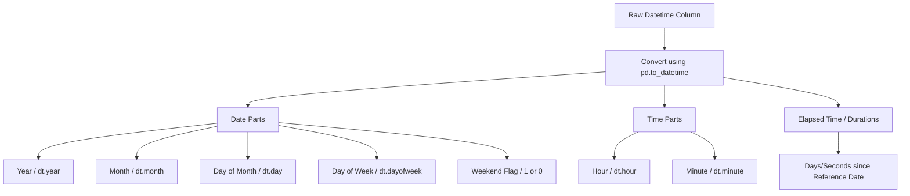

# Handling Date & Time Variables

[](https://colab.research.google.com/github/RiazML/machine-learning-notes/blob/main/notebooks/034_handling_date_and_time_variables.ipynb)

Raw date and time columns are typically stored as strings (object dtype) or timestamps. If fed directly into machine learning models, they are treated as high-cardinality categorical features or text fields, which is useless for learning patterns.

To extract value from temporal columns, we perform **feature extraction** to break down date and time values into distinct numerical features representing cycles, intervals, and offsets.

---

## 1. Why Engineer Datetime Variables?

- **Periodicity & Seasonality**: Extracting attributes like months, hours, or quarters helps models capture cyclic behavior (e.g., higher retail sales in December, higher electricity usage during summer, or high website traffic at 8:00 PM).
- **Logical Offsets**: Creating binary flags like `is_weekend` or `is_holiday` explains sudden behavioral changes in target variables.
- **Time Differences (Elapsed Time)**: Measuring the duration between two events (e.g., days since user registration, delivery time of a parcel) transforms static dates into predictive numerical intervals.

---

## 2. Feature Extraction Roadmap



---

## 3. Implementation Code

Below is the complete, runnable Python code demonstrating how to convert raw date/time string features, extract all main temporal attributes, compute elapsed durations, and feed them into a machine learning classifier.

```python
import numpy as np
import pandas as pd
from sklearn.model_selection import train_test_split
from sklearn.ensemble import RandomForestClassifier

# 1. Generate Mock Transaction Dataset with Datetime Strings
np.random.seed(42)
n_samples = 250

start_date = pd.to_datetime('2025-01-01 00:00:00')
end_date = pd.to_datetime('2025-12-31 23:59:59')

# Generate random timestamps between start and end date
random_timestamps = pd.to_datetime(
    np.random.randint(start_date.value, end_date.value, n_samples)
)

# Convert to string format to represent standard raw file import
df = pd.DataFrame({
    'TransactionDate': random_timestamps.strftime('%Y-%m-%d %H:%M:%S'),
    'Amount': np.random.uniform(10.0, 1500.0, size=n_samples)
})

# Binary target (e.g., fraud detected)
df['IsFraud'] = np.where((df['Amount'] > 1000) & (random_timestamps.hour > 22), 1, 0)

print("Raw Dataset Preview:")
print(df.head())

# 2. Parse Column to Datetime Type
df['TransactionDate'] = pd.to_datetime(df['TransactionDate'])

# 3. Extract Core Date Features
df['Year'] = df['TransactionDate'].dt.year
df['Month'] = df['TransactionDate'].dt.month
df['MonthName'] = df['TransactionDate'].dt.month_name()
df['Day'] = df['TransactionDate'].dt.day
df['DayOfWeek'] = df['TransactionDate'].dt.dayofweek  # Monday = 0, Sunday = 6
df['DayOfWeekName'] = df['TransactionDate'].dt.day_name()

# Create binary Weekend Flag
df['IsWeekend'] = np.where(df['DayOfWeek'].isin([5, 6]), 1, 0)

# 4. Extract Core Time Features
df['Hour'] = df['TransactionDate'].dt.hour
df['Minute'] = df['TransactionDate'].dt.minute

# 5. Extract Elapsed Time (Duration)
# Compute number of days elapsed since the beginning of the year
reference_date = pd.to_datetime('2025-01-01 00:00:00')
df['DaysElapsed'] = (df['TransactionDate'] - reference_date).dt.days

print("\nEngineered Datetime Dataset Preview:")
print(df.drop(columns=['TransactionDate']).head())

# 6. Benchmark Model Training
# Select only numerical features for training (exclude raw names/strings)
feature_cols = ['Amount', 'Year', 'Month', 'Day', 'DayOfWeek', 'IsWeekend', 'Hour', 'Minute', 'DaysElapsed']
X = df[feature_cols]
y = df['IsFraud']

X_train, X_test, y_train, y_test = train_test_split(X, y, test_size=0.2, random_state=42)

clf = RandomForestClassifier(random_state=42)
clf.fit(X_train, y_train)
accuracy = clf.score(X_test, y_test)
print(f"\nModel Accuracy after Feature Engineering: {accuracy * 100:.2f}%")
```

---

## 4. Key Highlights & Settings

1. **Parsing Formats**: If `pd.to_datetime` runs slowly on large datasets, explicitly pass the date format to skip automatic detection:
    - `pd.to_datetime(df['date'], format='%Y-%m-%d %H:%M:%S')`
2. **Circular Encoding for Cyclic Features**: Features like `Hour` (ranges 0-23) or `Month` (ranges 1-12) have a cyclic nature. In a raw linear numerical scale, hour 23 and hour 0 are far apart, whereas in reality they are consecutive. To preserve this closeness, transform them using sine and cosine transformations:
    - $x_{sin} = \sin\left(\frac{2 \pi \times x}{\max(x)}\right)$
    - $x_{cos} = \cos\left(\frac{2 \pi \times x}{\max(x)}\right)$
3. **Time Zones**: If your dataset includes records from multiple locations, standardize timestamps to Coordinated Universal Time (UTC) using `.dt.tz_convert('UTC')` before extracting hour or day of week features.
