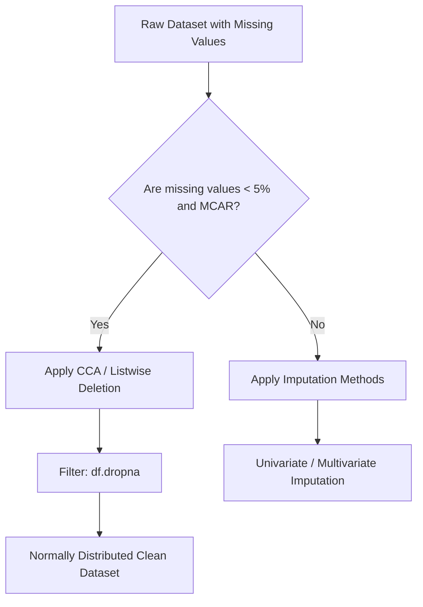

# Handling Missing Data Part 1: Complete Case Analysis (CCA)

[](https://colab.research.google.com/github/RiazML/machine-learning-notes/blob/main/notebooks/035_handling_missing_data.ipynb)

Missing data is one of the most common issues in real-world machine learning. Broadly, missingness is classified into three statistical mechanisms, which dictate how we can handle the missing values.

---

## 1. Mechanisms of Missing Data

| Mechanism                               | Description                                                                                                                             | Example                                                                                                           |
| :-------------------------------------- | :-------------------------------------------------------------------------------------------------------------------------------------- | :---------------------------------------------------------------------------------------------------------------- |
| **MCAR** (Missing Completely at Random) | The probability of data being missing is entirely independent of any observed or unobserved values in the dataset.                      | A questionnaire page was accidentally blown away by the wind.                                                     |
| **MAR** (Missing at Random)             | The probability of missingness depends systematically on other observed features in the dataset, but not the missing values themselves. | Men are less likely to disclose their weight, but weight missingness is predictable based on the `Gender` column. |
| **MNAR** (Missing Not at Random)        | The probability of data being missing depends on the unobserved value itself.                                                           | Patients with high blood pressure are less likely to report their blood pressure values due to anxiety.           |

---

## 2. What is Complete Case Analysis (CCA)?

**Complete Case Analysis (CCA)**, also known as **Listwise Deletion**, is the practice of discarding any rows (or observations) that contain missing values in any of the features of interest.



### When to Use CCA

- When data is **MCAR**.
- When the percentage of missing values is extremely small (typically **less than 5%** of the total observations).

### Advantages

- **Simplicity**: No complex modeling or interpolation is required.
- **Preserves Distribution**: If the missingness is truly MCAR, dropping missing observations does not shift the mean, variance, or covariance of the features.

### Disadvantages

- **Data Loss**: If multiple columns contain 2% missing values at random positions, dropping rows can cause a cumulative loss of 15% to 30% of the dataset.
- **Bias**: If the data is MAR or MNAR, deleting rows will introduce significant selection bias, rendering predictions inaccurate.

---

## 3. Implementation Code

Below is the complete, runnable Python code demonstrating how to apply Complete Case Analysis, and how to verify if dropping rows caused a distribution shift in the features.

```python
import numpy as np
import pandas as pd
from sklearn.model_selection import train_test_split
from sklearn.linear_model import LogisticRegression

# 1. Create a Mock Dataset with MCAR Missing Values
np.random.seed(42)
n_samples = 500

# Continuous feature (normally distributed)
study_hours = np.random.normal(loc=10, scale=3, size=n_samples)
# Continuous feature (normally distributed)
sleep_hours = np.random.normal(loc=7, scale=1, size=n_samples)

# Target binary variable (pass exam)
y = np.where(study_hours + 0.5 * sleep_hours > 12, 1, 0)

# Create DataFrame
df = pd.DataFrame({
    'StudyHours': study_hours,
    'SleepHours': sleep_hours,
    'Pass': y
})

# Introduce MCAR missingness (3% in StudyHours, 2% in SleepHours)
study_missing_idx = np.random.choice(n_samples, size=15, replace=False)
sleep_missing_idx = np.random.choice(n_samples, size=10, replace=False)

df.loc[study_missing_idx, 'StudyHours'] = np.nan
df.loc[sleep_missing_idx, 'SleepHours'] = np.nan

print("Original Dataset Shape:", df.shape)
print("Missing values per column:")
print(df.isnull().sum())

# 2. Check if dropping rows shifts feature distributions (Crucial Step)
# Calculate observed means before dropping
mean_study_pre = df['StudyHours'].mean()
mean_sleep_pre = df['SleepHours'].mean()

# Apply Complete Case Analysis (CCA)
df_clean = df.dropna()

print("\nDataset Shape after CCA:", df_clean.shape)

mean_study_post = df_clean['StudyHours'].mean()
mean_sleep_post = df_clean['SleepHours'].mean()

print("\n--- Distribution Metrics Comparison ---")
print(f"Study Hours Mean - Before CCA: {mean_study_pre:.4f} | After CCA: {mean_study_post:.4f} (Shift: {abs(mean_study_pre-mean_study_post):.4f})")
print(f"Sleep Hours Mean - Before CCA: {mean_sleep_pre:.4f} | After CCA: {mean_sleep_post:.4f} (Shift: {abs(mean_sleep_pre-mean_sleep_post):.4f})")

# 3. Model Benchmark on Complete Case Data
X = df_clean.drop(columns=['Pass'])
y_clean = df_clean['Pass']

X_train, X_test, y_train, y_test = train_test_split(X, y_clean, test_size=0.2, random_state=42)

clf = LogisticRegression()
clf.fit(X_train, y_train)
score = clf.score(X_test, y_test)
print(f"\nLogistic Regression Accuracy on CCA-processed Data: {score * 100:.2f}%")
```

---

## 4. Key Takeaways

1. **Checking the Distribution Shift**: After performing listwise deletion, always verify that the ratio of variance, mean, and histograms of the remaining data matches the original observed data. If the means shift significantly, the missingness was not MCAR, and you should use imputation.
2. **Cumulative Loss Warning**: Complete Case Analysis becomes highly problematic in production settings. If a user submits a registration form and misses a single optional field, CCA will discard the entire event rather than using defaults.
