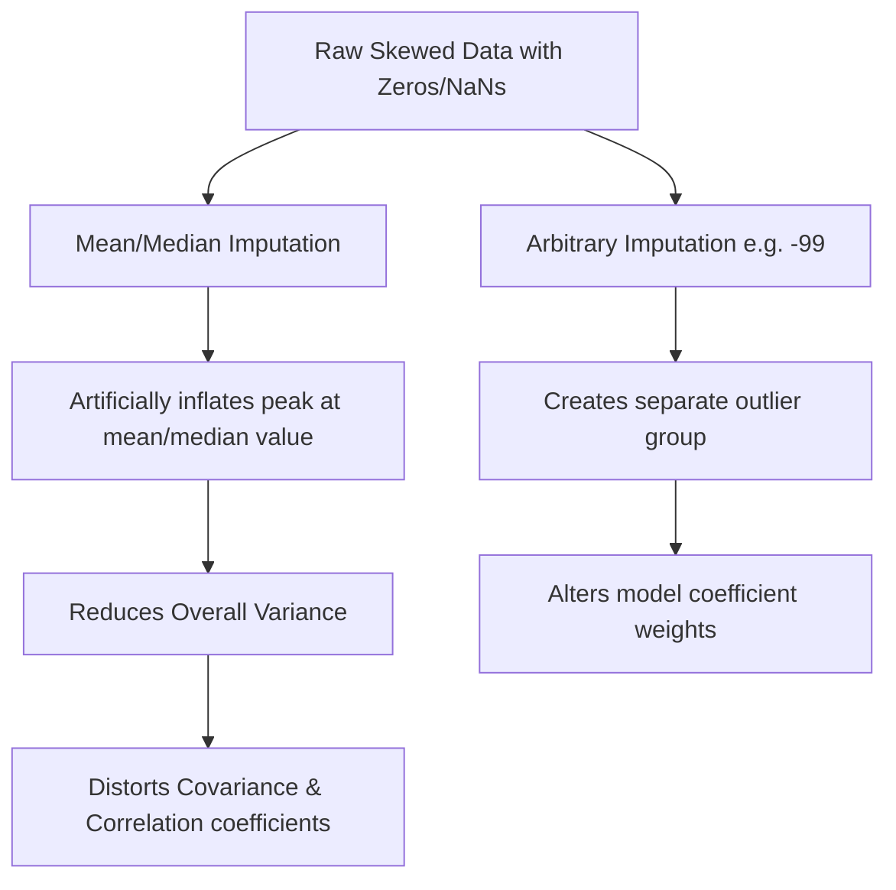

# Handling Missing Data Part 2: Numerical Mean/Median/Arbitrary Imputation

[](https://colab.research.google.com/github/RiazML/machine-learning-notes/blob/main/notebooks/036_handling_missing_data.ipynb)

When Complete Case Analysis is not viable due to extensive data loss, we must fill the missing entries using **imputation**. The simplest class of techniques is **univariate numerical imputation**, where we calculate a replacement value using statistics from the same column.

---

## 1. Core Imputation Methods

| Imputation Strategy      | Mathematical Choice                                             | Best Used For                                                           |
| :----------------------- | :-------------------------------------------------------------- | :---------------------------------------------------------------------- |
| **Mean Imputation**      | Replace $NaN$ with the column mean $\mu = \frac{1}{N} \sum x_i$ | Normally distributed features with small skewness.                      |
| **Median Imputation**    | Replace $NaN$ with the middle value $M = \text{Median}(X)$      | Highly skewed features (since the median is robust to outliers).        |
| **Arbitrary Imputation** | Replace $NaN$ with a constant value $c$ (e.g., $-1, 999$)       | When you want to explicitly capture the fact that the value is missing. |

---

## 2. Statistical Distortion of Univariate Imputation

Using a single value to fill all missing entries introduces structural distortions:



### Variance Shrinkage

If we fill a large percentage of values with the exact same mean or median, the overall spread of values decreases, shrinking the variance:

$$\text{Variance}_{\text{imputed}} < \text{Variance}_{\text{original}}$$

---

## 3. Implementation Code

Below is the complete, runnable Python code demonstrating how to use Scikit-Learn's [SimpleImputer](file:///Users/prime/Developer/ml/036_handling_missing_data.md#simpleimputer) for mean, median, and arbitrary constant values, and printing the resulting variance changes.

```python
import numpy as np
import pandas as pd
from sklearn.model_selection import train_test_split
from sklearn.impute import SimpleImputer
from sklearn.linear_model import LogisticRegression

# 1. Create a Highly Skewed Dataset with Missing Values (Lognormal Distribution)
np.random.seed(42)
n_samples = 400

# High right-skew feature
income = np.random.lognormal(mean=4.0, sigma=1.0, size=n_samples)
# Normal feature
credit_score = np.random.normal(loc=650, scale=80, size=n_samples)
# Target (approved for premium card)
y = np.where((income > 75) & (credit_score > 600), 1, 0)

df = pd.DataFrame({
    'Income': income,
    'CreditScore': credit_score
})

# Artificially inject 15% missing values in the Income column
missing_indices = np.random.choice(n_samples, size=60, replace=False)
df.loc[missing_indices, 'Income'] = np.nan

X_train, X_test, y_train, y_test = train_test_split(df, y, test_size=0.2, random_state=42)

print("Original Training Variance (with NaN ignored):", X_train['Income'].var())
print("Original Training Skew (with NaN ignored):", X_train['Income'].skew())

# 2. Mean Imputer
imputer_mean = SimpleImputer(strategy='mean')
X_train_mean = X_train.copy()
X_train_mean['Income'] = imputer_mean.fit_transform(X_train[['Income']])
print(f"\nVariance after Mean Imputation: {X_train_mean['Income'].var():.4f} (Skew: {X_train_mean['Income'].skew():.4f})")

# 3. Median Imputer
imputer_median = SimpleImputer(strategy='median')
X_train_median = X_train.copy()
X_train_median['Income'] = imputer_median.fit_transform(X_train[['Income']])
print(f"Variance after Median Imputation: {X_train_median['Income'].var():.4f} (Skew: {X_train_median['Income'].skew():.4f})")

# 4. Arbitrary Constant Imputer
# Inscribing an arbitrary constant value outside normal ranges, e.g., -99.0
imputer_constant = SimpleImputer(strategy='constant', fill_value=-99.0)
X_train_const = X_train.copy()
X_train_const['Income'] = imputer_constant.fit_transform(X_train[['Income']])
print(f"Variance after Constant (-99) Imputation: {X_train_const['Income'].var():.4f} (Skew: {X_train_const['Income'].skew():.4f})")

# 5. Evaluate Performance of Models Built on Imputed Sets
# Helper function to fit and evaluate
def evaluate_imputation(X_tr, X_te, strategy_name):
    # Apply same imputation on test set
    if strategy_name == 'mean':
        X_te_imputed = X_te.copy()
        X_te_imputed['Income'] = imputer_mean.transform(X_te[['Income']])
    elif strategy_name == 'median':
        X_te_imputed = X_te.copy()
        X_te_imputed['Income'] = imputer_median.transform(X_te[['Income']])
    else:
        X_te_imputed = X_te.copy()
        X_te_imputed['Income'] = imputer_constant.transform(X_te[['Income']])

    clf = LogisticRegression()
    clf.fit(X_tr, y_train)
    acc = clf.score(X_te_imputed, y_test)
    print(f"Model accuracy using {strategy_name} imputation: {acc * 100:.2f}%")

print("\n--- Model Benchmark Scores ---")
evaluate_imputation(X_train_mean, X_test, 'mean')
evaluate_imputation(X_train_median, X_test, 'median')
evaluate_imputation(X_train_const, X_test, 'constant')
```

---

## 4. Key Highlights & Decision Guidelines

1. **Skewed vs. Normal Distributions**: For skewed numerical columns, choose **Median Imputation** over Mean Imputation. The mean is strongly influenced by extreme values and tail ranges, making it an unrepresentative center.
2. **Imputation Boundary rule**: Always compute the mean or median using the **training set only** (`fit_transform` on training) and apply those calculated values to the test set (`transform` on test). Do not calculate means on the full dataset, otherwise you introduce **data leakage** from the target/test sets.
3. **Arbitrary Values in Linear Models**: Constant/arbitrary imputation (like `-99` or `-999`) works well for tree-based classifiers (Decision Trees, Random Forests) because the tree can easily isolate `-99` into its own split branch. However, linear models will try to fit a slope through the arbitrary values, leading to skewed predictions.
