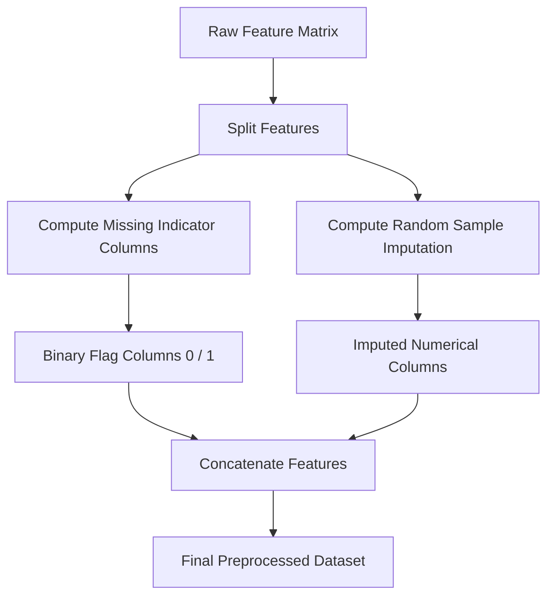

# Missing Indicator & Random Sample Imputation

[](https://colab.research.google.com/github/RiazML/machine-learning-notes/blob/main/notebooks/038_missing_indicator.ipynb)

When data is not missing completely at random (MNAR), the fact that a value is missing is itself a powerful predictive signal. Conversely, simple statistical imputation (like mean or median) shrinks the variance of features. To address these issues, we use **Missing Indicators** to capture the pattern of missingness and **Random Sample Imputation** to preserve the feature's original probability distribution.

---

## 1. Concepts and Mathematical Foundations

### A. Missing Indicator (Binary Flag)

A Missing Indicator creates a new binary column indicating whether a value was missing in the original column. If a feature $X$ has missing values, the indicator feature $I$ is defined as:

$$
I_i = \begin{cases}
1 & \text{if } x_i \text{ is missing} (NaN) \\
0 & \text{if } x_i \text{ is observed}
\end{cases}
$$

This ensures that the model can learn different behaviors or coefficients for missing observations, which is crucial when the missingness is non-random (MNAR).

### B. Random Sample Imputation

Random Sample Imputation replaces missing values in a column by randomly selecting observed values from the same column. If $X_{obs}$ is the set of non-missing values in $X$, then for each missing value $x_{mis}$:

$$x_{mis} \sim \text{UniformRandom}(X_{obs})$$

#### Why use Random Sample Imputation?

Unlike mean or median imputation, which artificially inflates the frequency of a single value and shrinks variance ($\sigma^2_{imputed} < \sigma^2_{orig}$), Random Sample Imputation preserves the shape, variance, and covariance structure of the distribution.

| Metric                           | Mean/Median Imputation                 | Random Sample Imputation                          |
| :------------------------------- | :------------------------------------- | :------------------------------------------------ |
| **Variance Preservation**        | Shrunk (high peak at center)           | Preserved (distribution remains identical)        |
| **Outlier Influence**            | Diluted                                | Preserved                                         |
| **Model Type Compatibility**     | Good for trees, poor for linear models | Good for linear models and distance-based metrics |
| **Randomness / Seed Dependency** | Deterministic                          | Stochastic (requires setting `random_state`)      |

---

## 2. Imputation Pipeline Workflow



---

## 3. Implementation Code

Below is a complete, runnable Python script. It implements a custom, scikit-learn-compatible `RandomSampleImputer` and applies it in a pipeline alongside `MissingIndicator` and a downstream classifier.

```python
import numpy as np
import pandas as pd
from sklearn.base import BaseEstimator, TransformerMixin
from sklearn.model_selection import train_test_split
from sklearn.impute import MissingIndicator
from sklearn.pipeline import FeatureUnion, Pipeline
from sklearn.ensemble import RandomForestClassifier
from sklearn.compose import ColumnTransformer

# 1. Custom Scikit-Learn-Compatible Random Sample Imputer
class RandomSampleImputer(BaseEstimator, TransformerMixin):
    def __init__(self, random_state=None):
        self.random_state = random_state
        self.rng = np.random.default_rng(self.random_state)
        self.train_samples_ = {}

    def fit(self, X, y=None):
        # Store observed non-null values for each column
        X_df = pd.DataFrame(X)
        for col in X_df.columns:
            non_null_vals = X_df[col].dropna().values
            # If the column is completely null, default to 0
            if len(non_null_vals) == 0:
                non_null_vals = np.array([0.0])
            self.train_samples_[col] = non_null_vals
        return self

    def transform(self, X):
        X_df = pd.DataFrame(X).copy()
        for col in X_df.columns:
            null_mask = X_df[col].isnull()
            n_missing = null_mask.sum()
            if n_missing > 0:
                # Randomly sample from training non-null values
                sampled_values = self.rng.choice(
                    self.train_samples_[col],
                    size=n_missing,
                    replace=True
                )
                X_df.loc[null_mask, col] = sampled_values
        return X_df.values

# 2. Generate a Mock Dataset with MNAR Missingness
np.random.seed(42)
n_samples = 500

# Age feature (normally distributed)
age = np.random.normal(loc=35, scale=10, size=n_samples)
# Target variable: high correlation with missingness
# Imagine older people are less likely to report their age
y = (age > 40).astype(int)

# Introduce MNAR missingness in Age (older people have a 70% missing probability)
missing_probs = np.where(age > 40, 0.70, 0.10)
missing_mask = np.random.random(n_samples) < missing_probs
age_with_nan = age.copy()
age_with_nan[missing_mask] = np.nan

df = pd.DataFrame({
    'Age': age_with_nan
})

X_train, X_test, y_train, y_test = train_test_split(df, y, test_size=0.2, random_state=42)

print("Training set original variance:", X_train['Age'].var())
print("Missing values in Age column (Train):", X_train['Age'].isnull().sum())

# 3. Create Feature Preprocessor Pipeline
# We want to extract both the missing indicator and the imputed value
preprocessor = ColumnTransformer(
    transformers=[
        ('age_features', FeatureUnion(
            transformer_list=[
                ('imputed', RandomSampleImputer(random_state=42)),
                ('indicator', MissingIndicator(features='all'))
            ]
        ), ['Age'])
    ]
)

pipeline = Pipeline([
    ('preprocessor', preprocessor),
    ('model', RandomForestClassifier(random_state=42))
])

# Fit and evaluate
pipeline.fit(X_train, y_train)
accuracy = pipeline.score(X_test, y_test)

# Verify Variance Conservation
imputer_only = RandomSampleImputer(random_state=42)
imputed_age = imputer_only.fit_transform(X_train[['Age']])
print("Imputed Age variance:", np.var(imputed_age))
print(f"Model Classification Accuracy: {accuracy * 100:.2f}%")
```

---

## 4. Best Practices & Caveats

1. **Setting the Random State**: Because Random Sample Imputation is stochastic, you must pin the random seed/state during the training phase. If `random_state` is not set, model evaluations or deployments will produce slightly different predictions on identical datasets.
2. **Memory Footprint**: The custom imputer must save the non-null training set array `train_samples_` inside the fitted object. For massive datasets, this increases serialization size (e.g., using `pickle`), which can be a consideration during production model deployment.
3. **Production Pipelines**: Always combine Random Sample Imputation with a [MissingIndicator](file:///Users/prime/Developer/ml/038_missing_indicator.md#missingindicator) to explicitly label rows that were imputed, allowing linear and tree models to adjust their internal boundaries accordingly.
