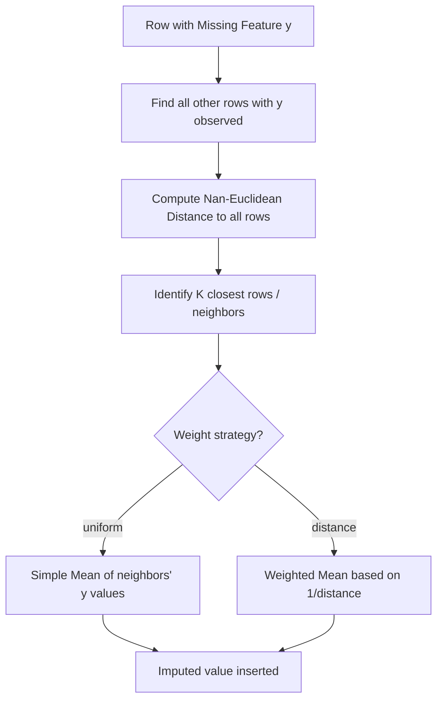

# K-Nearest Neighbors Imputer (KNNImputer)

[](https://colab.research.google.com/github/RiazML/machine-learning-notes/blob/main/notebooks/039_knn_imputer.ipynb)

Statistical univariate imputation methods (like mean, median, or mode) fail to leverage relationships _between_ features. **KNNImputer** is a multivariate imputation strategy that estimates missing values by finding similar observations in the multidimensional feature space and averaging their values.

---

## 1. How KNNImputer Works

For an observation with missing values:

1. It calculates the distance between this observation and all other observations using the **Nan-Euclidean Distance** metric.
2. It selects the $K$ closest observations (neighbors).
3. It replaces the missing value with the average (mean or weighted mean) of the corresponding feature values of the $K$ neighbors.



---

## 2. Nan-Euclidean Distance Formula

When calculating the Euclidean distance between two vectors $x$ and $y$ in a dataset with missing values, standard Euclidean distance cannot be computed directly. Instead, we compute the **Nan-Euclidean distance**:

$$d(x, y) = \sqrt{\frac{M}{|S|} \sum_{i \in S} (x_i - y_i)^2}$$

Where:

- $M$ is the **Total number of features** in the dataset.
- $S$ is the **Set of feature indices** where both $x_i$ and $y_i$ are present (observed/non-null).
- $|S|$ is the number of features present in both vectors.
- If no features are present in both ($|S| = 0$), the distance between the two rows is set to $\infty$.

### Numerical Example

Suppose we have two samples (3 features):

- $x = [1.5, \text{NaN}, 3.0]$
- $y = [2.0, 5.0, 1.0]$

The total number of features $M = 3$. The overlapping observed features are $S = \{0, 2\}$, so $|S| = 2$.
The distance is:

$$d(x, y) = \sqrt{\frac{3}{2} \cdot \left((1.5 - 2.0)^2 + (3.0 - 1.0)^2\right)} = \sqrt{1.5 \cdot (0.25 + 4.0)} = \sqrt{6.375} \approx 2.52$$

---

## 3. Implementation Code

Below is a complete, runnable Python script that generates a synthetic dataset with missing values, applies `KNNImputer`, and tunes the neighbor parameter $K$ using cross-validation.

```python
import numpy as np
import pandas as pd
from sklearn.model_selection import GridSearchCV, train_test_split
from sklearn.impute import KNNImputer
from sklearn.pipeline import Pipeline
from sklearn.preprocessing import StandardScaler
from sklearn.ensemble import RandomForestRegressor

# 1. Generate Synthetic Dataset (correlated features)
np.random.seed(42)
n_samples = 400

# Feature 1: Base normal variable
f1 = np.random.normal(loc=10.0, scale=3.0, size=n_samples)
# Feature 2: Highly correlated with Feature 1
f2 = 2.0 * f1 + np.random.normal(loc=0.0, scale=1.0, size=n_samples)
# Feature 3: Weakly correlated
f3 = -0.5 * f1 + np.random.normal(loc=5.0, scale=2.0, size=n_samples)

# Target variable dependent on all features
y = 1.5 * f1 + 2.0 * f2 - 1.0 * f3 + np.random.normal(0, 2, n_samples)

df = pd.DataFrame({'F1': f1, 'F2': f2, 'F3': f3})

# Inject missing values (MCAR) in F1 and F2
nan_mask_f1 = np.random.choice(n_samples, size=40, replace=False)
nan_mask_f2 = np.random.choice(n_samples, size=30, replace=False)
df.loc[nan_mask_f1, 'F1'] = np.nan
df.loc[nan_mask_f2, 'F2'] = np.nan

X_train, X_test, y_train, y_test = train_test_split(df, y, test_size=0.2, random_state=42)

print("Training Missing Counts:")
print(X_train.isnull().sum())

# 2. Build Pipeline with KNNImputer
# Note: Always standard-scale before KNN to prevent features with larger scales from dominating the distance calculation
pipeline = Pipeline([
    ('scaler', StandardScaler()),
    ('imputer', KNNImputer()),
    ('model', RandomForestRegressor(n_estimators=100, random_state=42))
])

# 3. Hyperparameter Tuning of 'K' (n_neighbors) and weighting strategy
param_grid = {
    'imputer__n_neighbors': [2, 3, 5, 7, 10],
    'imputer__weights': ['uniform', 'distance']
}

grid_search = GridSearchCV(
    estimator=pipeline,
    param_grid=param_grid,
    cv=5,
    scoring='neg_mean_squared_error',
    n_jobs=-1
)

grid_search.fit(X_train, y_train)

print(f"\nBest Parameters Found: {grid_search.best_params_}")
best_rmse = np.sqrt(-grid_search.best_score_)
print(f"Best CV RMSE: {best_rmse:.4f}")

# Evaluate on test set
test_r2 = grid_search.score(X_test, y_test)
print(f"Test Set MSE score: {-test_r2:.4f}")
```

---

## 4. Key Highlights & Parameters

1. **Distance vs. Uniform Weights**:
    - `weights='uniform'`: All $K$ neighbors contribute equally to the average.
    - `weights='distance'`: Closer neighbors contribute more to the average ($w_i = 1 / d(x, y_i)$). This is robust to high values of $K$.
2. **Preprocessing is Mandatory**: You must scale your data (e.g., using `StandardScaler`) before using [KNNImputer](file:///Users/prime/Developer/ml/039_knn_imputer.md#knnimputer). Otherwise, features with larger units (like Salary) will swamp features with smaller scales (like Age) during distance computation.
3. **Computational Complexity**: Finding nearest neighbors requires computing distances across the entire dataset. In production, this can be extremely slow for large datasets ($O(N \cdot M)$ complexity, where $N$ is sample size and $M$ is features). Consider other methods (like MICE or Random Sample Imputation) for large-scale databases.
