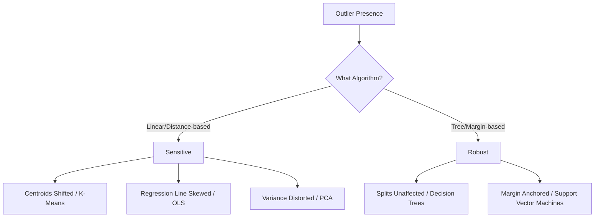

# What are Outliers?

[](https://colab.research.google.com/github/RiazML/machine-learning-notes/blob/main/notebooks/041_what_are_outliers.ipynb)

In statistics and machine learning, an **outlier** is an observation that deviates significantly from the other observations in the same dataset. Outliers can distort statistical analyses, violate assumptions of parametric models, and lead to poor predictive performance if not handled properly.

---

## 1. Classification of Outliers

Outliers can be classified into three primary categories based on the context of the dataset:

| Category                  | Description                                                                         | Example                                                     |
| :------------------------ | :---------------------------------------------------------------------------------- | :---------------------------------------------------------- |
| **Univariate Outliers**   | An extreme value in a single feature space.                                         | A person's height recorded as $240 \text{ cm}$.             |
| **Multivariate Outliers** | A combination of standard values across multiple features that is highly anomalous. | A person with Age = $5$ years old and Salary = $\$100,000$. |
| **Contextual Outliers**   | An observation that is anomalous under specific conditions.                         | A temperature reading of $35^\circ\text{C}$ in winter.      |

---

## 2. Impact on Machine Learning Models

ML algorithms respond to outliers differently based on their loss functions and mathematical assumptions:

### A. Highly Sensitive Models

- **Linear Regression**: Minimizes Mean Squared Error (MSE). Because errors are squared, large residuals from outliers dominate the cost function, shifting the regression line.
- **K-Means Clustering**: Outliers pull centroid positions toward themselves, distorting cluster boundaries.
- **PCA**: Outliers skew the covariance matrix, resulting in principal components aligned with the outlier direction rather than true data variance.

### B. Robust Models

- **Tree-based Models**: Decision Trees split data using thresholds (e.g., $x_j > \theta$). An outlier's extreme value does not affect the split threshold choice if the majority of samples lie elsewhere.
- **SVM**: Support Vector Machines (especially soft-margin) rely only on support vectors near the margin; outliers far from the decision boundary have zero impact.



---

## 3. Mathematical Influence (OLS vs. Huber Loss)

Ordinary Least Squares (OLS) minimizes the squared residuals:

$$J(w) = \sum_{i=1}^n (y_i - w^T x_i)^2$$

If a single outlier has a residual $e_i = 100$, its contribution to the cost function is $10,000$. This forces the gradient descent optimizer to adjust weights $w$ to reduce this single error, even at the cost of increasing errors for normal points.

To mitigate this, robust estimators use **Huber Loss**, which behaves quadratically for small errors and linearly for large errors:

$$
L_\delta(e_i) = \begin{cases}
\frac{1}{2} e_i^2 & \text{for } |e_i| \leq \delta \\
\delta \left(|e_i| - \frac{1}{2}\delta\right) & \text{for } |e_i| > \delta
\end{cases}
$$

Here, $\delta$ is the threshold parameter separating normal residuals from outliers.

---

## 4. Implementation Code

The following runnable Python script demonstrates how a single synthetic outlier skews an OLS `LinearRegression` model, and how a robust `HuberRegressor` resists this skew.

```python
import numpy as np
import pandas as pd
from sklearn.linear_model import LinearRegression, HuberRegressor

# 1. Generate Linear Data with a Single Extreme Outlier
np.random.seed(42)
n_samples = 80

X = np.linspace(0, 10, n_samples).reshape(-1, 1)
y = 2.5 * X.squeeze() + np.random.normal(loc=0, scale=1.5, size=n_samples)

# Save clean targets for comparison
y_clean = y.copy()

# Inject 1 massive outlier at X = 2
y[15] = 85.0

print("Original clean target range:", np.min(y_clean), "to", np.max(y_clean))
print("Outlier target value:", y[15])

# 2. Fit Standard OLS Linear Regression
ols = LinearRegression()
ols.fit(X, y)
ols_coef = ols.coef_[0]
ols_intercept = ols.intercept_

# 3. Fit Robust Huber Regression
huber = HuberRegressor(epsilon=1.35)  # Epsilon regulates delta threshold
huber.fit(X, y)
huber_coef = huber.coef_[0]
huber_intercept = huber.intercept_

# 4. Fit OLS on Clean Data (Ground Truth)
ols_clean = LinearRegression()
ols_clean.fit(X, y_clean)
clean_coef = ols_clean.coef_[0]

print("\nModel Coefficients comparison:")
print(f"Ground Truth Coefficient (Clean Data): {clean_coef:.4f}")
print(f"OLS Coefficient (With Outlier):         {ols_coef:.4f}")
print(f"Huber Coefficient (With Outlier):       {huber_coef:.4f}")

print("\nExplanation:")
print("Notice how the single outlier pulled the OLS coefficient away from the ground truth.")
print("The Huber Regressor remains highly accurate, matching the clean data profile closely.")
```

---

## 5. Summary: Outlier Handling Framework

When outliers are detected, we generally choose one of three handling strategies:

1. **Trimming**: Drop the outlier observations completely. Only done if the outlier is guaranteed to be a measurement error or invalid sample.
2. **Capping / Winsorization**: Cap the extreme values at statistical boundaries (e.g., 99th percentile or $3\sigma$).
3. **Algorithmic Selection**: Transition to models that are inherently robust to outliers (e.g., Random Forest or Huber Regressors).
