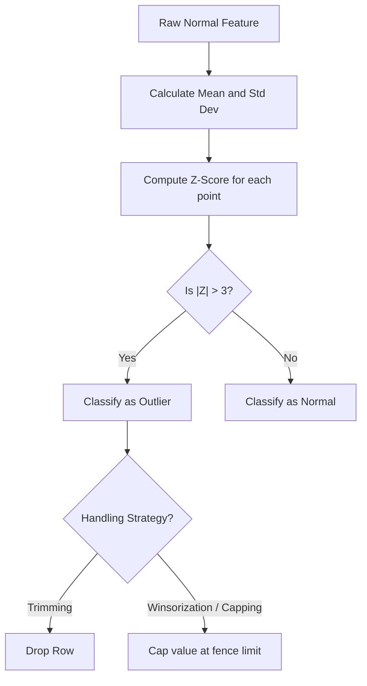

# Outlier Detection & Removal Using Z-Score

[](https://colab.research.google.com/github/RiazML/machine-learning-notes/blob/main/notebooks/042_outlier_detection_and_removal_using_z-score.ipynb)

The **Z-Score method** (also known as the Standard Score method) is a parametric outlier detection technique suitable for normally (Gaussian) distributed numerical variables. It measures how many standard deviations a given data point lies away from the mean.

---

## 1. Mathematical Formulation

For a feature $X$ with mean $\mu$ and standard deviation $\sigma$, the Z-score for observation $x_i$ is defined as:

$$Z_i = \frac{x_i - \mu}{\sigma}$$

According to the **Empirical Rule (68-95-99.7 Rule)** for normal distributions:

- $\approx 68.27\%$ of the data lies within $1\sigma$ of the mean ($|Z| \leq 1$).
- $\approx 95.45\%$ of the data lies within $2\sigma$ of the mean ($|Z| \leq 2$).
- $\approx 99.73\%$ of the data lies within $3\sigma$ of the mean ($|Z| \leq 3$).

Therefore, any observation with an absolute Z-score greater than $3$ is mathematically classified as an outlier:

$$\text{Outlier Condition: } |Z_i| > 3$$

Which translates to the following statistical fences:

$$\text{Lower Limit} = \mu - 3\sigma$$
$$\text{Upper Limit} = \mu + 3\sigma$$



---

## 2. Trimming vs. Winsorization (Capping)

Once outliers are identified, we can handle them using one of two primary strategies:

| Strategy                    | Logic                                                                                                             | Pros                                              | Cons                                                                              |
| :-------------------------- | :---------------------------------------------------------------------------------------------------------------- | :------------------------------------------------ | :-------------------------------------------------------------------------------- |
| **Trimming**                | Delete the entire row containing the outlier.                                                                     | Completely removes the anomalous signal.          | Can result in significant data loss if multiple features contain outliers.        |
| **Winsorization (Capping)** | Replace values above $\mu + 3\sigma$ with the upper fence, and values below $\mu - 3\sigma$ with the lower fence. | Retains all observations, preserving sample size. | Distorts the variance and creates artificial artificial spikes at the boundaries. |

---

## 3. Implementation Code

Below is a complete, runnable Python script implementing a custom, scikit-learn-compatible `ZScoreOutlierHandler` that supports both `trim` and `cap` strategies.

```python
import numpy as np
import pandas as pd
from sklearn.base import BaseEstimator, TransformerMixin

# 1. Custom Z-Score Outlier Handler
class ZScoreOutlierHandler(BaseEstimator, TransformerMixin):
    def __init__(self, threshold=3.0, strategy='cap'):
        self.threshold = threshold
        self.strategy = strategy
        self.means_ = {}
        self.stds_ = {}
        self.lower_limits_ = {}
        self.upper_limits_ = {}

    def fit(self, X, y=None):
        X_df = pd.DataFrame(X)
        for col in X_df.columns:
            mean = X_df[col].mean()
            std = X_df[col].std()
            # Handle zero std dev to prevent divide-by-zero errors
            if std == 0:
                std = 1e-8

            self.means_[col] = mean
            self.stds_[col] = std
            self.lower_limits_[col] = mean - (self.threshold * std)
            self.upper_limits_[col] = mean + (self.threshold * std)
        return self

    def transform(self, X):
        X_df = pd.DataFrame(X).copy()
        if self.strategy == 'cap':
            for col in X_df.columns:
                lower = self.lower_limits_[col]
                upper = self.upper_limits_[col]
                X_df[col] = np.clip(X_df[col], lower, upper)
            return X_df.values

        elif self.strategy == 'trim':
            # Identify row masks containing outliers in any column
            keep_mask = pd.Series(True, index=X_df.index)
            for col in X_df.columns:
                lower = self.lower_limits_[col]
                upper = self.upper_limits_[col]
                col_mask = (X_df[col] >= lower) & (X_df[col] <= upper)
                keep_mask = keep_mask & col_mask
            return X_df.loc[keep_mask].values

# 2. Generate normally distributed feature with extreme outliers
np.random.seed(42)
n_samples = 400
normal_data = np.random.normal(loc=50.0, scale=10.0, size=n_samples)

# Inject artificial outliers (values far beyond 3 standard deviations)
outlier_indices = [12, 85, 230, 310]
normal_data[outlier_indices] = [95.0, 1.0, 110.0, -15.0]

df = pd.DataFrame({'Score': normal_data})

print("Original Stats:")
print(df['Score'].describe())
print(f"Skewness before handling: {df['Score'].skew():.4f}")

# 3. Apply Winsorization (Capping)
capper = ZScoreOutlierHandler(threshold=3.0, strategy='cap')
capped_data = capper.fit_transform(df)
df_capped = pd.DataFrame(capped_data, columns=df.columns)

print("\nStats After Capping:")
print(df_capped['Score'].describe())
print(f"Skewness after capping: {df_capped['Score'].skew():.4f}")
print("Capped upper limit set at:", capper.upper_limits_['Score'])
print("Capped lower limit set at:", capper.lower_limits_['Score'])

# 4. Apply Trimming
trimmer = ZScoreOutlierHandler(threshold=3.0, strategy='trim')
trimmed_data = trimmer.fit_transform(df)
print(f"\nOriginal shape: {df.shape}")
print(f"Shape after Z-score trimming: {trimmed_data.shape}")
```

---

## 4. Operational Guidelines

1. **Strict Normality Requirement**: Do not use the Z-score method on heavily skewed or multimodal variables. If a variable is skewed (e.g., Household Income), the mean and standard deviation themselves will be skewed by the outliers, shifting the fences outwards and rendering the detection metric ineffective. Use the IQR or Percentile methods instead.
2. **Multivariate Risk**: The Z-score method evaluates columns independently (univariate). A row containing multiple borderline points ($Z \approx 2.5$ in three columns) will not be flagged by univariate Z-score, even though the combination is highly improbable.
