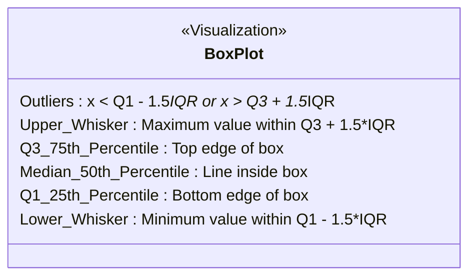

# Outlier Detection & Removal Using the Interquartile Range (IQR) Method

[](https://colab.research.google.com/github/RiazML/machine-learning-notes/blob/main/notebooks/043_outlier_detection_and_removal_using_the.ipynb)

For skewed or non-normally distributed numerical features, standard parametric methods like the Z-score perform poorly because the mean and standard deviation are themselves highly sensitive to outliers. The **Interquartile Range (IQR) method** (often called Tukey's Fences) is a non-parametric outlier detection technique that relies on robust, rank-based statistics.

---

## 1. Mathematical Formulation

Quartiles divide a sorted dataset into four equal parts. The core statistics used are:

- **First Quartile ($Q_1$)**: The 25th percentile (median of the lower half of the data).
- **Third Quartile ($Q_3$)**: The 75th percentile (median of the upper half of the data).
- **Interquartile Range (IQR)**: The distance between the 75th and 25th percentiles, which represents the spread of the middle 50% of the observations:

$$\text{IQR} = Q_3 - Q_1$$

Outliers are identified using Tukey's Fences, defined as:

$$\text{Lower Limit} = Q_1 - 1.5 \times \text{IQR}$$
$$\text{Upper Limit} = Q_3 + 1.5 \times \text{IQR}$$

Any observation $x_i$ that falls outside these fences is classified as an outlier:

$$\text{Outlier Condition: } x_i < \text{Lower Limit} \quad \text{or} \quad x_i > \text{Upper Limit}$$

> [!NOTE]
> For detecting **extreme outliers**, statistical analyses sometimes use a multiplier of $3.0$ instead of $1.5$:
>
> $$\text{Lower Limit}_{\text{extreme}} = Q_1 - 3.0 \times \text{IQR}$$
> $$\text{Upper Limit}_{\text{extreme}} = Q_3 + 3.0 \times \text{IQR}$$

---

## 2. Visual Representation (Box-and-Whisker Plot)

The IQR method forms the direct mathematical engine behind the standard box plot:



---

## 3. Implementation Code

Below is a complete, runnable Python script implementing a custom, scikit-learn-compatible `IQROutlierHandler` that calculates boundaries on training data and applies trimming or capping to any target matrix.

```python
import numpy as np
import pandas as pd
from sklearn.base import BaseEstimator, TransformerMixin

# 1. Custom IQR Outlier Handler Class
class IQROutlierHandler(BaseEstimator, TransformerMixin):
    def __init__(self, multiplier=1.5, strategy='cap'):
        self.multiplier = multiplier
        self.strategy = strategy
        self.lower_limits_ = {}
        self.upper_limits_ = {}

    def fit(self, X, y=None):
        X_df = pd.DataFrame(X)
        for col in X_df.columns:
            q1 = X_df[col].quantile(0.25)
            q3 = X_df[col].quantile(0.75)
            iqr = q3 - q1

            self.lower_limits_[col] = q1 - (self.multiplier * iqr)
            self.upper_limits_[col] = q3 + (self.multiplier * iqr)
        return self

    def transform(self, X):
        X_df = pd.DataFrame(X).copy()
        if self.strategy == 'cap':
            for col in X_df.columns:
                lower = self.lower_limits_[col]
                upper = self.upper_limits_[col]
                X_df[col] = np.clip(X_df[col], lower, upper)
            return X_df.values

        elif self.strategy == 'trim':
            keep_mask = pd.Series(True, index=X_df.index)
            for col in X_df.columns:
                lower = self.lower_limits_[col]
                upper = self.upper_limits_[col]
                col_mask = (X_df[col] >= lower) & (X_df[col] <= upper)
                keep_mask = keep_mask & col_mask
            return X_df.loc[keep_mask].values

# 2. Generate a Skewed Feature (Log-normal distribution) with Outliers
np.random.seed(42)
n_samples = 500

# Right-skewed distribution simulating income or pricing features
skewed_data = np.random.lognormal(mean=4.0, sigma=0.6, size=n_samples)
df = pd.DataFrame({'Price': skewed_data})

print("Original Skewed Feature Distribution:")
print(df['Price'].describe())
print(f"Original Skewness: {df['Price'].skew():.4f}")

# 3. Apply IQR Capping (Winsorization)
iqr_handler = IQROutlierHandler(multiplier=1.5, strategy='cap')
capped_data = iqr_handler.fit_transform(df)
df_capped = pd.DataFrame(capped_data, columns=df.columns)

print("\nPost-IQR Capping Distribution:")
print(df_capped['Price'].describe())
print(f"Post-Capping Skewness: {df_capped['Price'].skew():.4f}")
print("Price lower limit fence:", iqr_handler.lower_limits_['Price'])
print("Price upper limit fence:", iqr_handler.upper_limits_['Price'])

# 4. Apply IQR Trimming
trimmer = IQROutlierHandler(multiplier=1.5, strategy='trim')
trimmed_data = trimmer.fit_transform(df)
print(f"\nOriginal dimensions: {df.shape}")
print(f"Dimensions after IQR trimming: {trimmed_data.shape}")
```

---

## 4. Key Takeaways

1. **Robustness to Skew**: Since $Q_1$ and $Q_3$ represent sorting order indices, extreme outliers do not pull the boundary values. This makes Tukey's fences significantly more robust than Z-score limits for skewed features.
2. **Symmetric Fences on Skewed Data**: Although IQR limits are robust, they remain mathematically symmetric around the quartiles ($1.5 \times \text{IQR}$ is applied equally to both the lower and upper bounds). For heavily skewed data, the lower limit might fall below 0 (as seen in the Price pricing example above), which can be physically impossible for certain columns. In such cases, standardizing or transforming the column (e.g. log scaling) before outlier handling is advised.
3. **Strict Boundary Fitment**: When building preprocessing pipelines for machine learning, always learn the $Q_1$ and $Q_3$ markers solely from the **training set** during `.fit()` and apply them to the test set during `.transform()`. This prevents data leakage.
