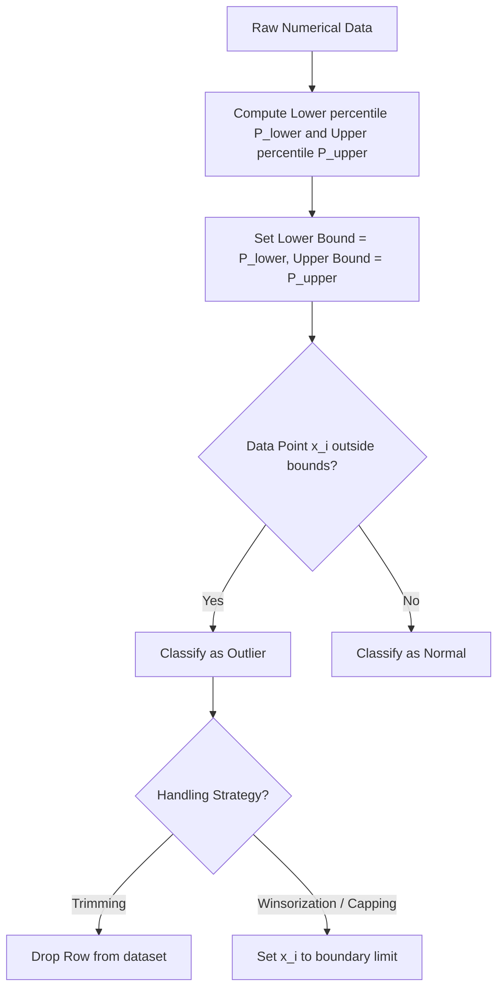

# Outlier Detection Using the Percentile Method

[](https://colab.research.google.com/github/RiazML/machine-learning-notes/blob/main/notebooks/044_outlier_detection_using_the_percentile_method.ipynb)

The **Percentile Method** (also referred to as quantile-based trimming or winsorization) is a non-parametric outlier detection technique. Unlike the Z-score (which assumes normality) or the IQR method (which defines boundaries based on a $1.5\times$ spread), the Percentile method caps or drops a fixed, pre-specified percentage of extreme values at both ends of the feature distribution.

---

## 1. Concept and Mathematical Bounds

For a numerical feature $X$, we select a lower percentile threshold $q_{\text{lower}}$ (typically $1\%$ or $0.5\%$) and an upper percentile threshold $q_{\text{upper}}$ (typically $99\%$ or $99.5\%$).

The statistical bounds are defined as:

$$\text{Lower Bound} = P_{q_{\text{lower}}}$$
$$\text{Upper Bound} = P_{q_{\text{upper}}}$$

Where $P_k$ represents the $k$-th percentile of the feature $X$. Any observation $x_i$ is flagged as an outlier if:

$$\text{Outlier Condition: } x_i < P_{q_{\text{lower}}} \quad \text{or} \quad x_i > P_{q_{\text{upper}}}$$



---

## 2. Advantages and Disadvantages

### Advantages

- **Distribution Agnostic**: Works on skewed, uniform, bimodal, or normal distributions without making prior mathematical assumptions.
- **Predictable Data Retention**: When trimming at $1\%$ and $99\%$, you are guaranteed to retain exactly $98\%$ of the dataset, which is helpful for memory and data pipeline planning.

### Disadvantages

- **Arbitrary Truncation**: If the dataset contains zero true outliers, the Percentile method will still flag and alter the top $1\%$ and bottom $1\%$ of valid data points.
- **Sensitivity to Sample Size**: In very small datasets, percentiles can fluctuate significantly based on noise.

---

## 3. Implementation Code

Below is a complete, runnable Python script implementing a custom, scikit-learn-compatible `PercentileOutlierHandler` that handles both trimming and winsorization.

```python
import numpy as np
import pandas as pd
from sklearn.base import BaseEstimator, TransformerMixin

# 1. Custom Percentile Outlier Handler Class
class PercentileOutlierHandler(BaseEstimator, TransformerMixin):
    def __init__(self, lower_pct=1.0, upper_pct=99.0, strategy='cap'):
        self.lower_pct = lower_pct
        self.upper_pct = upper_pct
        self.strategy = strategy
        self.lower_bounds_ = {}
        self.upper_bounds_ = {}

    def fit(self, X, y=None):
        X_df = pd.DataFrame(X)
        for col in X_df.columns:
            # Convert percentage inputs to fractional quantiles
            self.lower_bounds_[col] = X_df[col].quantile(self.lower_pct / 100.0)
            self.upper_bounds_[col] = X_df[col].quantile(self.upper_pct / 100.0)
        return self

    def transform(self, X):
        X_df = pd.DataFrame(X).copy()
        if self.strategy == 'cap':
            for col in X_df.columns:
                lower = self.lower_bounds_[col]
                upper = self.upper_bounds_[col]
                X_df[col] = np.clip(X_df[col], lower, upper)
            return X_df.values

        elif self.strategy == 'trim':
            keep_mask = pd.Series(True, index=X_df.index)
            for col in X_df.columns:
                lower = self.lower_bounds_[col]
                upper = self.upper_bounds_[col]
                col_mask = (X_df[col] >= lower) & (X_df[col] <= upper)
                keep_mask = keep_mask & col_mask
            return X_df.loc[keep_mask].values

# 2. Generate a Feature with Random Spikes
np.random.seed(42)
n_samples = 300

# Exponential distribution simulating user session lengths with some extreme values
session_lengths = np.random.exponential(scale=15.0, size=n_samples)
# Add extreme manual spikes
session_lengths[[5, 45, 120, 280]] = [450.0, 500.0, 380.0, 410.0]

df = pd.DataFrame({'SessionLength': session_lengths})

print("Original Session Length Stats:")
print(df['SessionLength'].describe())

# 3. Apply Percentile Capping (Winsorization) at 1st and 99th percentiles
handler = PercentileOutlierHandler(lower_pct=1.0, upper_pct=99.0, strategy='cap')
capped_data = handler.fit_transform(df)
df_capped = pd.DataFrame(capped_data, columns=df.columns)

print("\nCapped Session Length Stats:")
print(df_capped['SessionLength'].describe())
print(f"Lower percentile boundary ({handler.lower_pct}%): {handler.lower_bounds_['SessionLength']:.4f}")
print(f"Upper percentile boundary ({handler.upper_pct}%): {handler.upper_bounds_['SessionLength']:.4f}")

# 4. Apply Percentile Trimming
trimmer = PercentileOutlierHandler(lower_pct=1.0, upper_pct=99.0, strategy='trim')
trimmed_data = trimmer.fit_transform(df)
print(f"\nOriginal dimensions: {df.shape}")
print(f"Dimensions after percentile trimming: {trimmed_data.shape}")
```

---

## 4. Key Takeaways

1. **Industrial Scaling**: The Percentile method is widely used in high-throughput data streams (such as logging user clicks or web server latency) to filter out occasional network timeouts or script errors before analysis.
2. **Avoid Leakage**: As with all preprocessing transformers, never compute percentile boundaries on the entire dataset. Fit the quantiles exclusively on the training split, and apply those static thresholds to both train and test splits to preserve model generalization limits.
