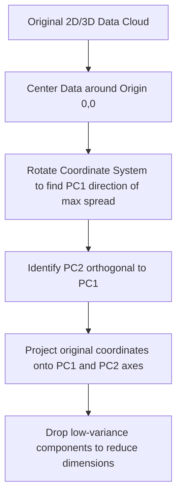

# Principal Component Analysis (PCA): Geometric Intuition

[](https://colab.research.google.com/github/RiazML/machine-learning-notes/blob/main/notebooks/047_principle_component_analysis_pca.ipynb)

Principal Component Analysis (PCA) is an unsupervised linear dimensionality reduction technique. Its objective is to transform a set of correlated high-dimensional features into a lower-dimensional space of uncorrelated variables called **Principal Components** while preserving as much variance as possible.

---

## 1. Geometric Concepts

Geometrically, PCA can be visualized as fitting an $n$-dimensional ellipsoid to the data, where the axes of the ellipsoid represent the principal components:

1. **Mean Centering**: The dataset is shifted so that its coordinate origin $(0, 0)$ lies exactly at the center of the data cloud.
2. **Variance Maximization**: PCA searches for the axis (direction vector) along which the projection of the data points has the maximum spread (variance). This is **PC1** (Principal Component 1).
3. **Orthogonality**: PCA then searches for the next axis of maximum variance under the strict constraint that it must be **orthogonal** (perpendicular) to all previous components. This is **PC2**.
4. **Projection**: Original data points are projected orthogonally onto these new axes.



---

## 2. Mathematical Definition of Projections

Let $X$ be the centered data matrix ($N \times D$). We want to find a unit projection vector $u$ ($\|u\|_2 = 1$) that projects each data point $x_i$ onto a 1D line:

$$z_i = x_i^T u$$

The variance of the projected data points is:

$$\text{Var}(z) = \frac{1}{N} \sum_{i=1}^N (x_i^T u)^2 = \frac{1}{N} u^T X^T X u = u^T \Sigma u$$

Where $\Sigma$ is the **Covariance Matrix** of the centered data. PCA solves:

$$\max_{u} u^T \Sigma u \quad \text{subject to } u^T u = 1$$

---

## 3. Implementation Code

Below is a complete, runnable Python script that generates a 2D correlated dataset, computes the principal component direction geometrically using singular value decomposition, and transforms the points into 1D coordinates along PC1.

```python
import numpy as np
import pandas as pd
from sklearn.decomposition import PCA

# 1. Create a 2D Correlated Dataset
np.random.seed(42)
n_samples = 150

# X1 is random normal
x1 = np.random.normal(loc=10.0, scale=3.0, size=n_samples)
# X2 is highly correlated with X1
x2 = 0.8 * x1 + np.random.normal(loc=2.0, scale=1.0, size=n_samples)

df = pd.DataFrame({'X1': x1, 'X2': x2})

# 2. Mean Centering
X_centered = df - df.mean()

print("Centering Verification:")
print("Centered Means:")
print(X_centered.mean())

# 3. Fit PCA to project from 2D down to 1D
pca = PCA(n_components=1)
X_pca = pca.fit_transform(X_centered)

# 4. Review geometric attributes of the projection
pc1_direction = pca.components_[0]
explained_variance_ratio = pca.explained_variance_ratio_[0]

print("\nPCA Geometric Attributes:")
print(f"PC1 Direction Vector (eigenvector): {pc1_direction}")
print(f"Explained Variance Ratio by PC1:      {explained_variance_ratio * 100:.2f}%")

# Create comparison DataFrame showing projection mapping
projection_df = pd.DataFrame({
    'Original_X1': X_centered['X1'].values[:5],
    'Original_X2': X_centered['X2'].values[:5],
    'Projected_PC1': X_pca[:5].squeeze()
})

print("\nOriginal Centered 2D coordinates vs. Projected 1D PC1 value:")
print(projection_df.to_string(index=False, formatters={
    'Original_X1': '{:.4f}'.format,
    'Original_X2': '{:.4f}'.format,
    'Projected_PC1': '{:.4f}'.format
}))
```

---

## 4. Key Highlights & Geometric Properties

1. **Zero Correlation**: By construction, the principal components are orthogonal to each other. This means the pearson correlation coefficient between $PC_1$ and $PC_2$ is exactly $0.0$.
2. **No Information Loss if all components kept**: If we have $D$ features and we extract $D$ principal components, we have simply rotated the data cloud. No information is discarded. Information loss only occurs when we select a subset of components $K < D$.
3. **Scale Sensitivity**: PCA is highly sensitive to the scale of features. If one feature is measured in thousands (e.g. Salary) and another in single digits (e.g. Age), the variance along the Salary dimension will be massive, forcing PC1 to align almost perfectly with it. **Always scale features** (mean=0, variance=1) before applying PCA.
