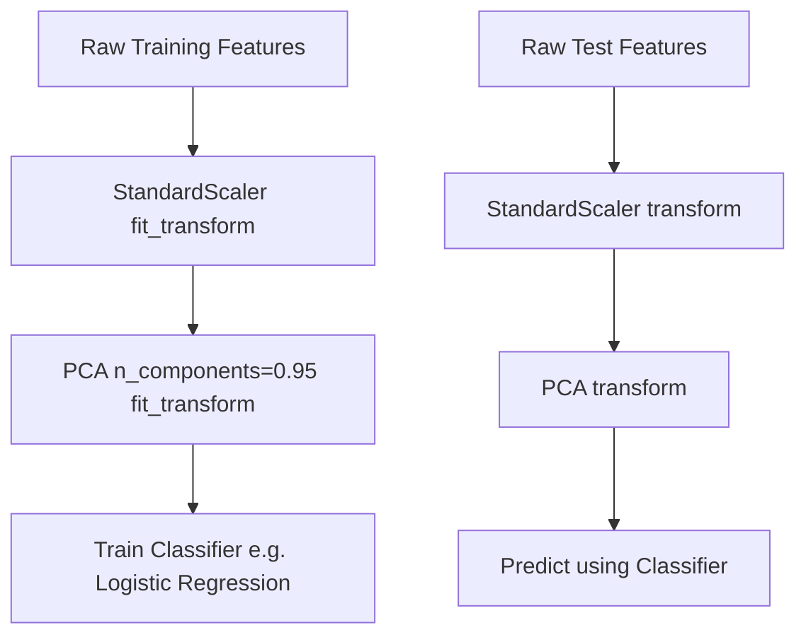

# Practical PCA in Scikit-Learn

[](https://colab.research.google.com/github/RiazML/machine-learning-notes/blob/main/notebooks/049_principle_component_analysis_pca.ipynb)

Understanding the mathematical derivation of PCA is crucial, but deploying it inside production machine learning pipelines requires mastering Scikit-Learn's API. This study guide focuses on cumulative explained variance analysis, automated component selection, and integrating PCA into cross-validated estimators.

---

## 1. Explained Variance Ratio (EVR)

The **Explained Variance Ratio (EVR)** measures the proportion of the dataset's total variance captured by each individual principal component. For the $i$-th component:

$$\text{EVR}_i = \frac{\lambda_i}{\sum_{j=1}^D \lambda_j}$$

Where $D$ is the total number of features (dimensions) and $\lambda$ represents the eigenvalues.

### Determining the Optimal Components ($K$)

1. **Scree Plot**: A bar chart of individual EVRs. We look for an **elbow** (the point where the variance drop flattens out) to select $K$.
2. **Cumulative Explained Variance**: We select the minimum number of components $K$ such that the cumulative sum of explained variance exceeds a predefined threshold (usually $90\%$ or $95\%$):

$$\text{Cumulative EVR}_K = \sum_{i=1}^K \text{EVR}_i \geq 0.95$$

> [!TIP]
> In Scikit-Learn, instead of passing an integer to `n_components`, you can pass a float between `0.0` and `1.0`. For example, `PCA(n_components=0.95)` will automatically calculate the covariance matrix, perform SVD, compute cumulative variance, and select the minimum number of components required to preserve $95\%$ of the original information.

---

## 2. Pipeline Integration Workflow

PCA is an unsupervised transformation, so it must be calculated strictly on the training set and applied to the validation and test sets.



---

## 3. Implementation Code

Below is a complete, runnable Python script that generates a high-dimensional dataset (25 features with structural correlation groups), applies a standardized pipeline, automatically computes the components needed for $95\%$ variance, and trains a downstream model.

```python
import numpy as np
import pandas as pd
from sklearn.datasets import make_classification
from sklearn.model_selection import train_test_split, GridSearchCV
from sklearn.preprocessing import StandardScaler
from sklearn.decomposition import PCA
from sklearn.linear_model import LogisticRegression
from sklearn.pipeline import Pipeline

# 1. Create a High-Dimensional Correlated Classification Dataset
# 25 features, but only 5 are truly informative; the rest are redundant or noise
X_raw, y = make_classification(
    n_samples=600,
    n_features=25,
    n_informative=5,
    n_redundant=10,
    n_repeated=0,
    random_state=42
)

X_train, X_test, y_train, y_test = train_test_split(X_raw, y, test_size=0.2, random_state=42)

print(f"Original Training shape: {X_train.shape}")

# 2. Automated Variance Selection
# Scale features and run PCA to capture 95% of the variance
scaler = StandardScaler()
X_train_scaled = scaler.fit_transform(X_train)

pca_95 = PCA(n_components=0.95, random_state=42)
X_train_pca = pca_95.fit_transform(X_train_scaled)

print(f"Components selected to capture 95% variance: {pca_95.n_components_}")
print("Cumulative explained variance ratio per component:")
print(np.cumsum(pca_95.explained_variance_ratio_))

# 3. Create a Grid Search Pipeline to optimize PCA components and classifier parameters
pipeline = Pipeline([
    ('scaler', StandardScaler()),
    ('pca', PCA(random_state=42)),
    ('classifier', LogisticRegression(solver='liblinear', random_state=42))
])

# Define grid: test specific components vs. raw performance
param_grid = {
    'pca__n_components': [3, 5, 8, 12, 18],
    'classifier__C': [0.01, 0.1, 1.0, 10.0]
}

grid_search = GridSearchCV(pipeline, param_grid, cv=5, scoring='accuracy', n_jobs=-1)
grid_search.fit(X_train, y_train)

print(f"\nBest Cross-Validated parameters: {grid_search.best_params_}")
print(f"Best CV Accuracy: {grid_search.best_score_ * 100:.2f}%")

# 4. Final Evaluation on Test Set
test_accuracy = grid_search.score(X_test, y_test)
print(f"Test Set Accuracy: {test_accuracy * 100:.2f}%")
```

---

## 4. Practical Guidelines for Production

1. **Strict Scaling**: Always place a scaling step (like `StandardScaler`) immediately before `PCA` in your pipeline. Without scaling, PCA will bias components toward features with the largest raw numerical range.
2. **Scree Plot Verification**: In exploratory analysis, write a helper function to plot `np.cumsum(pca.explained_variance_ratio_)`. This helps you visualize where the diminishing returns start.
3. **Loss of Interpretability**: While PCA resolves collinearity and reduces training time, the resulting components ($PC_1, PC_2$, etc.) are linear combinations of all original features. If your business stakeholders require feature-level importance metrics (e.g., "how much does age affect churn?"), PCA makes this explanation difficult to formulate.
