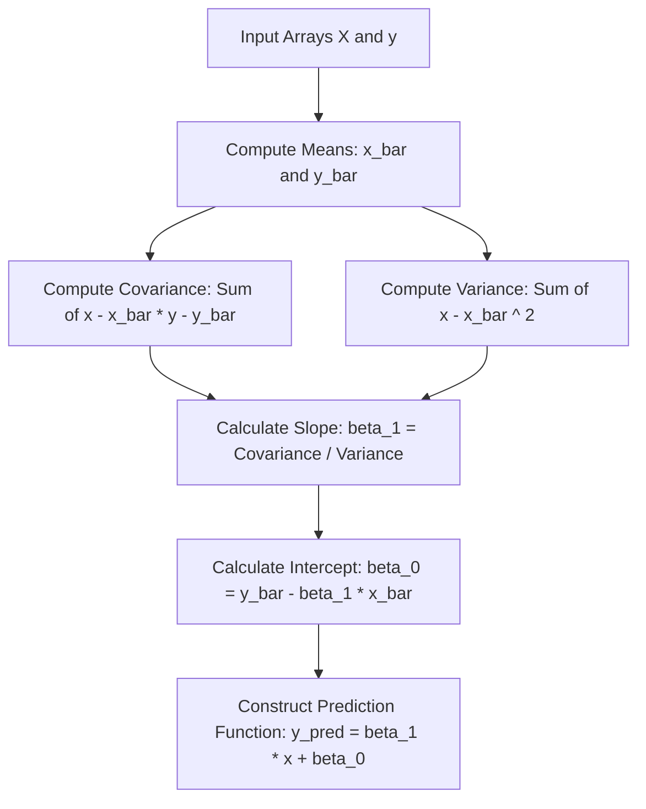

# Simple Linear Regression (OLS closed-form)

[](https://colab.research.google.com/github/RiazML/machine-learning-notes/blob/main/notebooks/050_simple_linear_regression.ipynb)

Simple Linear Regression is a fundamental parametric machine learning algorithm that models the linear relationship between a single independent input variable $X$ and a single dependent target variable $y$.

---

## 1. Mathematical Formulation & OLS Derivation

The linear relationship is expressed as:

$$y_i = \beta_1 x_i + \beta_0 + \epsilon_i$$

Where:

- $\beta_1$ is the slope coefficient.
- $\beta_0$ is the y-intercept.
- $\epsilon_i$ represents the residual error for observation $i$.

The predicted target is $\hat{y}_i = \beta_1 x_i + \beta_0$. The **Ordinary Least Squares (OLS)** method finds optimal values for $\beta_1$ and $\beta_0$ by minimizing the Sum of Squared Residuals (SSR):

$$\text{SSR}(\beta_0, \beta_1) = \sum_{i=1}^N (y_i - \hat{y}_i)^2 = \sum_{i=1}^N \left(y_i - (\beta_1 x_i + \beta_0)\right)^2$$

### Derivation of $\beta_0$

Taking the partial derivative of $\text{SSR}$ with respect to $\beta_0$ and setting it to $0$:

$$\frac{\partial \text{SSR}}{\partial \beta_0} = -2 \sum_{i=1}^N (y_i - \beta_1 x_i - \beta_0) = 0$$

$$\sum_{i=1}^N y_i - \beta_1 \sum_{i=1}^N x_i - N\beta_0 = 0$$

Dividing by $N$:

$$\bar{y} - \beta_1 \bar{x} - \beta_0 = 0 \implies \beta_0 = \bar{y} - \beta_1 \bar{x}$$

Where $\bar{x}$ and $\bar{y}$ are the sample means of features and targets.

### Derivation of $\beta_1$

Taking the partial derivative of $\text{SSR}$ with respect to $\beta_1$ and setting it to $0$:

$$\frac{\partial \text{SSR}}{\partial \beta_1} = -2 \sum_{i=1}^N x_i (y_i - \beta_1 x_i - \beta_0) = 0$$

Substituting $\beta_0 = \bar{y} - \beta_1 \bar{x}$:

$$\sum_{i=1}^N x_i (y_i - \beta_1 x_i - (\bar{y} - \beta_1 \bar{x})) = 0$$

$$\sum_{i=1}^N x_i (y_i - \bar{y}) - \beta_1 \sum_{i=1}^N x_i (x_i - \bar{x}) = 0$$

Using standard algebraic identity $\sum (x_i - \bar{x})(y_i - \bar{y}) = \sum x_i(y_i - \bar{y})$:

$$\beta_1 = \frac{\sum_{i=1}^N (x_i - \bar{x})(y_i - \bar{y})}{\sum_{i=1}^N (x_i - \bar{x})^2} = \frac{\text{Cov}(x, y)}{\text{Var}(x)}$$



---

## 2. Implementation Code (Scratch vs. Scikit-Learn)

Below is a complete, runnable Python script that implements the closed-form OLS solutions inside a custom, scikit-learn-style estimator class and compares it with Scikit-Learn's `LinearRegression`.

```python
import numpy as np
import pandas as pd
from sklearn.linear_model import LinearRegression
from sklearn.metrics import r2_score

# 1. Custom OLS Simple Linear Regression Estimator
class SimpleLinearRegressionScratch:
    def __init__(self):
        self.coef_ = None
        self.intercept_ = None

    def fit(self, X, y):
        # Ensure inputs are flat 1D numpy arrays
        X_flat = np.array(X).flatten()
        y_flat = np.array(y).flatten()

        # Calculate sample means
        x_bar = np.mean(X_flat)
        y_bar = np.mean(y_flat)

        # Calculate terms for slope (beta_1)
        numerator = np.sum((X_flat - x_bar) * (y_flat - y_bar))
        denominator = np.sum((X_flat - x_bar) ** 2)

        # Guard against zero variance
        if denominator == 0:
            self.coef_ = 0.0
        else:
            self.coef_ = numerator / denominator

        # Calculate y-intercept (beta_0)
        self.intercept_ = y_bar - (self.coef_ * x_bar)
        return self

    def predict(self, X):
        X_flat = np.array(X).flatten()
        return (self.coef_ * X_flat) + self.intercept_

# 2. Generate Linear Synthetic Data with Gaussian Noise
np.random.seed(42)
n_samples = 150
X_val = np.random.uniform(low=5.0, high=25.0, size=n_samples)
y_val = 3.5 * X_val + 12.0 + np.random.normal(loc=0.0, scale=4.0, size=n_samples)

# Reshape X for compatibility with scikit-learn standard inputs (N, 1)
X_input = X_val.reshape(-1, 1)

# 3. Fit Custom Scratch Estimator
model_scratch = SimpleLinearRegressionScratch()
model_scratch.fit(X_input, y_val)

# 4. Fit Scikit-Learn Estimator
model_sklearn = LinearRegression()
model_sklearn.fit(X_input, y_val)

# 5. Verify parameters match
print(f"Scratch Slope (beta_1):      {model_scratch.coef_:.6f}")
print(f"Sklearn Slope (coef_):       {model_sklearn.coef_[0]:.6f}")
print(f"Scratch Intercept (beta_0):  {model_scratch.intercept_:.6f}")
print(f"Sklearn Intercept (intercept_): {model_sklearn.intercept_:.6f}")

assert np.allclose(model_scratch.coef_, model_sklearn.coef_[0], atol=1e-7)
assert np.allclose(model_scratch.intercept_, model_sklearn.intercept_, atol=1e-7)

# Verify predictions match
preds_scratch = model_scratch.predict(X_input)
preds_sklearn = model_sklearn.predict(X_input)
assert np.allclose(preds_scratch, preds_sklearn, atol=1e-7)

print(f"\n[SUCCESS] Custom OLS class matched Scikit-Learn outputs perfectly!")
print(f"R2 Coefficient of Determination: {r2_score(y_val, preds_scratch):.4f}")
```

---

## 3. Assumptions of Simple Linear Regression

Simple Linear Regression assumes the following conditions hold for the features and target variable:

1. **Linearity**: The relationship between $X$ and $y$ must be linear.
2. **Independence**: The residuals must be independent of one another.
3. **Homoscedasticity**: The variance of residuals must remain constant across all levels of the predictor feature $X$.
4. **Normality**: The residual errors must be normally distributed (crucial for valid hypothesis testing and confidence interval boundaries).
