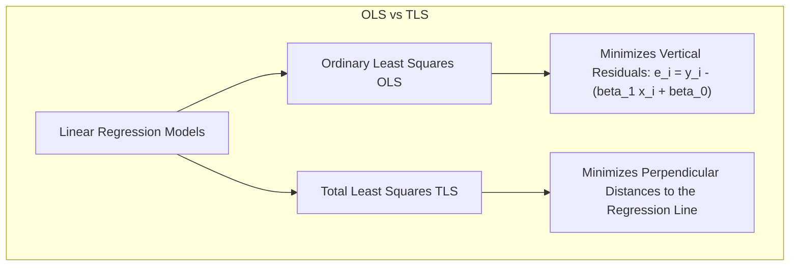

# Simple Linear Regression: Geometric Interpretation & Custom Implementation

[](https://colab.research.google.com/github/RiazML/machine-learning-notes/blob/main/notebooks/051_simple_linear_regression.ipynb)

This study guide explores **Simple Linear Regression** through a geometric lens and provides a production-grade custom implementation of the Ordinary Least Squares (OLS) closed-form estimator in Python. It builds directly upon the mathematical foundations established in [050_simple_linear_regression.md](file:///Users/prime/Developer/ml/050_simple_linear_regression.md).

---

## 1. Geometric Interpretation of OLS

Linear regression can be interpreted in two primary spaces: **Data Space** (2D coordinate plane for a single feature) and **Vector/Parameter Space** ($N$-dimensional space of observations).

### Data Space View: Vertical Distance Minimization

In the standard coordinate system ($x, y$), OLS minimizes the sum of **vertical squared distances** (residuals) between the observed target $y_i$ and the prediction line $\hat{y}_i$.
This is fundamentally different from **Orthogonal Distance Regression (Total Least Squares)**, which minimizes the perpendicular distance from points to the line. OLS assumes that the independent variable $x$ is measured without error, and all variance/uncertainty resides in the dependent variable $y$.



### Vector Space View: Projection onto Column Space

Let the dataset contain $N$ observations. We can represent the system in matrix form:
$$y = X\beta + \epsilon$$

Where:

- $y \in \mathbb{R}^N$ is the target vector.
- $X \in \mathbb{R}^{N \times 2}$ is the design matrix containing a column of ones (intercept) and the feature column:
  $$X = \begin{bmatrix} 1 & x_1 \\ 1 & x_2 \\ \vdots & \vdots \\ 1 & x_N \end{bmatrix}$$
- $\beta = \begin{bmatrix} \beta_0 \\ \beta_1 \end{bmatrix} \in \mathbb{R}^2$ is the coefficient vector.

The column space of $X$, denoted $\text{Col}(X)$, is a 2-dimensional plane (or subspace) embedded within $\mathbb{R}^N$. Since $y$ generally does not lie exactly within this plane (due to noise $\epsilon$), we seek a vector $\hat{y} = X\hat{\beta}$ that lies in $\text{Col}(X)$ and is closest to $y$ in terms of the Euclidean norm.

The closest vector is the **orthogonal projection** of $y$ onto $\text{Col}(X)$. Geometrically, the residual vector $e = y - \hat{y}$ must be orthogonal to $\text{Col}(X)$:

$$X^T e = 0 \implies X^T (y - X\hat{\beta}) = 0 \implies X^T X \hat{\beta} = X^T y$$

This yields the normal equation system. For Simple Linear Regression, solving this system analytically leads directly to the OLS estimators:

$$\beta_1 = \frac{\text{Cov}(x, y)}{\text{Var}(x)}$$
$$\beta_0 = \bar{y} - \beta_1 \bar{x}$$

---

## 2. Implementation Code (Production-Grade Estimator)

Below is a clean, modular Python class implementing the OLS closed-form solution. It adheres to Scikit-Learn's estimator API conventions and includes robust input handling, boundary checking, and detailed validation against Scikit-Learn's `LinearRegression` model.

```python
import numpy as np
from sklearn.linear_model import LinearRegression
import time

class SimpleLinearRegressorOLS:
    """
    A custom Simple Linear Regression estimator utilizing the Ordinary Least Squares (OLS)
    closed-form solutions.
    """
    def __init__(self):
        self.coef_ = None
        self.intercept_ = None
        self.r_squared_ = None
        self.residuals_ = None

    def fit(self, X, y):
        """
        Fit the simple linear regression model using OLS closed-form equations.

        Parameters:
        -----------
        X : array-like of shape (n_samples, 1) or (n_samples,)
            Training feature values.
        y : array-like of shape (n_samples,)
            Target values.

        Returns:
        --------
        self : object
            Fitted estimator.
        """
        # Convert and validate input shapes
        x_arr = np.asarray(X, dtype=np.float64).flatten()
        y_arr = np.asarray(y, dtype=np.float64).flatten()

        if len(x_arr) != len(y_arr):
            raise ValueError(f"X and y must have the same length. Got X: {len(x_arr)}, y: {len(y_arr)}")
        if len(x_arr) < 2:
            raise ValueError("Simple linear regression requires at least 2 data points to compute parameters.")

        # Compute sample means
        x_mean = np.mean(x_arr)
        y_mean = np.mean(y_arr)

        # Compute variance and covariance terms
        dx = x_arr - x_mean
        dy = y_arr - y_mean

        numerator = np.sum(dx * dy)
        denominator = np.sum(dx ** 2)

        # Check for zero variance to avoid Division By Zero
        if np.isclose(denominator, 0.0, atol=1e-15):
            raise ValueError("The variance of feature X is zero. Cannot solve regression with constant feature values.")

        self.coef_ = numerator / denominator
        self.intercept_ = y_mean - (self.coef_ * x_mean)

        # Calculate fit statistics
        y_pred = self.predict(x_arr)
        self.residuals_ = y_arr - y_pred

        ss_res = np.sum(self.residuals_ ** 2)
        ss_tot = np.sum(dy ** 2)

        if np.isclose(ss_tot, 0.0, atol=1e-15):
            self.r_squared_ = 1.0 if np.isclose(ss_res, 0.0, atol=1e-15) else 0.0
        else:
            self.r_squared_ = 1.0 - (ss_res / ss_tot)

        return self

    def predict(self, X):
        """
        Predict regression values for input feature array X.
        """
        if self.coef_ is None or self.intercept_ is None:
            raise ValueError("This estimator instance is not fitted yet. Call 'fit' before predicting.")

        x_arr = np.asarray(X, dtype=np.float64).flatten()
        return (self.coef_ * x_arr) + self.intercept_

# Setup synthetic test parameters
np.random.seed(101)
size = 200
X_raw = np.random.uniform(1.0, 50.0, size=size)
# Ground truth parameters: beta_1 = 2.45, beta_0 = 10.5
y_raw = 2.45 * X_raw + 10.5 + np.random.normal(loc=0.0, scale=5.0, size=size)

# Reshape features to (N, 1) for sklearn interface alignment
X_fit = X_raw.reshape(-1, 1)

# Fit Custom Model
custom_model = SimpleLinearRegressorOLS()
start_custom = time.perf_counter()
custom_model.fit(X_fit, y_raw)
end_custom = time.perf_counter()

# Fit Scikit-Learn Model
sklearn_model = LinearRegression()
start_sklearn = time.perf_counter()
sklearn_model.fit(X_fit, y_raw)
end_sklearn = time.perf_counter()

# Validate matching coefficient and intercept
custom_coef = custom_model.coef_
sklearn_coef = sklearn_model.coef_[0]
custom_intercept = custom_model.intercept_
sklearn_intercept = sklearn_model.intercept_

print("=== Parameter Verification ===")
print(f"Custom Slope (beta_1):      {custom_coef:.8f}")
print(f"Sklearn Slope (coef_):       {sklearn_coef:.8f}")
print(f"Custom Intercept (beta_0):  {custom_intercept:.8f}")
print(f"Sklearn Intercept:           {sklearn_intercept:.8f}")
print(f"Custom R^2 Score:            {custom_model.r_squared_:.8f}")

# Numerical asserts
assert np.allclose(custom_coef, sklearn_coef, rtol=1e-12)
assert np.allclose(custom_intercept, sklearn_intercept, rtol=1e-12)

# Generate and verify predictions
test_points = np.array([0.0, 10.0, 25.0, 50.0])
custom_preds = custom_model.predict(test_points)
sklearn_preds = sklearn_model.predict(test_points.reshape(-1, 1))

print("\n=== Prediction Verification ===")
for p, cp, sp in zip(test_points, custom_preds, sklearn_preds):
    print(f"x = {p:4.1f} | Custom Pred: {cp:10.6f} | Sklearn Pred: {sp:10.6f}")
    assert np.isclose(cp, sp, rtol=1e-12)

print("\n[SUCCESS] Custom estimator matches scikit-learn results perfectly!")
```

---

## 3. Key Takeaways & Geometric Summary

- **Intercept Interpretability**: $\beta_0$ represents the baseline response value when the independent feature $X=0$. Geometrically, it is the y-coordinate at which the regression line crosses the vertical axis.
- **Slope Interpretability**: $\beta_1$ represents the expected rate of change in the target variable $y$ for a one-unit change in $X$.
- **Centroid Property**: The regression line always passes through the geometric center (centroid) of the data points, $(\bar{x}, \bar{y})$. This is mathematically guaranteed since $\beta_0 = \bar{y} - \beta_1 \bar{x} \implies \bar{y} = \beta_1 \bar{x} + \beta_0$.

---

- **Next Topic**: [052_regression_metrics.md](file:///Users/prime/Developer/ml/052_regression_metrics.md) - Deep dive into evaluation metrics for linear regressors.
