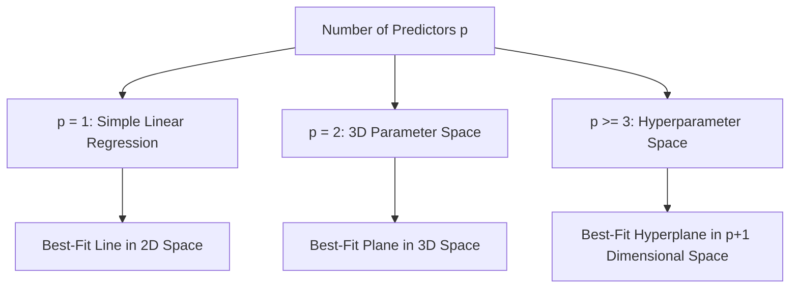

# Multiple Linear Regression: Geometric Intuition & Scikit-Learn Implementation

[](https://colab.research.google.com/github/RiazML/machine-learning-notes/blob/main/notebooks/053_multiple_linear_regression.ipynb)

Multiple Linear Regression (MLR) extends Simple Linear Regression by modeling the relationship between a single continuous dependent target variable $y$ and two or more independent predictor features $X_1, X_2, \ldots, X_p$.

---

## 1. Geometric Intuition: Dimension Generalization

As we add features, the geometric shape of the regression function expands into higher dimensions:



### From Lines to Planes to Hyperplanes

1. **Line ($p=1$)**: With one independent variable, the model finds a line of best fit in a 2D plane:
    $$y = \beta_0 + \beta_1 x_1 + \epsilon$$
2. **Plane ($p=2$)**: With two independent variables, the data points exist in a 3D space $(x_1, x_2, y)$. The model represents a flat **regression plane**:
    $$y = \beta_0 + \beta_1 x_1 + \beta_2 x_2 + \epsilon$$
3. **Hyperplane ($p \ge 3$)**: When we have three or more features, the regression surface is a **hyperplane** embedded within a $(p+1)$-dimensional space:
    $$y = \beta_0 + \sum_{j=1}^p \beta_j x_j + \epsilon$$

Although a hyperplane cannot be drawn or visualized directly for $p \ge 3$, it maintains the exact same mathematical properties: it is a flat subspace of codimension 1.

---

## 2. Interpretation of Coefficients (Ceteris Paribus)

In Multiple Linear Regression, the coefficients have a specific, crucial interpretation:

- $\beta_0$ (**Intercept**): The expected value of $y$ when all predictor features are equal to zero ($x_1 = x_2 = \ldots = x_p = 0$).
- $\beta_j$ (**Partial Regression Coefficient**): The expected change in target variable $y$ per unit change in $x_j$, **holding all other independent variables constant** (_ceteris paribus_).

### The Danger of Ignoring Relationships: Multicollinearity

Because coefficients are interpreted as holding other variables constant, if two features are highly correlated (e.g. $x_1 \approx 2 x_2$), it becomes physically impossible to change $x_1$ while keeping $x_2$ constant. This causes numerical instability (large standard errors for coefficients) and degrades the interpretability of the individual weight values.

---

## 3. Scikit-Learn Implementation and Manual Verification

Below is a complete, runnable script generating synthetic 3D regression data, fitting Scikit-Learn's `LinearRegression` estimator, extracting the learned plane parameters, and performing manual validation.

```python
import numpy as np
import pandas as pd
from sklearn.linear_model import LinearRegression

# 1. Generate Synthetic Data for 2 Predictors (3D Space)
# Ground Truth Equation: y = 15.0 + 4.5 * x1 - 2.8 * x2 + Gaussian Noise
np.random.seed(42)
n_samples = 150
x1 = np.random.uniform(0, 10, size=n_samples)
x2 = np.random.uniform(10, 50, size=n_samples)
noise = np.random.normal(loc=0.0, scale=3.0, size=n_samples)

y = 15.0 + 4.5 * x1 - 2.8 * x2 + noise

# Package features into a matrix/dataframe
X_df = pd.DataFrame({'x1': x1, 'x2': x2})

# 2. Fit the Scikit-Learn LinearRegression Model
model = LinearRegression()
model.fit(X_df, y)

# 3. Extract Regression Parameters
beta_0 = model.intercept_
beta_1, beta_2 = model.coef_

print("=== Estimated Parameters ===")
print(f"Intercept (beta_0):     {beta_0:.6f}  (True = 15.0)")
print(f"Coeff for x1 (beta_1):   {beta_1:.6f}  (True = 4.5)")
print(f"Coeff for x2 (beta_2):  {beta_2:.6f}  (True = -2.8)")

# 4. Generate Predictions using Model API
preds_sklearn = model.predict(X_df)

# 5. Manual Matrix Prediction Verification
# We compute predictions using y_hat = X * beta + beta_0
# Where X is the feature matrix, and beta is the coefficient array
X_matrix = X_df.to_numpy()
beta_vector = np.array([beta_1, beta_2])

preds_manual = np.dot(X_matrix, beta_vector) + beta_0

# 6. Verify Match
assert np.allclose(preds_sklearn, preds_manual, rtol=1e-12)
print("\n[SUCCESS] Manual matrix multiplication prediction matches Scikit-Learn's output perfectly!")

# Show a few sample comparisons
for i in range(5):
    print(f"Sample {i}: Features = ({x1[i]:5.2f}, {x2[i]:5.2f}) | Sklearn Pred = {preds_sklearn[i]:10.6f} | Manual Pred = {preds_manual[i]:10.6f}")
```

---

- **Next Topic**: [054_multiple_linear_regression.md](file:///Users/prime/Developer/ml/054_multiple_linear_regression.md) - Mathematical derivation of the OLS Normal Equation.
