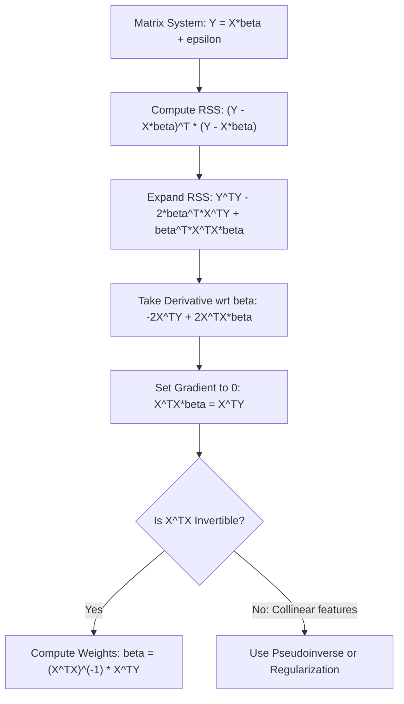

# Multiple Linear Regression: Mathematical Derivation of the Normal Equation

[](https://colab.research.google.com/github/RiazML/machine-learning-notes/blob/main/notebooks/054_multiple_linear_regression.ipynb)

This guide presents the complete, step-by-step matrix calculus derivation of the **Normal Equation** used to solve Multiple Linear Regression. It explains how Ordinary Least Squares (OLS) generalizes to multi-dimensional feature spaces using linear algebra.

---

## 1. System Formulation in Matrix Notation

For a dataset containing $N$ observations and $p$ predictor features, the relationship is modeled as:
$$y_i = \beta_0 + \beta_1 x_{i1} + \beta_2 x_{i2} + \ldots + \beta_p x_{ip} + \epsilon_i \quad \text{for } i = 1, 2, \ldots, N$$

We express this system of $N$ equations compactly in matrix notation:
$$Y = X\beta + \epsilon$$

Where:

- **Target Vector** $Y \in \mathbb{R}^{N \times 1}$:
  $$Y = \begin{bmatrix} y_1 \\ y_2 \\ \vdots \\ y_N \end{bmatrix}$$
- **Design Matrix** $X \in \mathbb{R}^{N \times (p+1)}$:
  The first column is filled with ones to represent the intercept parameter ($\beta_0$):
  $$X = \begin{bmatrix} 1 & x_{11} & x_{12} & \cdots & x_{1p} \\ 1 & x_{21} & x_{22} & \cdots & x_{2p} \\ \vdots & \vdots & \vdots & \ddots & \vdots \\ 1 & x_{N1} & x_{N2} & \cdots & x_{Np} \end{bmatrix}$$
- **Parameter Vector** $\beta \in \mathbb{R}^{(p+1) \times 1}$:
  $$\beta = \begin{bmatrix} \beta_0 \\ \beta_1 \\ \beta_2 \\ \vdots \\ \beta_p \end{bmatrix}$$
- **Residual Vector** $\epsilon \in \mathbb{R}^{N \times 1}$:
  $$\epsilon = \begin{bmatrix} \epsilon_1 \\ \epsilon_2 \\ \vdots \\ \epsilon_N \end{bmatrix}$$

---

## 2. Derivation of the Residual Sum of Squares (RSS)

The goal of OLS is to find the parameter vector $\beta$ that minimizes the Residual Sum of Squares ($\text{RSS}$):
$$\text{RSS}(\beta) = \sum_{i=1}^N \epsilon_i^2 = \epsilon^T \epsilon$$

Substituting the residual definition $\epsilon = Y - X\beta$:
$$\text{RSS}(\beta) = (Y - X\beta)^T (Y - X\beta)$$

Using matrix transpose distribution properties:
$$(A - B)^T = A^T - B^T \quad \text{and} \quad (AB)^T = B^T A^T$$

We expand the terms:
$$\text{RSS}(\beta) = (Y^T - (X\beta)^T) (Y - X\beta)$$
$$\text{RSS}(\beta) = (Y^T - \beta^T X^T) (Y - X\beta)$$
$$\text{RSS}(\beta) = Y^T Y - Y^T X \beta - \beta^T X^T Y + \beta^T X^T X \beta$$

### Scalar Simplification

Notice that the terms $Y^T X \beta$ and $\beta^T X^T Y$ are both scalar quantities (dimension $1 \times 1$). Since the transpose of a scalar is equal to itself:
$$(Y^T X \beta)^T = \beta^T X^T Y$$

Therefore, we can combine these two middle terms:
$$\text{RSS}(\beta) = Y^T Y - 2\beta^T X^T Y + \beta^T X^T X \beta$$

---

## 3. Matrix Calculus Optimization

To find the value of $\beta$ that minimizes $\text{RSS}$, we take the partial derivative (gradient) with respect to $\beta$ and set it to the zero vector.

We utilize the following two standard matrix differentiation rules:

1. **Linear Rule**: $\frac{\partial (a^T \beta)}{\partial \beta} = a$
2. **Quadratic Rule**: $\frac{\partial (\beta^T A \beta)}{\partial \beta} = 2 A \beta$ (where $A$ is a symmetric matrix)

Applying these rules to our expanded $\text{RSS}(\beta)$ function:

- $\frac{\partial (Y^T Y)}{\partial \beta} = 0 \quad$ (no dependency on $\beta$)
- $\frac{\partial (2\beta^T X^T Y)}{\partial \beta} = 2 X^T Y \quad$ (linear term where $a = X^T Y$)
- $\frac{\partial (\beta^T (X^T X) \beta)}{\partial \beta} = 2 (X^T X) \beta \quad$ (quadratic term where $A = X^T X$, which is symmetric)

Combining these:
$$\frac{\partial \text{RSS}}{\partial \beta} = -2 X^T Y + 2 X^T X \beta$$

Setting the gradient to zero to find the minimum:
$$-2 X^T Y + 2 X^T X \beta = 0$$
$$X^T X \beta = X^T Y$$

This set of equations is known as the **Normal Equations**.

---

## 4. The Closed-Form Normal Equation

If the matrix $X^T X$ is non-singular (invertible), we can pre-multiply both sides of the equation by $(X^T X)^{-1}$:
$$(X^T X)^{-1} X^T X \beta = (X^T X)^{-1} X^T Y$$
$$\beta = (X^T X)^{-1} X^T Y$$



### Invertibility & Singular Matrix Conditions

The matrix $X^T X$ is of size $(p+1) \times (p+1)$. It is invertible if and only if it has full column rank, which requires:

1. **No Perfect Multicollinearity**: No predictor feature is a perfect linear combination of other features. If a column is a linear combination of others, $X^T X$ is singular (not invertible).
2. **Number of Samples $N > p + 1$**: We must have more observations than feature variables. If $N < p + 1$, the system is underdetermined, and infinite solutions exist.

---

## 5. Python Verification of Mathematical Equivalents

The following runnable Python script generates synthetic multiple features and manually calculates each matrix expansion component to prove the equality of terms.

```python
import numpy as np

# Set random seed
np.random.seed(42)
N, p = 10, 3

# Generate random design matrix X (with ones column) and target Y
X_features = np.random.randn(N, p)
X = np.hstack([np.ones((N, 1)), X_features]) # Shape: (10, 4)
Y = np.random.randn(N, 1) # Shape: (10, 1)

# Generate a random parameter vector beta
beta = np.random.randn(p + 1, 1) # Shape: (4, 1)

# Compute components to prove scalar equivalence: Y^T * X * beta == (Y^T * X * beta)^T == beta^T * X^T * Y
term_1 = np.dot(np.dot(Y.T, X), beta)
term_2 = np.dot(np.dot(beta.T, X.T), Y)

print("=== Term Equivalence Verification ===")
print(f"Y^T * X * beta:  {term_1[0,0]:.12f}")
print(f"beta^T * X^T * Y: {term_2[0,0]:.12f}")
assert np.isclose(term_1[0,0], term_2[0,0])

# Compute RSS using raw formula: (Y - X*beta)^T * (Y - X*beta)
residuals = Y - np.dot(X, beta)
rss_direct = np.dot(residuals.T, residuals)[0, 0]

# Compute RSS using expanded formula: Y^T*Y - 2*beta^T*X^T*Y + beta^T*X^T*X*beta
term_yy = np.dot(Y.T, Y)
term_bxy = 2 * np.dot(np.dot(beta.T, X.T), Y)
term_bxxb = np.dot(np.dot(np.dot(beta.T, X.T), X), beta)
rss_expanded = (term_yy - term_bxy + term_bxxb)[0, 0]

print("\n=== RSS Expansion Verification ===")
print(f"Direct RSS calculation:   {rss_direct:.12f}")
print(f"Expanded RSS calculation: {rss_expanded:.12f}")
assert np.isclose(rss_direct, rss_expanded)

print("\n[SUCCESS] Matrix identities and algebraic expansions verified mathematically!")
```

---

- **Next Topic**: [055_multiple_linear_regression.md](file:///Users/prime/Developer/ml/055_multiple_linear_regression.md) - Coding the Normal Equation from scratch.
