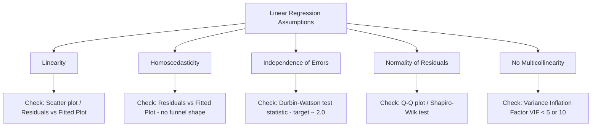

# Assumptions of Linear Regression & Diagnostic Tests in Python

[](https://colab.research.google.com/github/RiazML/machine-learning-notes/blob/main/notebooks/056_what_are_the_main_assumptions_of.ipynb)

Linear regression is a parametric model, meaning it relies on specific assumptions about the data structure and residuals. If these assumptions are violated, the model's coefficients can be biased, standard errors can be underestimated, and hypothesis tests (p-values) become invalid.

---

## 1. The 5 Core Assumptions



### Assumption 1: Linearity

- **Definition**: The relationship between the independent features $X$ and the dependent target $y$ must be linear.
- **Violation Impact**: The model will underfit, missing the underlying non-linear patterns.
- **Verification**: Plot residual values against fitted (predicted) values. The residuals should be randomly distributed around the horizontal axis $y=0$. A parabolic or systematic pattern indicates non-linearity.

### Assumption 2: Homoscedasticity (Constant Variance)

- **Definition**: The variance of the residuals must be constant across all values of the independent variables.
- **Violation Impact**: Standard errors are calculated incorrectly, rendering confidence intervals and hypothesis tests (p-values) unreliable.
- **Verification**: Plot residuals vs. fitted values. The spread of the residuals should remain constant (like a horizontal band). A "funnel" or "horn" shape (where residuals get wider as predictions grow) indicates **heteroscedasticity**.

### Assumption 3: Independence of Errors (No Autocorrelation)

- **Definition**: The residual errors of different observations must be independent of one another. This is particularly critical in time-series data.
- **Violation Impact**: Standard errors are heavily underestimated, making variables appear much more statistically significant than they are.
- **Verification**: Run the **Durbin-Watson (DW) test**:
  $$d = \frac{\sum_{t=2}^N (e_t - e_{t-1})^2}{\sum_{t=1}^N e_t^2}$$
  - $d \approx 2.0$: No autocorrelation.
  - $d < 1.5$: Positive autocorrelation (residuals are cluster-correlated).
  - $d > 2.5$: Negative autocorrelation.

### Assumption 4: Normality of Residuals

- **Definition**: The residual errors must be normally distributed. Note: the features $X$ do _not_ need to be normally distributed, only the error terms.
- **Violation Impact**: Confidence intervals and hypothesis tests (like t-tests on coefficients) assume normality. For large datasets, the Central Limit Theorem helps, but normality remains important for inference.
- **Verification**: Q-Q (Quantile-Quantile) Plot (points should lie along the diagonal line) or statistical tests (Shapiro-Wilk or Jarque-Bera).

### Assumption 5: No Multicollinearity

- **Definition**: Independent variables must not be highly correlated with each other.
- **Violation Impact**: Explodes the variance of the coefficient estimates, making them highly sensitive to minor dataset changes and rendering individual coefficient interpretations meaningless.
- **Verification**: Calculate the **Variance Inflation Factor (VIF)** for each feature. VIF measures how much the variance of an estimated regression coefficient is increased due to collinearity:
  $$\text{VIF}_j = \frac{1}{1 - R_j^2}$$
  Where $R_j^2$ is the coefficient of determination when regressing feature $X_j$ against all other $p-1$ features.
  - $\text{VIF} = 1$: No collinearity.
  - $\text{VIF} > 5$: Moderate collinearity (concern).
  - $\text{VIF} > 10$: Severe collinearity (requires removal or combination of features).

---

## 2. Diagnostic Calculations in Python

Below is a complete, runnable script that creates a multi-feature dataset, fits a linear regression model, and performs diagnostic checks for **Durbin-Watson** and **VIF** entirely from scratch.

```python
import numpy as np
import pandas as pd
from sklearn.linear_model import LinearRegression

# 1. Generate Synthetic Dataset
np.random.seed(42)
n_samples = 200

# x1, x2 are independent, x3 is highly collinear with x1 (x3 = 2*x1 + noise)
x1 = np.random.uniform(5, 25, size=n_samples)
x2 = np.random.uniform(1, 10, size=n_samples)
x3 = 2.0 * x1 + np.random.normal(loc=0.0, scale=0.5, size=n_samples)

X_df = pd.DataFrame({'x1': x1, 'x2': x2, 'x3': x3})
# Target variable
y = 3.0 * x1 - 1.5 * x2 + np.random.normal(loc=0.0, scale=2.0, size=n_samples)

# 2. Fit Regression Model
model = LinearRegression()
model.fit(X_df, y)
y_pred = model.predict(X_df)
residuals = y - y_pred

# 3. Calculate Durbin-Watson Statistic (From Scratch)
def calculate_durbin_watson(res):
    diff_res = np.diff(res)
    numerator = np.sum(diff_res ** 2)
    denominator = np.sum(res ** 2)
    return numerator / denominator

dw_stat = calculate_durbin_watson(residuals)
print("=== Independence of Residuals (Autocorrelation) ===")
print(f"Durbin-Watson Statistic: {dw_stat:.4f}")
if 1.5 <= dw_stat <= 2.5:
    print("Interpretation: No significant autocorrelation detected (DW is near 2.0).")
elif dw_stat < 1.5:
    print("Interpretation: Potential Positive Autocorrelation detected.")
else:
    print("Interpretation: Potential Negative Autocorrelation detected.")

# 4. Calculate Variance Inflation Factor (VIF) (From Scratch)
def calculate_vif(df):
    vif_dict = {}
    features = df.columns
    for feature in features:
        # Define other features
        other_features = [f for f in features if f != feature]

        # Regress current feature on all other features
        X_other = df[other_features]
        y_feat = df[feature]

        vif_model = LinearRegression()
        vif_model.fit(X_other, y_feat)

        # Calculate R^2
        y_feat_pred = vif_model.predict(X_other)
        ss_res = np.sum((y_feat - y_feat_pred) ** 2)
        ss_tot = np.sum((y_feat - np.mean(y_feat)) ** 2)
        r2 = 1.0 - (ss_res / ss_tot)

        # Calculate VIF
        if np.isclose(r2, 1.0):
            vif = float('inf')
        else:
            vif = 1.0 / (1.0 - r2)

        vif_dict[feature] = vif
    return vif_dict

vif_scores = calculate_vif(X_df)
print("\n=== Multicollinearity Check ===")
for feat, vif in vif_scores.items():
    print(f"VIF for {feat:4s}: {vif:10.4f}")
    if vif > 10:
        print(f"  [WARNING] Severe Multicollinearity! {feat} exceeds VIF of 10.")
    elif vif > 5:
        print(f"  [WARNING] Moderate Multicollinearity! {feat} exceeds VIF of 5.")
    else:
        print(f"  [OK] Collinearity for {feat} is within acceptable limits.")

# 5. Normal Distribution Check Metrics
# Skewness and Kurtosis of residuals
skew = np.mean((residuals - np.mean(residuals))**3) / (np.std(residuals)**3)
kurt = np.mean((residuals - np.mean(residuals))**4) / (np.std(residuals)**4)
print("\n=== Residual Normality Metrics ===")
print(f"Residuals Mean:     {np.mean(residuals):.6e} (Expect near 0)")
print(f"Residuals Skewness: {skew:.4f} (Expect near 0 for normal distribution)")
print(f"Residuals Kurtosis: {kurt:.4f} (Expect near 3.0 for normal distribution)")

assert np.isclose(np.mean(residuals), 0.0, atol=1e-10)
print("\n[SUCCESS] Custom diagnostic logic executed correctly!")
```

---

- **Next Topic**: [057_gradient_descent_from_scratch.md](file:///Users/prime/Developer/ml/057_gradient_descent_from_scratch.md) - Understanding gradient descent cost function optimization.
