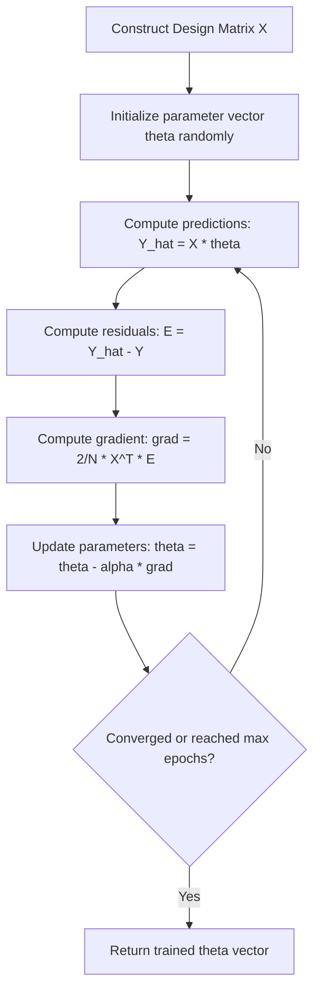

# Vectorized Batch Gradient Descent for Multiple Linear Regression

[](https://colab.research.google.com/github/RiazML/machine-learning-notes/blob/main/notebooks/058_batch_gradient_descent_with_code_demo.ipynb)

Batch Gradient Descent (BGD) optimizes parameters by calculating the gradient of the loss function across the **entire dataset** at each iteration. This study guide details the vectorized formulation of BGD, deriving the matrix-level gradient equations, and provides a clean from-scratch Python estimator compared directly to Scikit-Learn.

---

## 1. Vectorized System and Loss Formulation

Instead of updating the slope coefficients $\beta_j$ and intercept $\beta_0$ individually, we combine them into a single weight vector $\theta$:
$$\theta = \begin{bmatrix} \theta_0 \\ \theta_1 \\ \vdots \\ \theta_p \end{bmatrix} \in \mathbb{R}^{(p+1) \times 1}$$

Where $\theta_0$ is the intercept term. We prepend a column of ones to the feature matrix $X$ to form the design matrix $X_{\text{design}} \in \mathbb{R}^{N \times (p+1)}$.

The prediction vector is expressed as:
$$\hat{Y} = X \theta$$

The Mean Squared Error (MSE) cost function in vector form is:
$$J(\theta) = \frac{1}{N} (Y - X\theta)^T (Y - X\theta)$$

---

## 2. Derivation of the Vectorized Gradient

To perform gradient descent updates, we need the gradient vector $\nabla_{\theta} J(\theta)$ containing the partial derivatives for all elements in $\theta$:
$$\nabla_{\theta} J(\theta) = \begin{bmatrix} \frac{\partial J}{\partial \theta_0} \\ \frac{\partial J}{\partial \theta_1} \\ \vdots \\ \frac{\partial J}{\partial \theta_p} \end{bmatrix}$$

Using matrix differentiation rules:
$$J(\theta) = \frac{1}{N} \left( Y^T Y - 2\theta^T X^T Y + \theta^T X^T X \theta \right)$$

Taking the gradient with respect to $\theta$:
$$\nabla_{\theta} J(\theta) = \frac{\partial J}{\partial \theta} = \frac{1}{N} \left( 0 - 2X^T Y + 2X^T X \theta \right)$$
$$\nabla_{\theta} J(\theta) = \frac{2}{N} X^T (X\theta - Y) = -\frac{2}{N} X^T (Y - \hat{Y})$$

### Gradient Interpretation

- $Y - \hat{Y}$ is the residual error vector of shape $(N, 1)$.
- $X^T$ has dimensions $(p+1) \times N$.
- Multiplying $X^T$ by the residuals computes the dot product of each feature column with the error vector. This measures how much each feature is correlated with the prediction error.

### Vectorized Update Equation

At each iteration, we update the entire parameter vector simultaneously:
$$\theta \leftarrow \theta - \alpha \nabla_{\theta} J(\theta) = \theta - \frac{2\alpha}{N} X^T (X\theta - Y)$$



---

## 3. Python Implementation (Vectorized Scratch vs. Scikit-Learn)

Below is a complete, vectorized class implementation of Batch Gradient Descent, verified on a multi-feature dataset.

```python
import numpy as np
from sklearn.linear_model import LinearRegression
from sklearn.metrics import r2_score

class VectorizedBatchGDRegressor:
    """
    Multiple Linear Regression estimator using vectorized Batch Gradient Descent.
    """
    def __init__(self, learning_rate=0.01, epochs=2000, tolerance=1e-6):
        self.learning_rate = learning_rate
        self.epochs = epochs
        self.tolerance = tolerance
        self.theta = None
        self.coef_ = None
        self.intercept_ = None
        self.cost_history = []

    def fit(self, X, y):
        """
        Fit the model using vectorized parameter updates.
        """
        X_arr = np.asarray(X, dtype=np.float64)
        y_arr = np.asarray(y, dtype=np.float64).reshape(-1, 1)

        n_samples, n_features = X_arr.shape

        # Prepend a column of ones to represent the intercept term
        X_design = np.hstack([np.ones((n_samples, 1)), X_arr])

        # Initialize parameter weights vector (theta) to zeros
        self.theta = np.zeros((n_features + 1, 1))

        for epoch in range(self.epochs):
            # 1. Compute predictions
            y_pred = np.dot(X_design, self.theta)

            # 2. Compute cost (MSE)
            residuals = y_pred - y_arr
            cost = np.mean(residuals ** 2)
            self.cost_history.append(cost)

            # 3. Compute vectorized gradient: (2 / N) * X^T * residuals
            gradient = (2.0 / n_samples) * np.dot(X_design.T, residuals)

            # 4. Check for convergence based on parameter update norms
            prev_theta = np.copy(self.theta)

            # 5. Apply simultaneous updates
            self.theta -= self.learning_rate * gradient

            # Early stopping check
            if np.linalg.norm(self.theta - prev_theta, ord=2) < self.tolerance:
                print(f"BGD model converged early at epoch {epoch}.")
                break

        # Extract coef_ and intercept_ parameters
        self.intercept_ = float(self.theta[0, 0])
        self.coef_ = self.theta[1:].flatten()
        return self

    def predict(self, X):
        """
        Predict regression target values.
        """
        if self.theta is None:
            raise ValueError("This estimator is not fitted yet. Call 'fit' before predicting.")
        X_arr = np.asarray(X, dtype=np.float64)
        return np.dot(X_arr, self.coef_) + self.intercept_

# 1. Generate Synthetic Multivariable Regression Data
np.random.seed(42)
n_samples = 250
n_features = 4

# Generate features
X_raw = np.random.uniform(-5.0, 5.0, size=(n_samples, n_features))
# Ground truth parameter values: beta_0 = 8.5, coefs = [2.5, -4.0, 0.8, -1.5]
true_coefs = np.array([2.5, -4.0, 0.8, -1.5])
true_intercept = 8.5
y_raw = np.dot(X_raw, true_coefs) + true_intercept + np.random.normal(0, 1.8, size=n_samples)

# Standardize features (essential for stable gradient descent optimization)
X_mean = np.mean(X_raw, axis=0)
X_std = np.std(X_raw, axis=0)
X_scaled = (X_raw - X_mean) / X_std

# 2. Fit Vectorized Custom BGD Estimator
bgd_model = VectorizedBatchGDRegressor(learning_rate=0.05, epochs=5000)
bgd_model.fit(X_scaled, y_raw)

# 3. Fit Scikit-Learn Estimator
sklearn_model = LinearRegression()
sklearn_model.fit(X_scaled, y_raw)

# 4. Parameter and Score Checks
print("=== Parameter Verification ===")
print(f"Sklearn Intercept:    {sklearn_model.intercept_:.6f}")
print(f"Custom BGD Intercept: {bgd_model.intercept_:.6f}")
print(f"Sklearn Coefs:       {sklearn_model.coef_}")
print(f"Custom BGD Coefs:     {bgd_model.coef_}")

# Compute and print scores
preds_bgd = bgd_model.predict(X_scaled)
preds_sklearn = sklearn_model.predict(X_scaled)

r2_bgd = r2_score(y_raw, preds_bgd)
r2_sklearn = r2_score(y_raw, preds_sklearn)
print(f"\nCustom BGD R2 Score:   {r2_bgd:.6f}")
print(f"Sklearn R2 Score:      {r2_sklearn:.6f}")

# Asserts
assert np.isclose(bgd_model.intercept_, sklearn_model.intercept_, rtol=1e-4)
assert np.allclose(bgd_model.coef_, sklearn_model.coef_, rtol=1e-4)

print("\n[SUCCESS] Vectorized BGD matched Scikit-Learn outputs within standard tolerance!")
```

---

- **Next Topic**: [059_stochastic_gradient_descent.md](file:///Users/prime/Developer/ml/059_stochastic_gradient_descent.md) - Stochastic Gradient Descent (SGD) with learning rate schedules.
