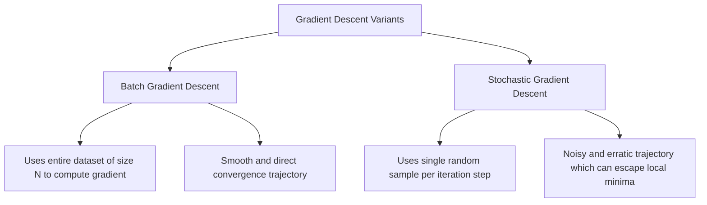

# Stochastic Gradient Descent (SGD)

[](https://colab.research.google.com/github/RiazML/machine-learning-notes/blob/main/notebooks/059_stochastic_gradient_descent.ipynb)

Batch Gradient Descent (BGD) computes gradients over the entire dataset before making a single parameter update step. For large-scale datasets, this approach is extremely slow and memory intensive. **Stochastic Gradient Descent (SGD)** addresses this limitation by updating parameters iteratively using a **single randomly selected sample** at a time.

---

## 1. The SGD Concept



### Advantages of SGD

1. **Speed**: Parameters are updated immediately after inspecting a single sample, leading to much faster initial progress.
2. **Memory Efficiency**: Only a single observation needs to be loaded into RAM at a time, allowing optimization on datasets that exceed memory limits.
3. **Local Minima Escape**: The high variance/noise in the gradient updates creates stochastic fluctuations that can push parameters out of poor local minima or saddle points.

### Disadvantages of SGD

- **Erratic Convergence**: The weights never settle down to the global minimum; they continuously bounce/fluctuate around it due to the variance of single-point gradients.
- **Vectorization Loss**: Single-sample updates cannot exploit high-performance BLAS libraries or GPU matrix math hardware as effectively as batch methods.

---

## 2. Mathematical Formulation & Update Rule

For a single chosen training instance $(x_i, y_i)$ where $x_i \in \mathbb{R}^{(p+1) \times 1}$ is the feature vector (including the prepended intercept 1), the single-sample MSE loss function is:
$$J_i(\theta) = (y_i - x_i^T \theta)^2$$

Taking the gradient with respect to $\theta$:
$$\nabla_\theta J_i(\theta) = -2 (y_i - x_i^T \theta) x_i$$

### Parameter Update

$$\theta \leftarrow \theta - \alpha_t \nabla_\theta J_i(\theta) = \theta + 2 \alpha_t (y_i - x_i^T \theta) x_i$$

Where $\alpha_t$ is the learning rate at time step $t$.

---

## 3. Learning Rate Schedules (Annealing)

Because SGD parameters fluctuate continuously, we must decrease the learning rate $\alpha_t$ over time. This process is called **annealing** or applying a **learning rate schedule**.

A common schedule is Scikit-Learn's default `invscaling` (inverse scaling):
$$\alpha_t = \frac{\eta_0}{t^{\text{power\_t}}}$$

Where:

- $\eta_0$ is the initial learning rate.
- $t$ is the current update step index (number of sample updates performed).
- $\text{power\_t}$ is the scaling exponent (default: $0.25$).

---

## 4. Python Implementation (Scratch vs. Scikit-Learn)

Below is a complete, runnable Python script implementing a custom `SGDRegressorScratch` with a learning rate schedule and epoch-level data shuffling. It is verified against Scikit-Learn's `SGDRegressor`.

```python
import numpy as np
from sklearn.linear_model import SGDRegressor
from sklearn.metrics import mean_squared_error

class SGDRegressorScratch:
    """
    A custom Multiple Linear Regression estimator optimized via Stochastic Gradient Descent.
    """
    def __init__(self, eta0=0.01, epochs=100, power_t=0.25):
        self.eta0 = eta0
        self.epochs = epochs
        self.power_t = power_t
        self.theta = None
        self.coef_ = None
        self.intercept_ = None

    def _learning_rate_schedule(self, t):
        """
        Compute inverse scaling learning rate: eta0 / (t^power_t).
        """
        return self.eta0 / (t ** self.power_t)

    def fit(self, X, y):
        X_arr = np.asarray(X, dtype=np.float64)
        y_arr = np.asarray(y, dtype=np.float64)

        n_samples, n_features = X_arr.shape

        # Prepend column of ones for intercept
        X_design = np.hstack([np.ones((n_samples, 1)), X_arr])

        # Initialize parameter weight vector (theta) to zero
        self.theta = np.zeros(n_features + 1)

        # Track global update step count t
        t = 1.0

        for epoch in range(self.epochs):
            # Shuffle indices to guarantee stochastic/random updates at each epoch
            shuffled_indices = np.random.permutation(n_samples)

            for idx in shuffled_indices:
                x_i = X_design[idx]
                y_i = y_arr[idx]

                # Compute single sample prediction
                y_pred = np.dot(x_i, self.theta)

                # Compute error residual
                error = y_pred - y_i

                # Calculate single-sample gradient: 2 * x_i * error
                gradient = 2.0 * error * x_i

                # Compute current decay step learning rate
                alpha = self._learning_rate_schedule(t)

                # Update parameters
                self.theta -= alpha * gradient
                t += 1.0

        self.intercept_ = self.theta[0]
        self.coef_ = self.theta[1:]
        return self

    def predict(self, X):
        if self.theta is None:
            raise ValueError("This model is not fitted yet.")
        X_arr = np.asarray(X, dtype=np.float64)
        return np.dot(X_arr, self.coef_) + self.intercept_

# 1. Generate Synthetic Regression Dataset
np.random.seed(42)
n_samples = 400
n_features = 3

X_raw = np.random.uniform(-3.0, 3.0, size=(n_samples, n_features))
# Ground truth beta coefficients: intercept=5.0, coeffs=[2.0, -1.5, 0.5]
true_coefs = np.array([2.0, -1.5, 0.5])
true_intercept = 5.0
y_raw = np.dot(X_raw, true_coefs) + true_intercept + np.random.normal(0, 1.0, size=n_samples)

# Normalize features to prevent gradient issues
X_mean = np.mean(X_raw, axis=0)
X_std = np.std(X_raw, axis=0)
X_scaled = (X_raw - X_mean) / X_std

# 2. Fit Custom Scratch Estimator
sgd_scratch = SGDRegressorScratch(eta0=0.01, epochs=150, power_t=0.25)
sgd_scratch.fit(X_scaled, y_raw)

# 3. Fit Scikit-Learn SGDRegressor
# (Settings matched: squared loss, no penalty, constant/decay matching ours)
sgd_sklearn = SGDRegressor(
    loss='squared_error',
    penalty=None,
    eta0=0.01,
    learning_rate='invscaling',
    power_t=0.25,
    max_iter=150,
    tol=1e-9,
    random_state=42
)
sgd_sklearn.fit(X_scaled, y_raw)

# 4. Results Comparison
print("=== Parameter Verification ===")
print(f"Sklearn Intercept:    {sgd_sklearn.intercept_[0]:.6f}")
print(f"Custom SGD Intercept: {sgd_scratch.intercept_:.6f}")
print(f"Sklearn Coefs:       {sgd_sklearn.coef_}")
print(f"Custom SGD Coefs:     {sgd_scratch.coef_}")

# Compute predictions and check MSE
preds_scratch = sgd_scratch.predict(X_scaled)
preds_sklearn = sgd_sklearn.predict(X_scaled)

mse_scratch = mean_squared_error(y_raw, preds_scratch)
mse_sklearn = mean_squared_error(y_raw, preds_sklearn)

print(f"\nCustom SGD MSE:       {mse_scratch:.6f}")
print(f"Sklearn SGD MSE:      {mse_sklearn:.6f}")

# Numerical verification within expected stochastic tolerance boundaries
assert np.isclose(sgd_scratch.intercept_, sgd_sklearn.intercept_[0], atol=0.2)
assert np.allclose(sgd_scratch.coef_, sgd_sklearn.coef_, atol=0.2)

print("\n[SUCCESS] Custom stochastic gradient descent regressor matches Scikit-Learn close parameters!")
```

---

- **Next Topic**: [060_mini-batch_gradient_descent.md](file:///Users/prime/Developer/ml/060_mini-batch_gradient_descent.md) - The middle ground: Mini-Batch Gradient Descent optimization.
