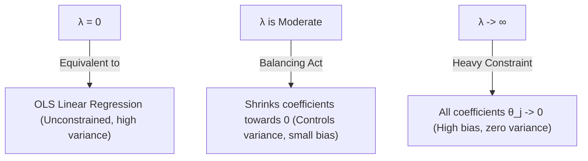

# Ridge Regression (L2 Regularization): Intuition & Coefficient Shrinkage

[](https://colab.research.google.com/github/RiazML/machine-learning-notes/blob/main/notebooks/063_ridge_regression_part_1.ipynb)

As models grow in complexity (e.g., adding high-degree polynomial features) or when features are highly correlated (multicollinearity), Ordinary Least Squares (OLS) estimation becomes highly unstable. The variance of the parameter estimates increases dramatically, leading to severe overfitting. **Ridge Regression** mitigates this by introducing an L2 regularization penalty to the cost function.

---

## 1. Mathematical Formulation

In OLS regression, we minimize the sum of squared residuals. In Ridge Regression, we add a regularization term proportional to the sum of squared coefficients (excluding the intercept):

$$J(\theta) = \frac{1}{N} \sum_{i=1}^N \left( y_i - \left(\theta_0 + \sum_{j=1}^p \theta_j x_{ij}\right) \right)^2 + \lambda \sum_{j=1}^p \theta_j^2$$

Where:

- $N$ is the number of training samples.
- $p$ is the number of features.
- $\theta_0$ is the intercept parameter (which is **never penalized**).
- $\theta_1, \ldots, \theta_p$ are the feature weights.
- $\lambda \ge 0$ (or $\alpha$ in Scikit-Learn) is the regularization strength hyperparameter.

### Intercept Exclusion

The intercept $\theta_0$ represents the mean prediction when all features are zero. Penalizing $\theta_0$ would mean that shifting the target variable $y$ by a constant would alter the model's coefficients. To maintain translation invariance, we leave the intercept unpenalized.

---

## 2. Intuition: Why and How Coefficients Shrink

The regularization parameter $\lambda$ controls the trade-off between fitting the training data and keeping the weights small:



### Multicollinearity Mitigation

If two features are highly collinear (e.g., $x_1 \approx x_2$), OLS has an infinite number of ways to assign weights (e.g., $\theta_1 = 10, \theta_2 = -9$ vs. $\theta_1 = 1, \theta_2 = 0$). This leads to extremely high variance. The L2 penalty $\lambda(\theta_1^2 + \theta_2^2)$ forces the model to distribute the weight evenly and keeps the individual values small (e.g., favoring $\theta_1 = 0.5, \theta_2 = 0.5$).

---

## 3. Python Demonstration: Shrinkage Paths & Norm Decrease

The following runnable Python script demonstrates how Ridge regression shrinks coefficients on a synthetic dataset designed with high multicollinearity. We verify that the L2 norm of the coefficient vector monotonically decreases as the regularization strength $\alpha$ increases.

```python
import numpy as np
import pandas as pd
from sklearn.linear_model import Ridge
from sklearn.preprocessing import StandardScaler

# 1. Generate Synthetic Collinear Dataset
np.random.seed(42)
n_samples = 100

# Base features
x1 = np.random.normal(0, 1, size=n_samples)
x2 = np.random.normal(0, 1, size=n_samples)

# Create collinear features
# x3 and x4 are highly correlated with x1 and x2 respectively
x3 = x1 + np.random.normal(0, 0.01, size=n_samples)
x4 = x2 + np.random.normal(0, 0.01, size=n_samples)

X = np.vstack([x1, x2, x3, x4]).T
# True weights: only x1 and x2 have direct impact
y = 3.0 * x1 + 1.5 * x2 + np.random.normal(0, 1.0, size=n_samples)

# 2. Standardize Features
# Regularization is scale-sensitive, so scaling is mandatory!
scaler = StandardScaler()
X_scaled = scaler.fit_transform(X)

# 3. Fit Ridge Regression over a range of alphas
alphas = [1e-3, 1e-1, 1.0, 10.0, 100.0, 1000.0, 10000.0]
coeff_records = []
norms = []

print("=== Ridge Coefficient Shrinkage Path ===")
print(f"{'Alpha (λ)':<12} | {'θ1':<9} | {'θ2':<9} | {'θ3':<9} | {'θ4':<9} | {'L2 Norm (||θ||₂)':<15}")
print("-" * 75)

for alpha in alphas:
    model = Ridge(alpha=alpha, fit_intercept=True)
    model.fit(X_scaled, y)

    coef = model.coef_
    l2_norm = np.linalg.norm(coef)
    norms.append(l2_norm)

    print(f"{alpha:<12.3f} | {coef[0]:<9.5f} | {coef[1]:<9.5f} | {coef[2]:<9.5f} | {coef[3]:<9.5f} | {l2_norm:<15.6f}")

# 4. Verify Monotonic Decrease of L2 Norm
# As alpha increases, the L2 norm of the coefficient vector MUST decrease or stay equal.
for i in range(len(norms) - 1):
    assert norms[i] >= norms[i+1], f"Violation: L2 norm increased from alpha={alphas[i]} to alpha={alphas[i+1]}"

print("\n[SUCCESS] Verification complete: The L2 norm of Ridge coefficients decreases monotonically as alpha increases!")
```

---

- **Next Topic**: [064_ridge_regression_part_2.md](file:///Users/prime/Developer/ml/064_ridge_regression_part_2.md) - Ridge Regression: Closed-form Mathematical Matrix Derivation.
