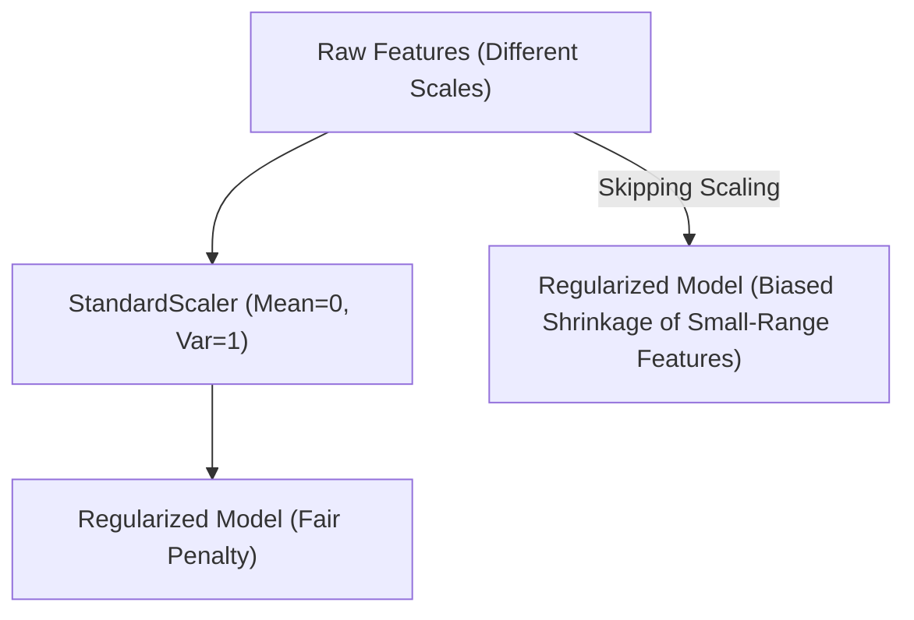

# 5 Key Points on Regularization: Theory & Practical Implementation

[](https://colab.research.google.com/github/RiazML/machine-learning-notes/blob/main/notebooks/066_5_key_points.ipynb)

Regularizing a linear model is not as simple as dropping an L1 or L2 penalty into your loss function. In practice, several key parameters and workflows must be followed to ensure the model behaves correctly. Here are the 5 essential points of regularization.

---

## The 5 Key Points

### 1. Feature Scaling is Mandatory

L1 and L2 penalties act directly on the magnitudes of the model parameters: $\sum |\theta_j|$ and $\sum \theta_j^2$. If your features have different scales, their coefficients will naturally exist on different scales to compensate.

- **Without Scaling**: A feature with a very small range (e.g., $0$ to $0.01$) needs a huge coefficient (e.g., $1000$) to impact the prediction. The regularization penalty will see this large coefficient and shrink it disproportionately, rendering the feature useless.
- **With Scaling**: Standardizing features to have zero mean and unit variance ensures that the regularization penalty treats all features equally.



### 2. Regularization Adjusts the Bias-Variance Curve

Regularization is a direct mechanism for managing the bias-variance trade-off. As the penalty parameter $\lambda$ (or $\alpha$) increases, the model's capacity decreases, leading to:

- **Higher Bias**: The model makes simpler assumptions.
- **Lower Variance**: The model's predictions become less sensitive to fluctuations in the training data.

### 3. The Intercept must Never be Regularized

The intercept ($\theta_0$) represents the baseline prediction of the model when all features are zero. If we regularize the intercept, the model's predictions will depend on where the coordinate system origin is placed. To ensure translation invariance, we leave the intercept unpenalized.

### 4. Multicollinearity Resolution

Under OLS, multicollinear features cause the matrix $(X^TX)$ to become singular or near-singular, resulting in highly unstable coefficients with massive variances. Ridge regression adds $\lambda I_0$ to $X^TX$, making it strictly invertible. L2 regularization distributes weights across collinear features, whereas L1 regularization selects one and sets the others to zero.

### 5. Proper Hyperparameter Tuning via Cross-Validation

Since the optimal value of $\lambda$ depends on the dataset, it cannot be calculated analytically. Instead, it must be tuned using techniques like Grid Search or Randomized Search combined with $K$-Fold Cross-Validation, ensuring we evaluate generalization performance on validation folds.

---

## Python Demonstration: Regularization Failure on Unscaled Features

The following runnable Python script generates a dataset where a small-scale feature is highly predictive, while a large-scale feature is noise. We show that Ridge regression fails when features are unscaled, and succeeds when they are scaled.

```python
import numpy as np
from sklearn.linear_model import Ridge
from sklearn.preprocessing import StandardScaler
from sklearn.pipeline import Pipeline
from sklearn.metrics import mean_squared_error

# 1. Generate Synthetic Dataset
np.random.seed(42)
n_samples = 150

# x1 has a tiny scale [0, 0.001] but is highly predictive
x1 = np.random.uniform(0.0, 0.001, size=n_samples)
# x2 has a large scale [0, 100.0] but is pure noise
x2 = np.random.uniform(0.0, 100.0, size=n_samples)

X = np.vstack([x1, x2]).T

# Target depends heavily on x1: y = 5000 * x1 + 0.0 * x2 + noise
y = 5000.0 * x1 + np.random.normal(0, 0.2, size=n_samples)

# Split into Train and Test sets
train_split = 100
X_train, X_test = X[:train_split], X[train_split:]
y_train, y_test = y[:train_split], y[train_split:]

# 2. Fit Ridge Regression WITHOUT Scaling (Alpha = 10.0)
unscaled_ridge = Ridge(alpha=10.0)
unscaled_ridge.fit(X_train, y_train)
y_pred_unscaled = unscaled_ridge.predict(X_test)
unscaled_mse = mean_squared_error(y_test, y_pred_unscaled)

# 3. Fit Ridge Regression WITH Scaling (Alpha = 10.0)
scaled_ridge_pipeline = Pipeline([
    ('scaler', StandardScaler()),
    ('ridge', Ridge(alpha=10.0))
])
scaled_ridge_pipeline.fit(X_train, y_train)
y_pred_scaled = scaled_ridge_pipeline.predict(X_test)
scaled_mse = mean_squared_error(y_test, y_pred_scaled)

# 4. Display Results
print("=== Regularization Scale Sensitivity Comparison ===")
print("Unscaled Ridge Model:")
print(f"  Coefficients: [x1_coef={unscaled_ridge.coef_[0]:.4f}, x2_coef={unscaled_ridge.coef_[1]:.4f}]")
print(f"  Test MSE:     {unscaled_mse:.6f}")

print("\nScaled Ridge Model:")
scaled_ridge_coefs = scaled_ridge_pipeline.named_steps['ridge'].coef_
print(f"  Coefficients (in scaled space): [x1_coef={scaled_ridge_coefs[0]:.4f}, x2_coef={scaled_ridge_coefs[1]:.4f}]")
print(f"  Test MSE:     {scaled_mse:.6f}")

# Assertions: Unscaled MSE should be significantly worse than Scaled MSE
# The unscaled model regularized the critical x1 coefficient to near-zero, ruining prediction performance
ratio = unscaled_mse / scaled_mse
print(f"\nMSE Ratio (Unscaled / Scaled): {ratio:.2f}x")
assert ratio > 5.0, "Unscaled model did not perform significantly worse as expected!"
print("\n[SUCCESS] Verification complete: Scaling successfully prevented regularization from suppressing the small-scale feature!")
```

---

- **Next Topic**: [067_lasso_regression.md](file:///Users/prime/Developer/ml/067_lasso_regression.md) - Lasso Regression: L1 Regularization, cost function, and feature selection.
