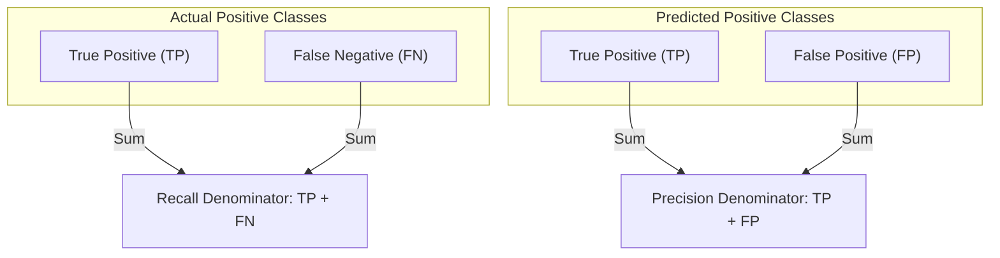

# Class Imbalance Metrics: Precision, Recall, & F1-Score

[](https://colab.research.google.com/github/RiazML/machine-learning-notes/blob/main/notebooks/077_precision_recall_and_f1_score.ipynb)

When dealing with imbalanced datasets (e.g., fraud detection, rare medical conditions), standard classification accuracy is a deceptive metric. In these contexts, we require metrics focused on the positive class: **Precision**, **Recall**, and the **F1-Score**.

---

## 1. Mathematical Definitions



### Precision (Positive Predictive Value)

Precision measures the accuracy of positive predictions: out of all samples the model predicted as positive, how many were actually positive?
$$\text{Precision} = \frac{TP}{TP + FP}$$

- **Use Case**: When the cost of a false positive is high (e.g., email spam detection: classifying a legitimate business email as spam is highly disruptive).

### Recall (Sensitivity / True Positive Rate)

Recall measures the model's ability to find all positive instances: out of all actual positive samples, how many did the model correctly identify?
$$\text{Recall} = \frac{TP}{TP + FN}$$

- **Use Case**: When the cost of a false negative is high (e.g., cancer detection: missing a patient who has cancer is potentially fatal).

### The Precision-Recall Trade-off

Increasing the classification threshold increases Precision but decreases Recall. Decreasing the threshold increases Recall but decreases Precision.

### F1-Score (Harmonic Mean)

The F1-Score combines Precision and Recall into a single metric. It is defined as the **harmonic mean** of Precision and Recall:
$$\text{F1} = 2 \cdot \frac{\text{Precision} \cdot \text{Recall}}{\text{Precision} + \text{Recall}}$$

#### Why Harmonic Mean instead of Arithmetic Mean?

The arithmetic mean treats both metrics additively, which can hide poor performance in one metric. The harmonic mean penalizes extreme values:

- Suppose $\text{Precision} = 1.0$ and $\text{Recall} = 0.0$.
  - Arithmetic Mean: $\frac{1.0 + 0.0}{2} = 0.5$ (misleadingly high).
  - Harmonic Mean: $2 \cdot \frac{1.0 \cdot 0.0}{1.0 + 0.0} = 0.0$ (correctly reflecting the failure to find any positives).

---

## 2. Python Implementation & Demonstration on Imbalanced Data

The following runnable Python script implements Precision, Recall, and F1-Score from scratch and demonstrates their value on a highly imbalanced mock dataset where accuracy fails to signal poor model performance.

```python
import numpy as np
from sklearn.metrics import accuracy_score, precision_score, recall_score, f1_score

# 1. Custom Metrics Implementation from Scratch
def calculate_precision_scratch(tp, fp):
    if (tp + fp) == 0:
        return 0.0
    return tp / (tp + fp)

def calculate_recall_scratch(tp, fn):
    if (tp + fn) == 0:
        return 0.0
    return tp / (tp + fn)

def calculate_f1_scratch(precision, recall):
    if (precision + recall) == 0:
        return 0.0
    return 2.0 * (precision * recall) / (precision + recall)

# 2. Setup Highly Imbalanced Dataset
# Out of 100 samples, only 5 are positive (Class 1)
np.random.seed(42)
y_true = np.array([0]*95 + [1]*5)

# Mock Model A: Predicts all negatives (Lazy Classifier)
y_pred_lazy = np.array([0] * 100)

# Mock Model B: Predicts some samples, gets 2 TP, but also 8 FP
y_pred_active = np.zeros(100, dtype=int)
y_pred_active[90:92] = 1  # Correct predictions (TP = 2)
y_pred_active[0:8] = 1    # False alarms (FP = 8)

# 3. Analyze Model A (Lazy Classifier)
# tp = 0, fp = 0, tn = 95, fn = 5
acc_a = accuracy_score(y_true, y_pred_lazy)
prec_a = precision_score(y_true, y_pred_lazy, zero_division=0)
rec_a = recall_score(y_true, y_pred_lazy, zero_division=0)
f1_a = f1_score(y_true, y_pred_lazy, zero_division=0)

print("=== Model A (Lazy Negative Classifier) ===")
print(f"Accuracy:  {acc_a:.4f} (Very high but misleading!)")
print(f"Precision: {prec_a:.4f}")
print(f"Recall:    {rec_a:.4f}")
print(f"F1-Score:  {f1_a:.4f}")

# 4. Analyze Model B (Active Classifier)
# actual positives are at indexes 95-99.
# predictions of 1 are at 0-7 (FP) and 90-91 (which are 0, so FP too).
# Wait, let's recount TP, FP, TN, FN for model B:
# actual: index 0 to 94 are 0, 95 to 99 are 1.
# predicted: index 0 to 7 are 1 (actual 0 -> FP = 8).
# predicted: index 90 to 91 are 1 (actual 0 -> FP = 2).
# Total predicted 1s = 10, all are actually 0! TP = 0, FP = 10.
# Let's adjust Mock Model B predictions to have some actual True Positives:
y_pred_active = np.zeros(100, dtype=int)
y_pred_active[95:97] = 1 # TP = 2, FN = 3 (since 97,98,99 are missed)
y_pred_active[0:8] = 1   # FP = 8, TN = 87 (since 8-94 are predicted 0)

tp = np.sum((y_true == 1) & (y_pred_active == 1))
fp = np.sum((y_true == 0) & (y_pred_active == 1))
tn = np.sum((y_true == 0) & (y_pred_active == 0))
fn = np.sum((y_true == 1) & (y_pred_active == 0))

acc_b = accuracy_score(y_true, y_pred_active)
prec_b_scratch = calculate_precision_scratch(tp, fp)
rec_b_scratch = calculate_recall_scratch(tp, fn)
f1_b_scratch = calculate_f1_scratch(prec_b_scratch, rec_b_scratch)

prec_b_sklearn = precision_score(y_true, y_pred_active)
rec_b_sklearn = recall_score(y_true, y_pred_active)
f1_b_sklearn = f1_score(y_true, y_pred_active)

print("\n=== Model B (Active Classifier) ===")
print(f"TP={tp}, FP={fp}, TN={tn}, FN={fn}")
print(f"Accuracy (Sklearn): {acc_b:.4f}")
print(f"Precision (Scratch): {prec_b_scratch:.4f} | Sklearn: {prec_b_sklearn:.4f}")
print(f"Recall (Scratch):    {rec_b_scratch:.4f} | Sklearn: {rec_b_sklearn:.4f}")
print(f"F1-Score (Scratch):  {f1_b_scratch:.4f} | Sklearn: {f1_b_sklearn:.4f}")

# Assert correctness
assert np.isclose(prec_b_scratch, prec_b_sklearn)
assert np.isclose(rec_b_scratch, rec_b_sklearn)
assert np.isclose(f1_b_scratch, f1_b_sklearn)
print("\n[SUCCESS] Custom Precision, Recall, and F1 calculations match Scikit-Learn exactly!")
```

---

- **Next Topic**: [078_roc_curve_in_machine_learning.md](file:///Users/prime/Developer/ml/078_roc_curve_in_machine_learning.md) - Model Evaluation: ROC Curve and AUC.
