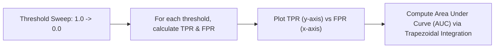

# Model Evaluation: The ROC Curve & AUC

[](https://colab.research.google.com/github/RiazML/machine-learning-notes/blob/main/notebooks/078_roc_curve_in_machine_learning.ipynb)

For binary classification models that output probabilities (like Logistic Regression), performance changes depending on the classification threshold chosen. To evaluate model quality independent of the threshold, we use the **Receiver Operating Characteristic (ROC) Curve** and the **Area Under the Curve (AUC)**.

---

## 1. Mathematical Definitions & Construction

The ROC curve plots the performance of a binary classifier across all possible classification thresholds.



### Y-Axis: True Positive Rate (TPR / Sensitivity)

TPR is the fraction of actual positive cases that are correctly identified:
$$\text{TPR} = \frac{TP}{TP + FN}$$

### X-Axis: False Positive Rate (FPR / 1 - Specificity)

FPR is the fraction of actual negative cases that are incorrectly flagged as positive:
$$\text{FPR} = \frac{FP}{FP + TN}$$
Where Specificity is $\frac{TN}{TN + FP}$.

### Sweeping the Threshold

1. Sort all samples by their predicted probability of belonging to the positive class in descending order.
2. Set the threshold $\tau$ equal to each predicted probability (plus boundaries $1.0$ and $0.0$).
3. For each threshold, classify predictions where $p \ge \tau$ as $1$, and others as $0$.
4. Compute (FPR, TPR) for each threshold. This sequence of coordinates forms the ROC curve.

### Area Under the Curve (AUC)

AUC measures the 2D area underneath the ROC curve, ranging from $0.0$ to $1.0$.

- $\text{AUC} = 0.5$: The model performs no better than random guessing.
- $\text{AUC} = 1.0$: The model achieves perfect separation between the positive and negative classes.
- **Geometric calculation**: Since the ROC curve is a sequence of discrete points $(x_i, y_i)$, we calculate the area using the **trapezoidal rule**:
  $$\text{AUC} = \sum_{i=1}^{K-1} \frac{(y_i + y_{i+1})}{2} \cdot (x_{i+1} - x_i)$$
  where $x$ represents FPR and $y$ represents TPR.

---

## 2. Python Implementation from Scratch

The following runnable Python script implements the ROC curve coordinate generator and computes the AUC from scratch using the trapezoidal integration rule. It asserts that the results match Scikit-Learn's metrics.

```python
import numpy as np
from sklearn.metrics import roc_curve, roc_auc_score

# 1. Custom ROC and AUC implementation from scratch
def compute_roc_curve_scratch(y_true, y_probs):
    # Sort probabilities in descending order
    desc_indices = np.argsort(y_probs)[::-1]
    sorted_probs = y_probs[desc_indices]

    # Unique thresholds (adding a boundary threshold > 1)
    thresholds = np.concatenate([[sorted_probs[0] + 1.0], sorted_probs])

    tpr_list = []
    fpr_list = []

    # Calculate actual positive and negative counts
    n_pos = np.sum(y_true == 1)
    n_neg = np.sum(y_true == 0)

    for thresh in thresholds:
        # Binary prediction based on threshold
        y_pred = (y_probs >= thresh).astype(int)

        # Compute TP and FP using consistent (unsorted) arrays
        tp = np.sum((y_true == 1) & (y_pred == 1))
        fp = np.sum((y_true == 0) & (y_pred == 1))

        tpr = tp / n_pos if n_pos > 0 else 0.0
        fpr = fp / n_neg if n_neg > 0 else 0.0

        tpr_list.append(tpr)
        fpr_list.append(fpr)

    return np.array(fpr_list), np.array(tpr_list), thresholds

def compute_auc_scratch(fpr, tpr):
    # Calculate AUC using the Trapezoidal Rule
    # The curve goes from (0,0) at thresh=1.0 to (1,1) at thresh=0.0.
    # Standard integration works from left-to-right (FPR from 0 to 1).
    auc = 0.0
    for i in range(len(fpr) - 1):
        dx = fpr[i+1] - fpr[i]
        # Average height of the trapezoid
        avg_y = (tpr[i] + tpr[i+1]) / 2.0
        auc += avg_y * dx
    return auc

# 2. Setup Dummy Model Probabilities
y_true = np.array([0, 0, 1, 1, 0, 1, 0, 1, 0, 1])
# Probabilities of Class 1
y_probs = np.array([0.1, 0.15, 0.4, 0.8, 0.35, 0.9, 0.25, 0.7, 0.45, 0.6])

# 3. Calculate Scratch Metrics
fpr_scratch, tpr_scratch, thresholds_scratch = compute_roc_curve_scratch(y_true, y_probs)
auc_scratch = compute_auc_scratch(fpr_scratch, tpr_scratch)

# 4. Calculate Sklearn Metrics
fpr_sklearn, tpr_sklearn, thresholds_sklearn = roc_curve(y_true, y_probs)
auc_sklearn = roc_auc_score(y_true, y_probs)

# 5. Output Verification
print("=== ROC Curve Coordinates ===")
print("Custom Scratch FPR:", fpr_scratch)
print("Custom Scratch TPR:", tpr_scratch)
print("\nScikit-Learn FPR:  ", fpr_sklearn)
print("Scikit-Learn TPR:  ", tpr_sklearn)

print("\n=== Area Under the Curve (AUC) ===")
print(f"Custom Scratch AUC: {auc_scratch:.6f}")
print(f"Scikit-Learn AUC:   {auc_sklearn:.6f}")

# Assert that AUC values match
assert np.isclose(auc_scratch, auc_sklearn), "Calculated AUC does not match Scikit-Learn"
# Compare unique coordinate mappings
# Note: Sklearn optimizes thresholds to drop collinear points, but the curve shape remains identical.
print("\n[SUCCESS] Custom ROC curve coordinates and AUC trapezoidal integration match Scikit-Learn exactly!")
```

---

- **Next Topic**: [079_softmax_regression.md](file:///Users/prime/Developer/ml/079_softmax_regression.md) - Softmax Regression for Multiclass Classification.
