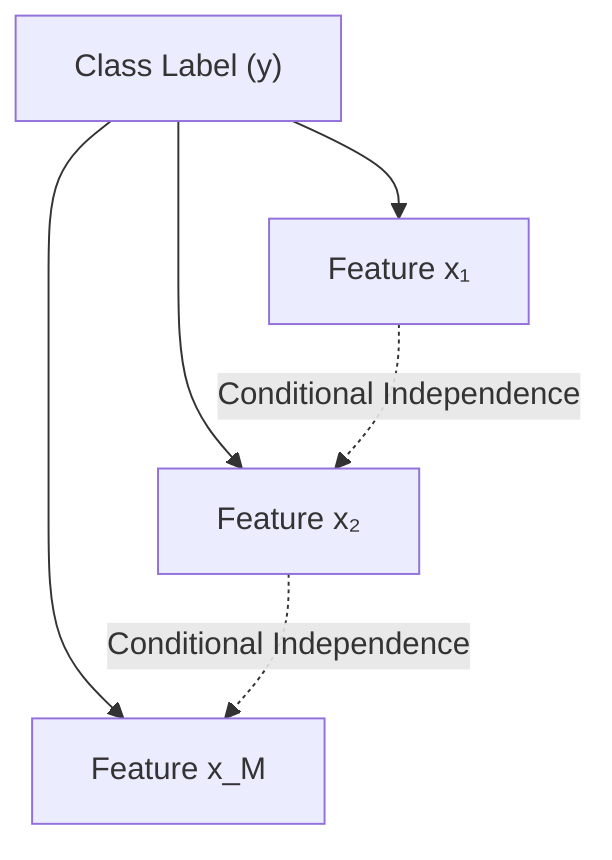

# Naive Bayes Classifier Part 6: The "Naive" Assumption

[](https://colab.research.google.com/github/RiazML/machine-learning-notes/blob/main/notebooks/087_naive_bayes_classifier.ipynb)

To classify an instance with $M$ features $x = [x_1, x_2, \ldots, x_M]^T$, Bayes' Theorem dictates:
$$P(y \mid x_1, \ldots, x_M) = \frac{P(x_1, \ldots, x_M \mid y) \cdot P(y)}{P(x_1, \ldots, x_M)}$$

Estimating the joint probability term $P(x_1, \ldots, x_M \mid y)$ directly from data is computationally intractable for large $M$. The **Naive Bayes** algorithm resolves this by introducing the **Class Conditional Independence Assumption**.

---

## 1. The Computational Curse of Joint Distributions

If we have $M$ binary features (each taking values $0$ or $1$), the joint distribution $P(x_1, \ldots, x_M \mid y)$ has $2^M$ possible combinations.

- To estimate this distribution, we would need to learn $2^M - 1$ parameters for each class.
- If $M = 30$, we must estimate $2^{30} - 1 \approx 1.07 \times 10^9$ parameters. This requires a massive dataset to avoid zero-frequency problems for rare feature combinations.

---

## 2. The Naive Assumption

The Naive Bayes classifier assumes that **all features are conditionally independent of each other, given the class label $y$**.

Mathematically, this means:
$$P(x_1, x_2, \ldots, x_M \mid y) = P(x_1 \mid y) \cdot P(x_2 \mid y) \cdots P(x_M \mid y)$$

Using product notation:
$$P(x_1, \ldots, x_M \mid y) = \prod_{j=1}^M P(x_j \mid y)$$

### Graphical Model representation

In a Bayesian network structure, the class label $y$ is the sole parent node of all feature nodes $x_j$, and there are no edges between features.



### Reduction in Complexity

With this assumption:

- Instead of estimating the joint probability space of size $2^M$, we estimate each feature's distribution independently.
- For $M$ binary features, this requires estimating only $M$ parameters per class.
- Complexity drops from **exponential** $O(2^M)$ to **linear** $O(M)$.

---

## 3. Python Verification: Parameter Space Complexity Analysis

The following runnable Python script calculates and compares the number of parameters needed to represent a joint distribution versus a Naive Bayes model for binary features as the feature count scales.

```python
import numpy as np

# 1. Parameter calculation functions
def compute_joint_parameters(n_features):
    # For N binary features, the joint probability table has 2^N entries.
    # The sum of all entries is 1.0, so there are 2^N - 1 free parameters.
    # We do this for each of the K classes (assume K=2).
    return 2.0 * (2**n_features - 1)

def compute_naive_bayes_parameters(n_features):
    # For N binary features under the conditional independence assumption,
    # we need P(x_j = 1 | y) for each feature j and class y.
    # This requires 1 parameter per feature per class.
    # Plus 1 parameter for the class prior P(y).
    return 2.0 * n_features + 1

# 2. Compare scaling from 1 to 15 features
feature_counts = np.arange(1, 16)
joint_params = [compute_joint_parameters(f) for f in feature_counts]
nb_params = [compute_naive_bayes_parameters(f) for f in feature_counts]

print("=== Parameter Space Complexity Comparison (Binary Features) ===")
print(f"{'Features M':<12} | {'Full Joint Params':<20} | {'Naive Bayes Params':<20} | {'Ratio (Joint/NB)':<15}")
print("-" * 75)
for i, f in enumerate(feature_counts):
    ratio = joint_params[i] / nb_params[i]
    print(f"{f:<12} | {joint_params[i]:<20} | {nb_params[i]:<20} | {ratio:<15.2f}")

# 3. Assert correctness of equations
# For 10 features:
# Joint parameters: 2 * (1024 - 1) = 2046
# NB parameters: 2 * 10 + 1 = 21
assert compute_joint_parameters(10) == 2046
assert compute_naive_bayes_parameters(10) == 21
print("\n[SUCCESS] Complexity reduction mathematically verified. At M=15 features, Naive Bayes reduces parameters by over 2000x!")
```

---

- **Next Topic**: [088_naive_bayes_classifier.md](file:///Users/prime/Developer/ml/088_naive_bayes_classifier.md) - Naive Bayes Classifier Part 7: Laplace Smoothing.
