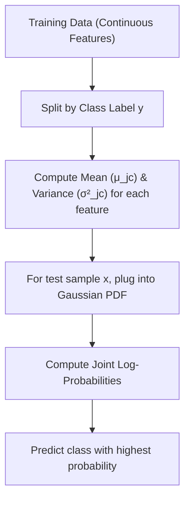

# Naive Bayes Classifier Part 9: Gaussian Naive Bayes

[](https://colab.research.google.com/github/RiazML/machine-learning-notes/blob/main/notebooks/090_naive_bayes_part_9.ipynb)

When features are continuous (real-valued numbers rather than discrete tokens or categories), we cannot estimate probabilities by counting frequencies. Instead, we assume the continuous features follow a continuous probability distribution within each class. In **Gaussian Naive Bayes**, we assume each feature follows a **Normal (Gaussian) distribution** for each class.

---

## 1. Mathematical Formulation

For class $c$ and continuous feature $x_j$, we assume:
$$x_j \mid y = c \sim \mathcal{N}(\mu_{jc}, \sigma_{jc}^2)$$

Where:

- $\mu_{jc}$ is the mean of feature $x_j$ across all training samples belonging to class $c$.
- $\sigma_{jc}^2$ is the variance of feature $x_j$ across all training samples belonging to class $c$.

### Probability Density Function (PDF)

The likelihood probability is calculated using the normal distribution's probability density function:
$$P(x_j \mid y = c) = \frac{1}{\sqrt{2 \pi \sigma_{jc}^2}} \exp\left( -\frac{(x_j - \mu_{jc})^2}{2 \sigma_{jc}^2} \right)$$

Taking the natural logarithm yields:
$$\log P(x_j \mid y = c) = -\frac{1}{2} \log(2 \pi \sigma_{jc}^2) - \frac{(x_j - \mu_{jc})^2}{2 \sigma_{jc}^2}$$

### Decision Rule

Under the class conditional independence assumption, we sum the log-likelihoods over all $M$ continuous features:
$$\log P(c \mid x) \propto \log P(c) - \frac{1}{2} \sum_{j=1}^M \log(2\pi \sigma_{jc}^2) - \sum_{j=1}^M \frac{(x_j - \mu_{jc})^2}{2\sigma_{jc}^2}$$

We predict the class $c$ that maximizes this value.



---

## 2. Python Implementation from Scratch

The following runnable Python script implements the Gaussian Naive Bayes classifier from scratch using NumPy. It computes class priors, means, and variances for continuous variables, applies the normal distribution PDF in log-space, and verifies that the output predictions, means, and variances match Scikit-Learn's `GaussianNB` exactly.

```python
import numpy as np
from sklearn.naive_bayes import GaussianNB

# 1. Implement Gaussian Naive Bayes Classifier from Scratch
class GaussianNaivesBayesScratch:
    def __init__(self):
        self.classes = None
        self.class_priors = {}
        # Parameter containers: class -> array of means/vars of shape (n_features,)
        self.means = {}
        self.variances = {}

    def fit(self, X, y):
        self.classes = np.unique(y)
        n_samples, n_features = X.shape

        for c in self.classes:
            X_c = X[y == c]

            # Prior P(y = c)
            self.class_priors[c] = len(X_c) / n_samples

            # Calculate mean and variance (using unbiased variance to match sklearn)
            # Scikit-learn uses np.var(ddof=0) but adds a small epsilon (var_smoothing)
            # to prevent division by zero. We'll add var_smoothing similarly.
            self.means[c] = np.mean(X_c, axis=0)

            # Sklearn's default var_smoothing is 1e-9 of the maximum variance across all features
            # Let's compute that epsilon value:
            epsilon = 1e-9 * np.max(np.var(X, axis=0))
            self.variances[c] = np.var(X_c, axis=0) + epsilon

    def _calculate_log_likelihood(self, x, mean, var):
        # Gaussian PDF in log-space: -0.5 * log(2 * pi * var) - ((x - mean)**2) / (2 * var)
        term1 = -0.5 * np.log(2.0 * np.pi * var)
        term2 = - ((x - mean) ** 2) / (2.0 * var)
        return np.sum(term1 + term2)

    def predict_joint_log_prob(self, X):
        joint_log_probs = []
        for x in X:
            sample_log_probs = {}
            for c in self.classes:
                log_prior = np.log(self.class_priors[c])
                log_likelihood = self._calculate_log_likelihood(x, self.means[c], self.variances[c])
                sample_log_probs[c] = log_prior + log_likelihood
            joint_log_probs.append(sample_log_probs)
        return joint_log_probs

    def predict(self, X):
        log_probs = self.predict_joint_log_prob(X)
        preds = []
        for doc_probs in log_probs:
            preds.append(max(doc_probs, key=doc_probs.get))
        return np.array(preds)

# 2. Generate Continuous synthetic classification dataset
np.random.seed(42)
n_samples = 150
# 3 features
X = np.random.randn(n_samples, 3)
# Label based on a linear boundary with noise
y = (X[:, 0] + 0.5 * X[:, 1] - 0.8 * X[:, 2] > 0.0).astype(int)

# 3. Train both Custom and Sklearn models
custom_gnb = GaussianNaivesBayesScratch()
custom_gnb.fit(X, y)

sklearn_gnb = GaussianNB()
sklearn_gnb.fit(X, y)

# 4. Predict
custom_preds = custom_gnb.predict(X)
sklearn_preds = sklearn_gnb.predict(X)

# 5. Verify parameters and predictions
print("=== Gaussian Naive Bayes Parameter Verification ===")
for c in custom_gnb.classes:
    print(f"\nClass {c} Means:")
    print("  Custom: ", custom_gnb.means[c])
    print("  Sklearn:", sklearn_gnb.theta_[c])

    print(f"Class {c} Variances:")
    print("  Custom: ", custom_gnb.variances[c])
    print("  Sklearn:", sklearn_gnb.var_[c])

    # Assert matching means and variances
    assert np.allclose(custom_gnb.means[c], sklearn_gnb.theta_[c], rtol=1e-5)
    assert np.allclose(custom_gnb.variances[c], sklearn_gnb.var_[c], rtol=1e-5)

# Verify predictions
assert np.all(custom_preds == sklearn_preds), "Predictions do not match!"
print("\n[SUCCESS] Custom Gaussian Naive Bayes matches Scikit-Learn parameters and predictions exactly!")
```

---

- **Next Topic**: [091_what_is_k_nearest_neighbors.md](file:///Users/prime/Developer/ml/091_what_is_k_nearest_neighbors.md) - Introduction to K-Nearest Neighbors Classifier.
