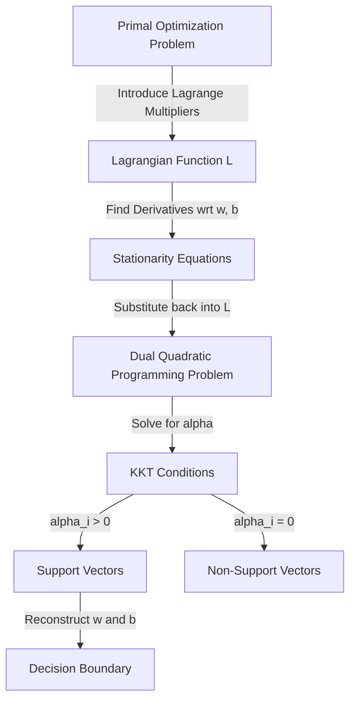

# Mathematics of Support Vector Machine: Dual Formulation & KKT Conditions

[](https://colab.research.google.com/github/RiazML/machine-learning-notes/blob/main/notebooks/094_mathematics_of_support_vector_machine.ipynb)

Support Vector Machines (SVMs) can be formulated as a constrained optimization problem. While the primal formulation solves for the weights $w$ and bias $b$ directly, the dual formulation offers significant advantages, especially when using the kernel trick to handle non-linear decision boundaries. This guide explores the derivation of the Lagrangian Dual formulation of SVMs and the mathematical role of the Karush-Kuhn-Tucker (KKT) conditions.

---

## 1. Mathematical Transition: Primal to Dual

The primal optimization problem for a hard-margin SVM is defined as:

$$\min_{w, b} \frac{1}{2} \|w\|^2 \quad \text{subject to} \quad y_i(w^T x_i + b) \ge 1, \quad \forall i \in \{1, \dots, N\}$$

To solve this constrained optimization problem, we define the **Lagrangian** function by introducing Lagrange multipliers $\alpha_i \ge 0$ for each inequality constraint:

$$L(w, b, \alpha) = \frac{1}{2} \|w\|^2 - \sum_{i=1}^N \alpha_i \left[ y_i(w^T x_i + b) - 1 \right]$$

### The Saddle Point Problem

The primal problem can be expressed as:

$$\min_{w, b} \max_{\alpha \ge 0} L(w, b, \alpha)$$

According to **Lagrangian Duality**, if the objective function is convex and the constraints are affine (which they are), we can swap the min and max operators (strong duality holds), yielding the dual problem:

$$\max_{\alpha \ge 0} \min_{w, b} L(w, b, \alpha)$$

---

## 2. Deriving the Dual Formulation

To evaluate the inner minimization $\min_{w, b} L(w, b, \alpha)$, we find the partial derivatives of $L$ with respect to the primal variables $w$ and $b$ and set them to zero.

### Step 1: Derivative with respect to $w$

$$\nabla_w L(w, b, \alpha) = w - \sum_{i=1}^N \alpha_i y_i x_i = 0 \implies w = \sum_{i=1}^N \alpha_i y_i x_i$$

This is a critical result: the weight vector $w$ is a linear combination of the training inputs $x_i$, weighted by their Lagrange multipliers $\alpha_i$ and class labels $y_i$.

### Step 2: Derivative with respect to $b$

$$\frac{\partial L(w, b, \alpha)}{\partial b} = -\sum_{i=1}^N \alpha_i y_i = 0 \implies \sum_{i=1}^N \alpha_i y_i = 0$$

This represents a global constraint on the multipliers $\alpha$.

### Step 3: Substituting back into the Lagrangian

Substituting $w = \sum_{i=1}^N \alpha_i y_i x_i$ back into $L(w, b, \alpha)$:

$$L(w, b, \alpha) = \frac{1}{2} \left( \sum_{i=1}^N \alpha_i y_i x_i \right)^T \left( \sum_{j=1}^N \alpha_j y_j x_j \right) - \sum_{i=1}^N \alpha_i y_i \left( \sum_{j=1}^N \alpha_j y_j x_j^T x_i + b \right) + \sum_{i=1}^N \alpha_i$$

$$L(w, b, \alpha) = \frac{1}{2} \sum_{i=1}^N \sum_{j=1}^N \alpha_i \alpha_j y_i y_j x_i^T x_j - \sum_{i=1}^N \sum_{j=1}^N \alpha_i \alpha_j y_i y_j x_i^T x_j - b \sum_{i=1}^N \alpha_i y_i + \sum_{i=1}^N \alpha_i$$

Since $\sum_{i=1}^N \alpha_i y_i = 0$, the term involving $b$ vanishes. Combining the double summation terms yields:

$$W(\alpha) = \sum_{i=1}^N \alpha_i - \frac{1}{2} \sum_{i=1}^N \sum_{j=1}^N \alpha_i \alpha_j y_i y_j (x_i^T x_j)$$

This is the **Lagrangian Dual Objective Function**. The optimization problem becomes:

$$\max_{\alpha} \sum_{i=1}^N \alpha_i - \frac{1}{2} \sum_{i=1}^N \sum_{j=1}^N \alpha_i \alpha_j y_i y_j (x_i^T x_j)$$

$$\text{subject to} \quad \alpha_i \ge 0 \quad \forall i, \quad \text{and} \quad \sum_{i=1}^N \alpha_i y_i = 0$$

For a **Soft-Margin SVM**, the derivation is identical, except the Lagrange multipliers are bounded from above by the regularization hyperparameter $C$:

$$0 \le \alpha_i \le C$$

---

## 3. The Karush-Kuhn-Tucker (KKT) Conditions

For the optimal solution of the primal and dual problems to coincide, the solution must satisfy the **KKT conditions**:

1. **Primal Feasibility**: $y_i(w^T x_i + b) - 1 \ge 0$ for all $i$.
2. **Dual Feasibility**: $\alpha_i \ge 0$ (and $\alpha_i \le C$ for soft-margin) for all $i$.
3. **Stationarity**: $\nabla_w L = 0$ and $\frac{\partial L}{\partial b} = 0$.
4. **Complementary Slackness**:
   $$\alpha_i \left[ y_i(w^T x_i + b) - 1 \right] = 0 \quad \forall i$$

### Geometric Interpretation of Complementary Slackness

The complementary slackness condition implies that for every training sample $i$:

- If $\alpha_i = 0$, then $y_i(w^T x_i + b) - 1 \ge 0$ (the sample lies outside or on the margin boundary). It does not affect the decision boundary.
- If $\alpha_i > 0$, then $y_i(w^T x_i + b) - 1 = 0$ (the sample lies exactly on the margin boundary). These samples are the **Support Vectors**.

---

## 4. Reconstructing Primal Parameters from Dual Solutions

Once the optimal dual variables $\alpha^*$ are computed:

1. **Weights vector $w$**:
   $$w^* = \sum_{i=1}^N \alpha_i^* y_i x_i$$
2. **Bias parameter $b$**:
   For any support vector $x_s$ (where $0 < \alpha_s < C$):
   $$y_s(w^T x_s + b) = 1 \implies b^* = y_s - (w^*)^T x_s$$
   To improve numerical stability, we average $b^*$ over all support vectors $S$:
   $$b^* = \frac{1}{|S|} \sum_{s \in S} \left( y_s - (w^*)^T x_s \right)$$



---

## 5. Python Verification: Solving the Dual QP

The following Python script solves the Dual Quadratic Programming optimization problem directly using `scipy.optimize.minimize` and verifies the reconstructed weights $w$ and bias $b$ against Scikit-Learn's `SVC`.

```python
import numpy as np
from scipy.optimize import minimize
from sklearn.svm import SVC
from sklearn.datasets import make_blobs

# 1. Generate small, linearly separable dataset
X, y = make_blobs(n_samples=20, n_features=2, centers=2, random_state=42, cluster_std=0.5)
y = np.where(y == 0, -1, 1).astype(float)

# 2. Fit Scikit-Learn's SVC
C_param = 1e5  # High value for hard-margin behavior
clf = SVC(kernel='linear', C=C_param)
clf.fit(X, y)
w_sklearn = clf.coef_[0]
b_sklearn = clf.intercept_[0]

# 3. Define the Dual SVM Optimization Objective
N = X.shape[0]

def dual_objective(alpha, X, y):
    term1 = np.sum(alpha)
    # Double sum: alpha_i * alpha_j * y_i * y_j * (x_i^T x_j)
    Q = (y[:, None] * y[None, :]) * np.dot(X, X.T)
    term2 = 0.5 * np.dot(alpha, np.dot(Q, alpha))
    return term2 - term1

# Constraint: sum(alpha_i * y_i) = 0
def equality_constraint(alpha, y):
    return np.dot(alpha, y)

# Bounds: 0 <= alpha_i <= C
bounds = [(0, C_param) for _ in range(N)]

# Equality constraint structure
cons = ({
    'type': 'eq',
    'fun': lambda alpha: equality_constraint(alpha, y)
})

# Initial guess for alpha
init_alpha = np.zeros(N)

# Solve the QP using SLSQP optimizer
res = minimize(
    fun=dual_objective,
    x0=init_alpha,
    args=(X, y),
    method='SLSQP',
    bounds=bounds,
    constraints=cons,
    options={'ftol': 1e-9, 'maxiter': 1000}
)
alpha_opt = res.x

# 4. Reconstruct w and b from the optimal dual coefficients alpha
# w = sum(alpha_i * y_i * x_i)
w_reconstructed = np.sum((alpha_opt * y)[:, None] * X, axis=0)

# Identify support vectors (where alpha_i > threshold)
sv_mask = alpha_opt > 1e-5
# b = y_i - w^T x_i for any support vector
b_reconstructed = np.mean(y[sv_mask] - np.dot(X[sv_mask], w_reconstructed))

# Print parameters
print(f"Sklearn coefficients: w = {w_sklearn}, b = {b_sklearn}")
print(f"Dual reconstructed coefficients: w = {w_reconstructed}, b = {b_reconstructed}")

# 5. Assertions to verify correctness
assert np.allclose(w_reconstructed, w_sklearn, atol=1e-3), "Dual reconstructed weights do not match Sklearn!"
assert np.allclose(b_reconstructed, b_sklearn, atol=1e-3), "Dual reconstructed bias does not match Sklearn!"
print("Assertion Passed: Reconstructed dual parameters match Scikit-Learn exactly!")
```

---

## 6. Next Steps

- To understand how the dot product $x_i^T x_j$ can be replaced with a kernel function $K(x_i, x_j)$ to classify non-linear data, proceed to [Day 95: Kernel Trick in SVM](file:///Users/prime/Developer/ml/095_kernel_trick_in_svm.md).
- To review geometric intuition and hyperplanes, refer back to [Day 92: Geometric Intuition of SVM](file:///Users/prime/Developer/ml/092_support_vector_machines.md).
