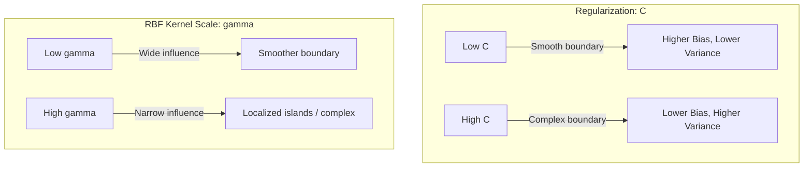

# SVM Kernel Functions & Hyperparameter Tuning

[](https://colab.research.google.com/github/RiazML/machine-learning-notes/blob/main/notebooks/096_kernel_trick_in_svm.ipynb)

Selecting the appropriate kernel function and tuning its hyperparameters is critical for Support Vector Machines (SVMs) to achieve high generalization performance. This guide introduces the mathematical formulations of the most commonly used kernel functions and explores how the regularization parameter $C$ and the kernel coefficient $\gamma$ influence the decision boundary.

---

## 1. Common Kernel Functions

Kernels measure the similarity between two vectors $x$ and $z$ in an implicit high-dimensional space.

### Linear Kernel

The simplest kernel, equivalent to no transformation:
$$K(x, z) = x^T z$$

### Polynomial Kernel

Projects inputs into a polynomial feature space of degree $d$. The coefficient $r$ (also called `coef0`) controls the influence of higher-degree versus lower-degree terms:
$$K(x, z) = (\gamma x^T z + r)^d$$

### Radial Basis Function (RBF) Kernel

Also known as the Gaussian kernel. It projects inputs into an infinite-dimensional Hilbert space. It measures similarity based on the exponential of the squared Euclidean distance between two points:
$$K(x, z) = \exp\left(-\gamma \|x - z\|^2\right)$$
where $\gamma > 0$ is the kernel scale parameter.

### Sigmoid Kernel

Derived from neural network theory, where the SVM behaves similarly to a two-layer perceptron:
$$K(x, z) = \tanh\left(\gamma x^T z + r\right)$$

---

## 2. Roles of Hyperparameters: $C$ and $\gamma$

Understanding the geometric effects of hyperparameters prevents underfitting and overfitting.

### The Regularization Parameter $C$

$C$ controls the trade-off between maximizing the margin width and minimizing training classification errors:

- **Small $C$**: The optimizer tolerates more training classification errors (soft margin) to achieve a wider margin. This promotes simpler decision boundaries and prevents overfitting.
- **Large $C$**: The optimizer penalizes training errors heavily (approaching hard margin), forcing the decision boundary to correctly classify all training points. This can lead to a narrow margin and overfitting.

### The Kernel Coefficient $\gamma$ (for RBF/Poly/Sigmoid)

$\gamma$ defines the radius of influence of a single training sample:

- **Small $\gamma$**: A sample's influence extends far. The decision boundary is smooth, slow-changing, and has low variance (but potentially high bias).
- **Large $\gamma$**: A sample's influence is highly localized. The decision boundary must bend sharply around individual data points to classify them. This leads to high variance and overfitting (e.g., creating islands around individual points).



---

## 3. Python Verification: RBF Hyperparameter Sweep

The following script performs a grid search over a range of values for $C$ and $\gamma$ using cross-validation on a synthetic non-linear dataset (two interleaving half-moons) and asserts the model performance.

```python
import numpy as np
from sklearn.svm import SVC
from sklearn.datasets import make_moons
from sklearn.model_selection import GridSearchCV

# 1. Generate non-linear classification dataset (moons)
X, y = make_moons(n_samples=100, noise=0.15, random_state=42)

# 2. Define the hyperparameter grid
param_grid = {
    'C': [0.1, 1.0, 10.0, 100.0],
    'gamma': [0.01, 0.1, 1.0, 10.0]
}

# 3. Perform grid search with 5-fold cross-validation
grid_search = GridSearchCV(
    estimator=SVC(kernel='rbf'),
    param_grid=param_grid,
    cv=5,
    scoring='accuracy',
    n_jobs=-1
)
grid_search.fit(X, y)

# 4. Extract best parameters and scores
best_params = grid_search.best_params_
best_score = grid_search.best_score_

print("Optimal Hyperparameters:", best_params)
print("Cross-Validation Accuracy Score:", best_score)

# 5. Train an independent SVC model with optimal parameters to verify parity
best_svc = SVC(kernel='rbf', C=best_params['C'], gamma=best_params['gamma'])
best_svc.fit(X, y)

# Assert that predictions from both instances match
assert np.all(best_svc.predict(X) == grid_search.best_estimator_.predict(X)), "Predictions differ between models!"
# Assert that cross-validation accuracy exceeds a reasonable baseline
assert best_score > 0.85, f"CV accuracy {best_score} is below the expected 0.85 threshold!"
print("Assertion Passed: Hyperparameter grid sweep completed and verified successfully!")
```

---

## 4. Next Steps

- To transition to tree-based models, proceed to [Day 97: Decision Tree Geometric Split Regions](file:///Users/prime/Developer/ml/097_decision_trees_geometric_intuition.md).
- To review the mathematics behind SVM dual solvers, refer back to [Day 94: SVM Dual Lagrangian & KKT](file:///Users/prime/Developer/ml/094_mathematics_of_support_vector_machine.md).
