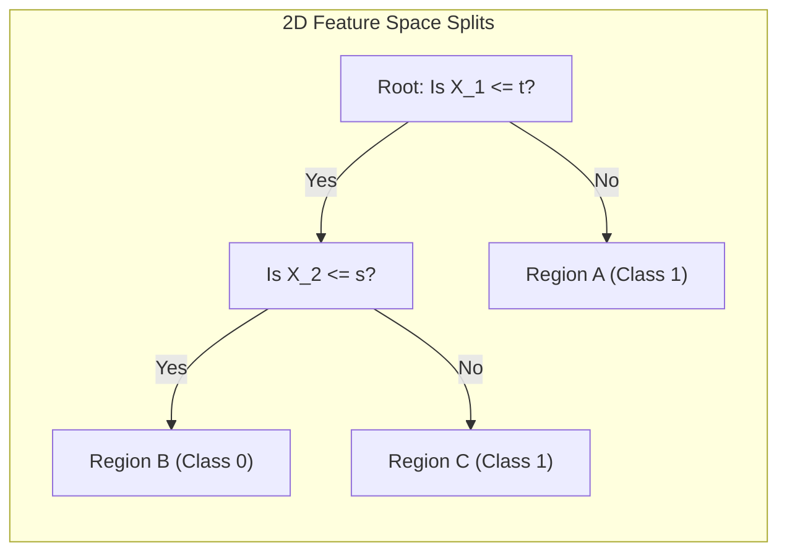

# Decision Trees: Geometric Intuition & Space Partitioning

[](https://colab.research.google.com/github/RiazML/machine-learning-notes/blob/main/notebooks/097_decision_trees_geometric_intuition.ipynb)

Decision Trees are highly intuitive machine learning algorithms that recursively split the feature space into distinct regions using conditional nested logic (`if-else` statements). Unlike parametric classifiers (like Logistic Regression or SVMs) that create a single continuous decision boundary across the entire feature space, a Decision Tree cuts the space orthogonally to form discrete regional subdivisions.

---

## 1. Geometric Intuition: Axis-Aligned Partitions

From a geometric standpoint, a Decision Tree partitions the feature space using **axis-aligned hyperplanes** (lines in 2D, flat planes in 3D, and hyperplanes in higher dimensions) that are always parallel to the coordinate axes of the input features.

### Splitting in Multiple Dimensions

1. **2D Space (Plane)**: Each split is a line perpendicular to one of the axes (e.g., $x_1 = t$ or $x_2 = s$). This cuts the 2D plane into rectangular regions (axis-aligned boxes).
2. **3D Space (Volume)**: Each split is a plane parallel to one of the coordinate planes (e.g., $x_3 = r$), cutting the 3D volume into cuboids (axis-aligned boxes).
3. **D-Dimensional Space**: Splits are $(D-1)$-dimensional axis-aligned hyperplanes, cutting the space into **hyper-rectangles** (hyper-cuboids).



### Visual Representation of the Splits

Consider a 2D space with features $X_1$ and $X_2$:

- A horizontal line at $X_2 = s$ divides the space into "above" and "below".
- A vertical line at $X_1 = t$ applied only to the "below" section creates sub-regions.
  Every leaf node in the decision tree corresponds to exactly one of these isolated axis-aligned bounding boxes. To classify a new sample, we simply locate which box it falls inside and assign it the majority class label of that box.

---

## 2. Tree Anatomy & Terminology

A decision tree is represented as a directed acyclic graph composed of nodes and edges:

- **Root Node**: The top node of the tree, representing the initial split over the entire dataset.
- **Decision Nodes (Internal Nodes)**: Nodes where the data splits based on a specific feature condition.
- **Leaf Nodes (Terminal Nodes)**: Nodes at the bottom of the tree that contain no further splits and represent the final class predictions or regression values.
- **Branches (Sub-trees)**: The pathways connecting the nodes.
- **Splitting Criteria**: The conditional rule (e.g., $X_j \le t$) applied at a decision node.

---

## 3. Python Verification: Programmatic Tree Traversal

The following Python script fits a Scikit-Learn `DecisionTreeClassifier` on a synthetic dataset and programmatically traverses its internal binary tree structure (`clf.tree_`) from scratch to assert that manual traversal matches Scikit-Learn's predictions.

```python
import numpy as np
from sklearn.tree import DecisionTreeClassifier
from sklearn.datasets import make_classification

# 1. Generate a synthetic 2D classification dataset
X, y = make_classification(n_samples=100, n_features=2, n_redundant=0, n_informative=2, random_state=42)

# 2. Fit a decision tree classifier
clf = DecisionTreeClassifier(max_depth=3, random_state=42)
clf.fit(X, y)

# 3. Custom recursive traversal of the tree structure
def traverse_decision_tree(sample, tree, node_id=0):
    # Retrieve the split feature and threshold for the current node
    feature = tree.feature[node_id]
    threshold = tree.threshold[node_id]

    # Check if we have reached a leaf node
    # Sklearn represents undefined split features at leaves as -2 (TREE_UNDEFINED)
    if feature == -2:
        # Return the class index with the maximum number of training samples in this node
        return np.argmax(tree.value[node_id][0])

    # Traverse down the left or right branch based on the feature threshold
    if sample[feature] <= threshold:
        return traverse_decision_tree(sample, tree, tree.children_left[node_id])
    else:
        return traverse_decision_tree(sample, tree, tree.children_right[node_id])

# 4. Predict classifications using both the manual traversal and Sklearn
predictions_scratch = np.array([traverse_decision_tree(x, clf.tree_) for x in X])
predictions_sklearn = clf.predict(X)

# 5. Verify correctness via assertions
assert np.all(predictions_scratch == predictions_sklearn), "Custom tree traversal does not match Sklearn!"
print("Assertion Passed: Custom programmatic tree traversal matches Scikit-Learn predictions exactly!")
```

---

## 4. Next Steps

- To understand how the tree decides which features and thresholds to split on using impurity metrics, proceed to [Day 98: Gini & Entropy Split Classifier](file:///Users/prime/Developer/ml/098_decision_trees.md).
- To review non-linear SVM kernels and parameter sweeps, refer back to [Day 96: SVM Kernel Hyperparameter Sweeps](file:///Users/prime/Developer/ml/096_kernel_trick_in_svm.md).
