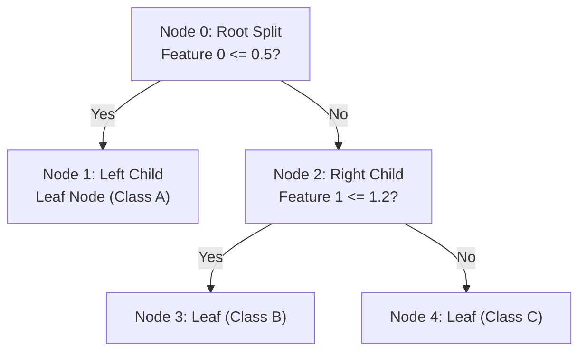

# Decision Tree Visualization & Internal Structure Traversal

[](https://colab.research.google.com/github/RiazML/machine-learning-notes/blob/main/notebooks/100_awesome_decision_tree_visualization_using_dtreeviz.ipynb)

Visualizing decision trees is critical for model interpretability, debugging, and explaining decision logic to stakeholders. While Scikit-Learn provides basic plotting utilities like `plot_tree`, advanced libraries like `dtreeviz` offer high-fidelity visualizations showing class distributions at each split point using histograms and scatter plots. This guide covers visualization concepts and demonstrates how to programmatically traverse the internal binary tree data structure of Scikit-Learn.

---

## 1. Visualizing Tree Splits

Standard decision tree plots can be difficult to read when trees are deep or features are high-dimensional. Advanced visualization tools improve upon default plots by:

1. **Histogram splits (Classification)**: Displaying the distribution of classes for the splitting feature at each decision node, highlighting how the chosen threshold separates the classes.
2. **Scatter plot splits (Regression)**: Plotting the feature value against the target value along with the prediction line to show the partition boundaries.
3. **Active prediction paths**: Highlighting the specific path a query sample takes from the root to the leaf node, showing the decision rules triggered at each node.



---

## 2. Programmatic Access to Scikit-Learn Tree Internals

Scikit-Learn stores the fitted binary tree structure inside the `tree_` attribute of the model. This object is an instance of `sklearn.tree._tree.Tree` and exposes several low-level arrays of size $N$ (where $N$ is the number of nodes in the tree):

- **`children_left`**: `children_left[i]` holds the node ID of the left child of node $i$, or `-1` if $i$ is a leaf node.
- **`children_right`**: `children_right[i]` holds the node ID of the right child of node $i$, or `-1` if $i$ is a leaf node.
- **`feature`**: `feature[i]` holds the feature index used to split node $i$. If $i$ is a leaf node, it contains `_tree.TREE_UNDEFINED` (value `-2`).
- **`threshold`**: `threshold[i]` holds the threshold value used to split node $i$. For leaf nodes, this is `-2`.
- **`value`**: `value[i]` is a 3D array of shape `(n_nodes, n_outputs, max_n_classes)` containing the class count distribution (for classification) or predicted values (for regression) at node $i$.

To trace how a specific sample is routed through the tree, we start at the root node (ID 0) and compare the sample's feature value against the node's threshold, recursively traversing left if `sample[feature] <= threshold` and right otherwise.

---

## 3. Python Verification: Programmatic Decision Path Traversal

The following Python script fits a `DecisionTreeClassifier` on a synthetic multiclass dataset, traverses the internal tree arrays to trace the decision path and English rule-paths for a query sample, and asserts that our scratch path matches Scikit-Learn's built-in `decision_path` method.

```python
import numpy as np
from sklearn.tree import DecisionTreeClassifier
from sklearn.datasets import make_classification

# 1. Generate a synthetic multiclass classification dataset
X, y = make_classification(n_samples=100, n_features=4, n_informative=3, n_redundant=0, n_classes=3, random_state=42)

# 2. Fit a DecisionTreeClassifier
clf = DecisionTreeClassifier(max_depth=3, random_state=42)
clf.fit(X, y)

# 3. Retrieve internal tree structures
tree = clf.tree_
children_left = tree.children_left
children_right = tree.children_right
feature = tree.feature
threshold = tree.threshold

# 4. Define a query sample to trace
query_sample = X[0]

# 5. Programmatically traverse the tree from root (node 0) to leaf
current_node = 0
scratch_path = []
english_rules = []

while True:
    scratch_path.append(int(current_node))
    f = int(feature[current_node])

    # If the feature is -2, we have reached a leaf node (TREE_UNDEFINED)
    if f == -2:
        break

    t = float(threshold[current_node])
    val = float(query_sample[f])

    if val <= t:
        english_rules.append(f"Node {current_node}: Feature {f} ({val:.4f}) <= {t:.4f}")
        current_node = children_left[current_node]
    else:
        english_rules.append(f"Node {current_node}: Feature {f} ({val:.4f}) > {t:.4f}")
        current_node = children_right[current_node]

# 6. Extract the decision path using Scikit-Learn's built-in method
sklearn_path = clf.decision_path(query_sample.reshape(1, -1)).indices.tolist()

# 7. Print and verify correctness via assertions
print("Scratch Decision Path Nodes:", scratch_path)
print("Sklearn Decision Path Nodes:", sklearn_path)
print("Reconstructed Traversal Rules:")
for rule in english_rules:
    print(f"  - {rule}")

assert scratch_path == sklearn_path, "Scratch decision path does not match Scikit-Learn's decision path!"
print("Assertion Passed: Reconstructed decision path and rules match Scikit-Learn exactly!")
```

---

## 4. Next Steps

- To understand how individual decision tree estimators can be combined into powerful ensemble models, proceed to [Day 101: Ensemble Learning & Jury Theorem Simulation](file:///Users/prime/Developer/ml/101_introduction_to_ensemble_learning.md).
- To review how continuous leaf predictions and regression splits are calculated, refer back to [Day 99: MSE Split Regression Tree](file:///Users/prime/Developer/ml/099_regression_trees.md).
