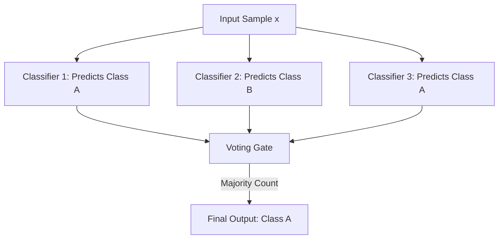
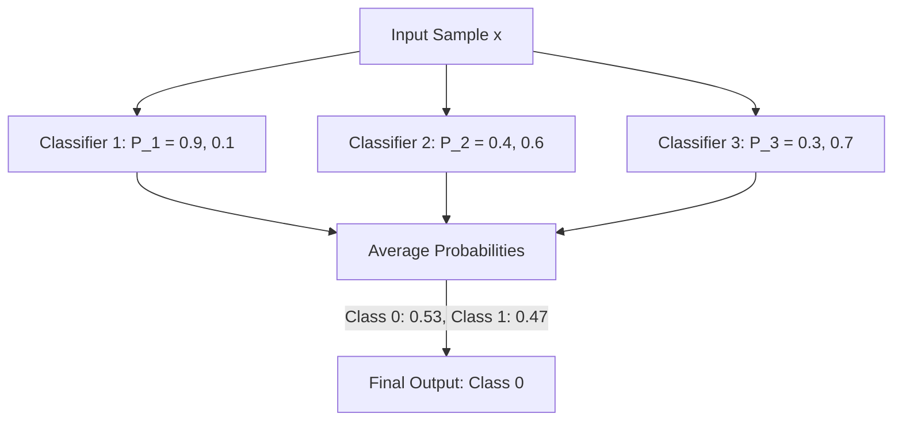

# Voting Ensemble Classifier (Hard vs. Soft Voting)

[](https://colab.research.google.com/github/RiazML/machine-learning-notes/blob/main/notebooks/102_voting_ensemble.ipynb)

A **Voting Classifier** is one of the simplest and most intuitive ensemble techniques. It combines the predictions of multiple, diverse base estimators (e.g., Logistic Regression, Decision Trees, Support Vector Machines) to make a collective prediction.

Voting Classifiers generally come in two flavors: **Hard Voting** (majority rule) and **Soft Voting** (weighted average of class probabilities).

---

## 1. Hard Voting (Majority Rule)

In **Hard Voting**, each base estimator predicts a single class label for a query point. The ensemble then aggregates these predictions and predicts the class label that received the majority of the votes (the mode).

### Mathematical Formulation

Let $M_1(x), M_2(x), \dots, M_K(x)$ be the predictions of $K$ base classifiers for an input sample $x$, where each $M_k(x) \in \{0, 1, \dots, C-1\}$. The hard voting prediction $\hat{y}$ is:
$$\hat{y} = \text{mode}\big(M_1(x), M_2(x), \dots, M_K(x)\big)$$



### Tie-Breaking in Hard Voting

When there is a tie (e.g., in a binary classification problem with an even number of estimators where one predicts $0$ and the other predicts $1$), a tie-breaking rule must be applied. In Scikit-Learn, ties are broken deterministically by selecting the class with the lowest index (i.e., according to the natural ordering of class labels).

---

## 2. Soft Voting (Probability Averaging)

In **Soft Voting**, the ensemble predicts the class label by summing the predicted class probabilities from each base estimator and choosing the class with the highest average probability.

> [!NOTE]
> Soft Voting is generally preferred over Hard Voting because it factors in the _confidence_ of each classifier's prediction rather than treating all votes equally. A highly confident prediction from one classifier can override marginal predictions from other classifiers.

### Mathematical Formulation

Let $P_k(y = c \mid x)$ be the probability predicted by classifier $k$ that sample $x$ belongs to class $c$. The soft voting prediction $\hat{y}$ is:
$$\hat{y} = \arg\max_{c} \frac{1}{K} \sum_{k=1}^K P_k(y = c \mid x)$$



_Requirements_: Base estimators in soft voting must support probability predictions (e.g., `predict_proba` in Scikit-Learn). For estimators like Support Vector Classifiers (SVC), this requires setting `probability=True` during initialization, which internally performs Platt scaling.

---

## 3. Comparison Summary

| Feature                 | Hard Voting                              | Soft Voting                                        |
| :---------------------- | :--------------------------------------- | :------------------------------------------------- |
| **Input Data**          | Class labels predicted by base learners. | Class probabilities predicted by base learners.    |
| **Decision Rule**       | Majority vote (mode).                    | Argmax of average class probabilities.             |
| **Sensitivity**         | Insensitive to model confidence.         | Highly sensitive to model confidence.              |
| **Prerequisites**       | None.                                    | Base classifiers must support probability outputs. |
| **General Performance** | Good, but ignores confidence details.    | Usually superior, smoother decision boundaries.    |

---

## 4. Python Implementation & Verification

Below is a self-contained implementation of a custom Voting Classifier from scratch. It supports both Hard and Soft voting, matches the exact deterministic tie-breaking logic of Scikit-Learn, and asserts prediction parity.

```python
import numpy as np
from sklearn.linear_model import LogisticRegression
from sklearn.tree import DecisionTreeClassifier
from sklearn.svm import SVC
from sklearn.ensemble import VotingClassifier
from sklearn.datasets import make_classification

class CustomVotingClassifier:
    def __init__(self, estimators, voting='hard'):
        from sklearn.base import clone
        # Clone estimators to avoid side-effects during fit
        self.estimators = [(name, clone(clf)) for name, clf in estimators]
        self.voting = voting

    def fit(self, X, y):
        self.classes_ = np.unique(y)
        for name, clf in self.estimators:
            clf.fit(X, y)
        return self

    def predict(self, X):
        if self.voting == 'hard':
            # Gather predictions from each classifier
            preds = np.column_stack([clf.predict(X) for name, clf in self.estimators])
            final_preds = []
            for row in preds:
                # Count frequencies of each class
                counts = np.bincount(row, minlength=len(self.classes_))
                # argmax returns the first index of the max count, matching sklearn tie-breaking
                final_preds.append(np.argmax(counts))
            return np.array(final_preds)
        elif self.voting == 'soft':
            # Take argmax of average probabilities
            probas = self.predict_proba(X)
            return np.argmax(probas, axis=1)

    def predict_proba(self, X):
        if self.voting == 'hard':
            raise AttributeError("predict_proba is not available when voting='hard'")
        # Calculate the mean probability across all estimators
        estimator_probas = [clf.predict_proba(X) for name, clf in self.estimators]
        return np.mean(estimator_probas, axis=0)

# 1. Generate synthetic classification dataset
X, y = make_classification(n_samples=150, n_features=6, n_classes=2, random_state=42)

# 2. Define base estimators
base_estimators = [
    ('lr', LogisticRegression(random_state=42)),
    ('dt', DecisionTreeClassifier(random_state=42)),
    ('svc', SVC(probability=True, random_state=42))
]

# 3. Train and verify Hard Voting parity
sk_hard = VotingClassifier(estimators=base_estimators, voting='hard')
sk_hard.fit(X, y)
sk_hard_preds = sk_hard.predict(X)

cust_hard = CustomVotingClassifier(estimators=base_estimators, voting='hard')
cust_hard.fit(X, y)
cust_hard_preds = cust_hard.predict(X)

assert np.array_equal(sk_hard_preds, cust_hard_preds), "Hard voting predictions do not match Scikit-Learn!"
print("Hard Voting predictions verified with 100% parity.")

# 4. Train and verify Soft Voting parity
sk_soft = VotingClassifier(estimators=base_estimators, voting='soft')
sk_soft.fit(X, y)
sk_soft_preds = sk_soft.predict(X)
sk_soft_proba = sk_soft.predict_proba(X)

cust_soft = CustomVotingClassifier(estimators=base_estimators, voting='soft')
cust_soft.fit(X, y)
cust_soft_preds = cust_soft.predict(X)
cust_soft_proba = cust_soft.predict_proba(X)

assert np.array_equal(sk_soft_preds, cust_soft_preds), "Soft voting predictions do not match Scikit-Learn!"
assert np.allclose(sk_soft_proba, cust_soft_proba), "Soft voting probabilities do not match Scikit-Learn!"
print("Soft Voting predictions and probabilities verified with 100% parity.")
```

---

_Previous Study Guide: [Day 101: Ensemble Learning & Wisdom of Crowds](file:///Users/prime/Developer/ml/101_introduction_to_ensemble_learning.md)_

_Next Study Guide: [Day 103: Voting Ensemble Code Demo & Custom Aggregation](file:///Users/prime/Developer/ml/103_voting_ensemble.md)_
