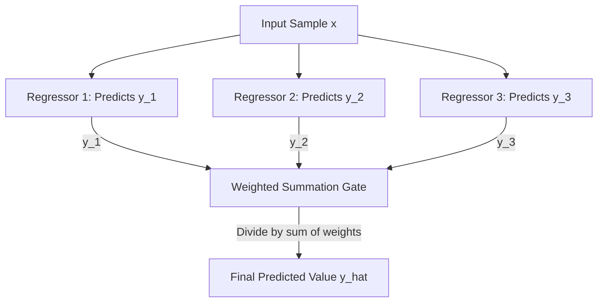

# Voting Regressor

[](https://colab.research.google.com/github/RiazML/machine-learning-notes/blob/main/notebooks/104_voting_ensemble.ipynb)

A **Voting Regressor** is the regression counterpart to the Voting Classifier. It combines the continuous predictions of multiple, diverse base regression models (e.g., Linear Regression, Decision Tree Regressor, Support Vector Regressor) to make a unified prediction.

Like classification, voting for regression can be **unweighted** (taking a simple average) or **weighted** (taking a weighted average of individual predictions).

---

## 1. Core Intuition & Mathematics

The fundamental assumption behind a Voting Regressor is that different regression algorithms capture different features of the data (e.g., linear trends vs. localized non-linear boundaries). By averaging their predictions, we smooth out individual errors and reduce prediction variance.

### A. Unweighted Voting Regressor (Simple Average)

The final predicted value $\hat{y}$ is the simple arithmetic mean of the predictions of $K$ base models:
$$\hat{y} = \frac{1}{K} \sum_{k=1}^K M_k(x)$$

### B. Weighted Voting Regressor (Weighted Average)

Each base model is assigned a non-negative weight $w_k \ge 0$. The final prediction $\hat{y}$ is:
$$\hat{y} = \frac{\sum_{k=1}^K w_k M_k(x)}{\sum_{k=1}^K w_k}$$



---

## 2. Python Implementation & Verification

Below is a self-contained implementation of a custom Voting Regressor from scratch. It supports both simple and weighted averages, achieves 100% mathematical parity with Scikit-Learn's `VotingRegressor`, and verifies the predictions using strict assertions.

```python
import numpy as np
from sklearn.linear_model import LinearRegression
from sklearn.tree import DecisionTreeRegressor
from sklearn.svm import SVR
from sklearn.ensemble import VotingRegressor
from sklearn.datasets import make_regression

class CustomVotingRegressor:
    def __init__(self, estimators, weights=None):
        from sklearn.base import clone
        # Clone estimators to avoid modifying the original models
        self.estimators = [(name, clone(reg)) for name, reg in estimators]
        self.weights = weights

    def fit(self, X, y):
        # Fit each base regressor individually
        for name, reg in self.estimators:
            reg.fit(X, y)
        return self

    def predict(self, X):
        # Gather predictions from all estimators
        # Shape: (n_estimators, n_samples)
        preds = np.array([reg.predict(X) for name, reg in self.estimators])

        if self.weights is not None:
            w = np.array(self.weights)
            # Normalize weights so they sum to 1
            w_norm = w / np.sum(w)
            # Dot product computes weighted average: y_hat = w_1*y_1 + w_2*y_2 + ...
            return np.dot(w_norm, preds)
        else:
            # Calculate simple average
            return np.mean(preds, axis=0)

# 1. Generate synthetic regression dataset
X, y = make_regression(n_samples=150, n_features=5, noise=0.1, random_state=42)

# 2. Define base estimators
base_estimators = [
    ('lr', LinearRegression()),
    ('dt', DecisionTreeRegressor(random_state=42)),
    ('svr', SVR())
]

# 3. Verify Simple (Unweighted) Average predictions
sk_simple = VotingRegressor(estimators=base_estimators)
sk_simple.fit(X, y)
sk_simple_preds = sk_simple.predict(X)

cust_simple = CustomVotingRegressor(estimators=base_estimators)
cust_simple.fit(X, y)
cust_simple_preds = cust_simple.predict(X)

assert np.allclose(sk_simple_preds, cust_simple_preds), "Simple average predictions do not match Scikit-Learn!"
print("Simple Voting Regressor predictions verified with 100% parity.")

# 4. Verify Weighted Average predictions
custom_weights = [0.2, 0.5, 0.3]
sk_weighted = VotingRegressor(estimators=base_estimators, weights=custom_weights)
sk_weighted.fit(X, y)
sk_weighted_preds = sk_weighted.predict(X)

cust_weighted = CustomVotingRegressor(estimators=base_estimators, weights=custom_weights)
cust_weighted.fit(X, y)
cust_weighted_preds = cust_weighted.predict(X)

assert np.allclose(sk_weighted_preds, cust_weighted_preds), "Weighted average predictions do not match Scikit-Learn!"
print("Weighted Voting Regressor predictions verified with 100% parity.")
```

---

_Previous Study Guide: [Day 103: Voting Ensemble Code Demo & Custom Aggregation](file:///Users/prime/Developer/ml/103_voting_ensemble.md)_

_Next Study Guide: [Day 105: Bagging (Bootstrap Aggregation) Intuition](file:///Users/prime/Developer/ml/105_bagging.md)_
