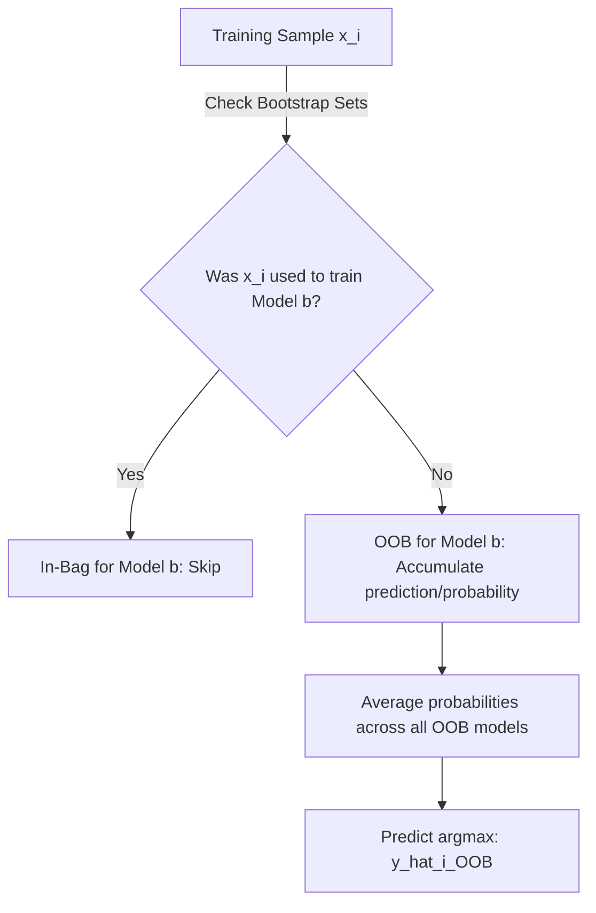

# Out-of-Bag (OOB) Evaluator

[](https://colab.research.google.com/github/RiazML/machine-learning-notes/blob/main/notebooks/107_bagging_ensemble.ipynb)

One of the greatest advantages of Bagging is the ability to perform validation without needing a separate train-test split or cross-validation folds. This is accomplished using **Out-of-Bag (OOB) Evaluation**.

Since each base model is trained on a bootstrap sample that excludes roughly $36.8\%$ of the dataset, these excluded samples (Out-of-Bag samples) can serve as a built-in validation set for that specific model.

---

## 1. How OOB Evaluation Works

For each training sample $x_i$ in the dataset:

1. Identify all base estimators $M_b$ that were _not_ trained on $x_i$ (i.e., $x_i$ was out-of-bag for model $b$).
2. Gather the predictions (or class probabilities) from only these estimators.
3. Aggregate these predictions to compute the **OOB prediction** $\hat{y}_i^{\text{OOB}}$.
4. Compute the **OOB Score** by comparing the OOB predictions for all samples against their true labels $y_i$.



### Mathematical Formulation

Let $S_b \subset \{1, \dots, N\}$ be the indices of the samples used to train estimator $M_b$. The aggregated OOB probability that sample $x_i$ belongs to class $c$ is:
$$P^{\text{OOB}}(y = c \mid x_i) = \frac{\sum_{b: i \notin S_b} P_b(y = c \mid x_i)}{\sum_{b: i \notin S_b} 1}$$

The OOB prediction is:
$$\hat{y}_i^{\text{OOB}} = \arg\max_{c} P^{\text{OOB}}(y = c \mid x_i)$$

The final OOB Score (accuracy) is:
$$\text{OOB Score} = \frac{1}{N} \sum_{i=1}^N \mathbb{I}(\hat{y}_i^{\text{OOB}} == y_i)$$

---

## 2. Python Implementation & Verification

Below is a self-contained implementation of a custom Out-of-Bag Evaluator from scratch. It replicates Scikit-Learn's probability-averaging OOB logic and asserts 100% mathematical parity for both OOB probabilities and the final OOB score.

```python
import numpy as np
from sklearn.tree import DecisionTreeClassifier
from sklearn.ensemble import BaggingClassifier
from sklearn.datasets import make_classification

# 1. Generate synthetic classification dataset
X, y = make_classification(n_samples=150, n_features=6, n_classes=2, random_state=42)

# 2. Fit Scikit-Learn's BaggingClassifier with OOB scoring enabled
sk_bagging = BaggingClassifier(
    estimator=DecisionTreeClassifier(random_state=42),
    n_estimators=10,
    bootstrap=True,
    oob_score=True,
    random_state=42
)
sk_bagging.fit(X, y)

# Retrieve Scikit-Learn's OOB attributes
sk_oob_score = sk_bagging.oob_score_
sk_oob_probs = sk_bagging.oob_decision_function_

# 3. Calculate OOB predictions and probabilities from scratch
n_samples = X.shape[0]
n_classes = len(np.unique(y))

# Accumulator matrices for OOB probabilities and count of OOB hits per sample
custom_oob_probs = np.zeros((n_samples, n_classes))
custom_oob_counts = np.zeros(n_samples)

# Loop over each estimator and its corresponding bootstrap sample indices
for clf, sample_indices in zip(sk_bagging.estimators_, sk_bagging.estimators_samples_):
    # A boolean mask identifying which samples were used to train this estimator (in-bag)
    in_bag_mask = np.zeros(n_samples, dtype=bool)
    in_bag_mask[sample_indices] = True

    # OOB samples are those NOT in-bag
    oob_mask = ~in_bag_mask

    if np.any(oob_mask):
        # Accumulate predicted probabilities for OOB samples
        custom_oob_probs[oob_mask] += clf.predict_proba(X[oob_mask])
        custom_oob_counts[oob_mask] += 1

# Average the probabilities for samples that were OOB at least once
has_oob = custom_oob_counts > 0
custom_oob_probs[has_oob] /= custom_oob_counts[has_oob, np.newaxis]

# 4. Compute final OOB predictions and score from scratch
custom_oob_preds = np.argmax(custom_oob_probs, axis=1)
custom_oob_score = np.mean(custom_oob_preds[has_oob] == y[has_oob])

# 5. Verify mathematical parity
assert np.allclose(sk_oob_probs[has_oob], custom_oob_probs[has_oob]), "OOB probabilities do not match Scikit-Learn!"
assert np.isclose(sk_oob_score, custom_oob_score), "OOB score does not match Scikit-Learn!"

print(f"Scikit-Learn OOB Score: {sk_oob_score:.6f}")
print(f"Custom OOB Score:       {custom_oob_score:.6f}")
print("OOB evaluation verified with 100% mathematical parity!")
```

---

_Previous Study Guide: [Day 106: Bagging Classifier Code Demo](file:///Users/prime/Developer/ml/106_bagging_ensemble.md)_

_Next Study Guide: [Day 108: Random Forest Subspace Feature Sampling](file:///Users/prime/Developer/ml/108_introduction_to_random_forest.md)_
