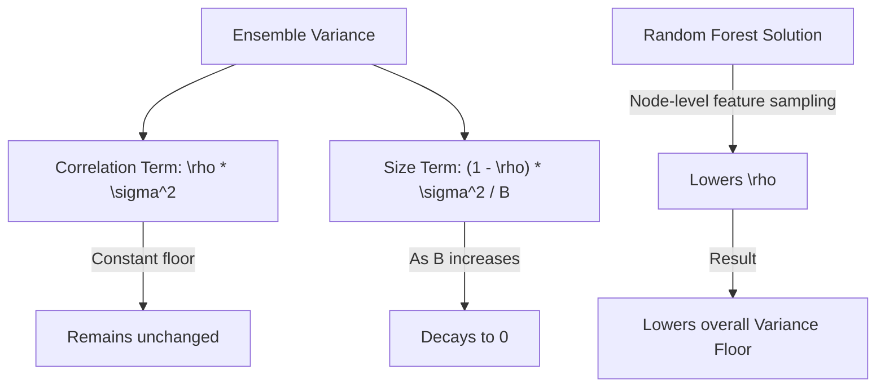

# Variance Reduction & Tree Decorrelation

[](https://colab.research.google.com/github/RiazML/machine-learning-notes/blob/main/notebooks/109_how_random_forest_performs_so_well.ipynb)

The outstanding performance of Random Forest across a wide variety of machine learning tasks is due to its ability to resolve the **bias-variance trade-off**. Specifically, Random Forest is designed to dramatically reduce the **variance** of its predictions without significantly increasing **bias**.

---

## 1. Bias-Variance Trade-Off Recap

In machine learning, generalization error can be decomposed into:
$$\text{Error} = \text{Bias}^2 + \text{Variance} + \text{Irreducible Error}$$

- **Bias**: The error introduced by approximating a real-world problem with a simplified model. High bias leads to underfitting.
- **Variance**: The model's sensitivity to small fluctuations in the training dataset. High variance leads to overfitting.

A fully grown decision tree has **low bias** (it can fit complex non-linear boundaries) but **high variance** (it is extremely sensitive to noise and outliers).

---

## 2. Mathematical Proof of Variance Reduction

Let $B$ be the number of base estimators (trees) in our ensemble. Let $T_i(x)$ be the prediction of the $i$-th tree. Assume each tree has variance:
$$\text{Var}(T_i(x)) = \sigma^2$$

### Case 1: Independent Trees ($\rho = 0$)

If all trees are completely independent and uncorrelated, the variance of their average prediction is:
$$\text{Var}\left(\frac{1}{B} \sum_{i=1}^B T_i(x)\right) = \frac{\sigma^2}{B}$$
As the number of trees $B \to \infty$, the ensemble variance approaches $0$.

### Case 2: Correlated Trees ($\rho > 0$)

In reality, because trees are trained on the same underlying dataset, they are correlated. Let $\rho$ be the pairwise correlation coefficient between any two trees. The variance of the average of $B$ correlated variables is:
$$\text{Var}\left(\frac{1}{B} \sum_{i=1}^B T_i(x)\right) = \rho \sigma^2 + \frac{1 - \rho}{B} \sigma^2$$

As $B \to \infty$:
$$\lim_{B \to \infty} \text{Var}\left(\frac{1}{B} \sum_{i=1}^B T_i(x)\right) = \rho \sigma^2$$

Here, $\rho \sigma^2$ acts as a **variance floor**. No matter how many trees we add, we cannot reduce the variance below this floor.



### The Random Forest Solution: Lowering $\rho$

To lower the variance floor, we must decrease the correlation $\rho$ between trees. By employing **node-level feature subspace sampling**, Random Forest forces different trees to split on different features, thereby decorrelating the trees (reducing $\rho$) and achieving a much lower variance than standard Bagging.

---

## 3. Python Verification: Simulating Correlated Estimator Variance

Below is a self-contained simulation generating correlated random variables to demonstrate the validity of the variance reduction formula.

```python
import numpy as np

def simulate_ensemble_variance(B, rho, sigma=1.0, n_simulations=100000):
    """
    Simulates B correlated estimators with pairwise correlation rho and
    computes the variance of their average.
    """
    # Generate a common factor Z0 to introduce correlation
    Z0 = np.random.normal(0, sigma, size=(n_simulations, 1))

    # Generate B independent random variables Zi
    Zi = np.random.normal(0, sigma, size=(n_simulations, B))

    # Construct correlated variables: Xi = sqrt(rho)*Z0 + sqrt(1-rho)*Zi
    # This guarantees that Var(Xi) = sigma^2 and Cov(Xi, Xj) = rho * sigma^2
    X = np.sqrt(rho) * Z0 + np.sqrt(1.0 - rho) * Zi

    # Compute the average of the B estimators for each simulation
    averages = np.mean(X, axis=1)

    # Calculate empirical variance of the average
    empirical_variance = np.var(averages)

    # Calculate theoretical variance using the formula
    theoretical_variance = rho * (sigma**2) + ((1.0 - rho) / B) * (sigma**2)

    return empirical_variance, theoretical_variance

# Run tests sweeping correlation (rho) and ensemble size (B)
B_sizes = [5, 10, 50, 100]
correlations = [0.1, 0.3, 0.7]

print("   B |  rho | Empirical Var | Theoretical Var | Absolute Diff")
print("-------------------------------------------------------------")
for B in B_sizes:
    for rho in correlations:
        emp, theo = simulate_ensemble_variance(B, rho)
        diff = abs(emp - theo)
        print(f"{B:4d} | {rho:.1f} | {emp:13.6f} | {theo:15.6f} | {diff:13.6f}")
        assert diff < 0.01, f"Parity mismatch for B={B}, rho={rho}!"

print("\nMathematical variance reduction formula verified successfully!")
```

---

_Previous Study Guide: [Day 108: Random Forest Subspace Feature Sampling](file:///Users/prime/Developer/ml/108_introduction_to_random_forest.md)_

_Next Study Guide: [Day 110: Random Forest vs Bagging & Gini MDI](file:///Users/prime/Developer/ml/110_bagging_vs_random_forest.md)_
