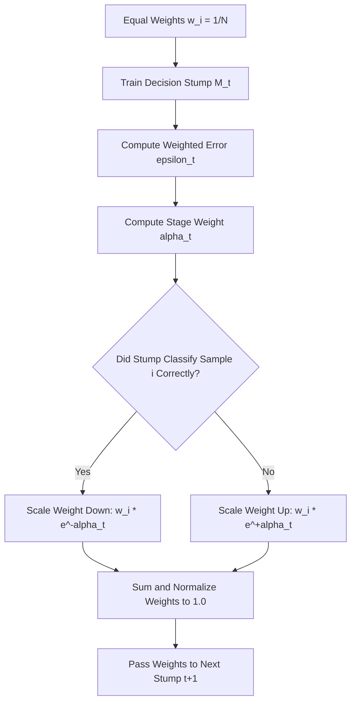

# How AdaBoost Classifier Works

[](https://colab.research.google.com/github/RiazML/machine-learning-notes/blob/main/notebooks/115_how_adaboost_classifier_works.ipynb)

Adaptive Boosting (AdaBoost) is an ensemble learning method that builds a strong classifier by sequentially combining multiple weak classifiers (typically decision stumps — decision trees with a depth of 1). The central intuition is that each subsequent model focuses on the errors made by its predecessors by adjusting training sample weights.

---

## 1. The Core Intuitive Principles

1. **Stumps over Deep Trees**: Unlike Random Forests, which grow deep independent trees, AdaBoost utilizes very shallow trees (stumps). A stump splits the data along a single feature threshold, making it a weak learner with slightly better accuracy than random guessing.
2. **Sequential Corrective Training**: The stumps are trained one after another. During each iteration, the algorithm increases the weights of the misclassified samples and decreases the weights of the correctly classified samples.
3. **Weighted Voting**: Instead of equal voting, each stump is assigned a stage weight ($\alpha$) based on its classification accuracy. Stumps with lower error rates have a larger voice in the final ensemble prediction.

---

## 2. Mathematical Framework

Let $X$ be the feature matrix, and $y_i \in \{-1, +1\}$ be the binary target labels.

### Step 1: Weight Initialization

Initialize all sample weights equally:

$$w_i^{(1)} = \frac{1}{N}, \quad i = 1, \dots, N$$

### Step 2: Iterative Sequential Training

For each boosting round $t = 1, \dots, T$:

1. Fit a weak classifier $M_t(x)$ using the weighted training data.
2. Calculate the weighted error rate $\epsilon_t$:

    $$\epsilon_t = \frac{\sum_{i=1}^N w_i^{(t)} \mathbb{I}(y_i \neq M_t(x_i))}{\sum_{i=1}^N w_i^{(t)}}$$

    If the error rate $\epsilon_t \ge 0.5$, we terminate or invert the predictions, as it is no better than random guessing.

3. Compute the classifier's importance/influence coefficient $\alpha_t$:

    $$\alpha_t = \frac{1}{2} \ln\left(\frac{1 - \epsilon_t}{\epsilon_t}\right)$$

4. Update the sample weights for the next round:

    $$w_i^{(t+1)} = w_i^{(t)} \exp\left(-\alpha_t y_i M_t(x_i)\right)$$
    - If $y_i = M_t(x_i)$ (correct): the exponent is negative ($-\alpha_t$), shrinking the weight.
    - If $y_i \neq M_t(x_i)$ (incorrect): the exponent is positive ($+\alpha_t$), boosting the weight.

5. Re-normalize the weights to sum to 1:

    $$w_i^{(t+1)} \leftarrow \frac{w_i^{(t+1)}}{\sum_{k=1}^N w_k^{(t+1)}}$$

---

## 3. Weight Scaling Dynamics



---

## 4. Weight Update Simulation

The following self-contained Python code demonstrates a single step of sample weight updating, verifying that the weights of misclassified samples increase while correctly classified sample weights shrink.

```python
import numpy as np

# Synthetic target and prediction values (binary classification with y in {-1, +1})
y = np.array([1, 1, 1, -1, -1, -1])
pred = np.array([1, 1, -1, -1, -1, 1]) # 2 misclassifications (index 2 and 5)

N = len(y)
# Step 1: Initialize weights
w = np.ones(N) / N

# Step 2: Compute weighted error rate
misclassified = (y != pred)
epsilon = np.sum(w[misclassified])

# Step 3: Compute stage weight alpha
alpha = 0.5 * np.log((1 - epsilon) / epsilon)

# Step 4: Update weights
w_new = w * np.exp(-alpha * y * pred)

# Step 5: Normalize weights
w_normalized = w_new / np.sum(w_new)

# Assertions to verify correct logic
assert np.allclose(np.sum(w_normalized), 1.0), "Normalized weights must sum to 1.0"
assert np.all(w_normalized[misclassified] > w[misclassified]), "Misclassified samples must have their weights increased"
assert np.all(w_normalized[~misclassified] < w[~misclassified]), "Correctly classified samples must have their weights decreased"

print(f"Initial weights: {w}")
print(f"Error rate epsilon: {epsilon:.4f}")
print(f"Stage weight alpha: {alpha:.4f}")
print(f"Normalized weights: {w_normalized}")
```

---

## Navigation Links

- **Previous**: [Day 112: Hyperparameter Tuning Random Forest using GridSearchCV](file:///Users/prime/Developer/ml/112_hyperparameter_tuning_random_forest_using_gridsearchcv.md)
- **Next**: [Day 116: AdaBoost Code Demo](file:///Users/prime/Developer/ml/116_adaboost.md)
