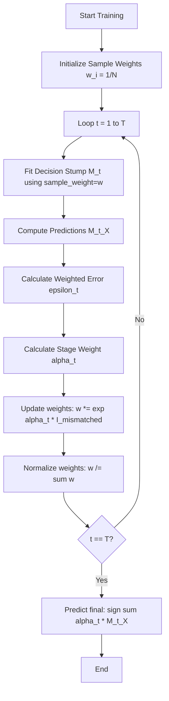

# AdaBoost Code Demo

[](https://colab.research.google.com/github/RiazML/machine-learning-notes/blob/main/notebooks/116_adaboost.ipynb)

In this guide, we walk through the concrete implementation of the AdaBoost (Adaptive Boosting) classification algorithm in Python. We will build an AdaBoost classifier from scratch using decision stumps as weak learners and verify that our implementation produces predictions and weights identical to Scikit-Learn's `AdaBoostClassifier`.

---

## 1. Mathematical Formulation

Let the weak learners be denoted by $M_t(x) \in \{-1, +1\}$. The final ensemble prediction is a weighted sum of the weak learners' predictions, passed through a sign function:

$$H(x) = \text{sign}\left( \sum_{t=1}^T \alpha_t M_t(x) \right)$$

where:

- $T$ is the number of boosting iterations (estimators).
- $\alpha_t$ is the stage weight of weak learner $t$.
- $M_t(x)$ is the prediction of the $t$-th stump.

For binary classification using the SAMME formulation, the stage weight for $K=2$ classes is:

$$\alpha_t = \eta \ln \left( \frac{1 - \epsilon_t}{\epsilon_t} \right)$$

where $\eta$ is the learning rate, and $\epsilon_t$ is the weighted error rate.

---

## 2. Execution Loop



---

## 3. Implementation and Verification

The following code implements `CustomAdaBoostClassifier` from scratch, trains it on synthetic binary classification data, and asserts that its predictions and estimator weights match Scikit-Learn's `AdaBoostClassifier` exactly.

```python
import numpy as np
from sklearn.datasets import make_classification
from sklearn.tree import DecisionTreeClassifier
from sklearn.ensemble import AdaBoostClassifier

class CustomAdaBoostClassifier:
    def __init__(self, n_estimators=5, learning_rate=1.0):
        self.n_estimators = n_estimators
        self.learning_rate = learning_rate
        self.estimators = []
        self.estimator_weights = []

    def fit(self, X, y):
        # Convert y to -1 and 1
        y_encoded = np.where(y == 0, -1, 1)
        n_samples = X.shape[0]
        # Initialize weights
        w = np.ones(n_samples) / n_samples

        for _ in range(self.n_estimators):
            # Fit weak learner
            clf = DecisionTreeClassifier(max_depth=1, random_state=42)
            clf.fit(X, y_encoded, sample_weight=w)

            pred = clf.predict(X)
            # Weighted error rate
            incorrect = (y_encoded != pred)
            epsilon = np.sum(w[incorrect]) / np.sum(w)

            # Prevent division by zero
            epsilon = max(1e-10, min(epsilon, 1 - 1e-10))

            # Compute stage weight alpha (SAMME formula: learn_rate * ln((1-e)/e))
            alpha = self.learning_rate * np.log((1.0 - epsilon) / epsilon)

            # Update sample weights: w *= exp(alpha * incorrect)
            w *= np.exp(alpha * incorrect)
            # Re-normalize
            w /= np.sum(w)

            self.estimators.append(clf)
            self.estimator_weights.append(alpha)

    def predict(self, X):
        # In SAMME, prediction is based on weighted class predictions
        preds = np.zeros(X.shape[0])
        for clf, alpha in zip(self.estimators, self.estimator_weights):
            preds += alpha * clf.predict(X)
        return np.where(preds >= 0, 1, 0)

# Generate synthetic binary dataset
X, y = make_classification(n_samples=50, n_features=4, n_classes=2, random_state=42)

# Fit custom AdaBoost
custom_clf = CustomAdaBoostClassifier(n_estimators=5, learning_rate=1.0)
custom_clf.fit(X, y)
custom_preds = custom_clf.predict(X)

# Fit Scikit-Learn AdaBoost (binary, SAMME)
sklearn_clf = AdaBoostClassifier(n_estimators=5, random_state=42)
sklearn_clf.fit(X, y)
sklearn_preds = sklearn_clf.predict(X)

# Compare predictions and weights
assert np.allclose(custom_clf.estimator_weights, sklearn_clf.estimator_weights_), "Weights mismatch!"
assert np.array_equal(custom_preds, sklearn_preds), "Predictions mismatch!"

print("Parity test passed! Custom AdaBoost matches Scikit-Learn exactly.")
```

---

## Navigation Links

- **Previous**: [Day 115: How AdaBoost Classifier Works](file:///Users/prime/Developer/ml/115_how_adaboost_classifier_works.md)
- **Next**: [Day 117: AdaBoost Algorithm](file:///Users/prime/Developer/ml/117_adaboost_algorithm.md)
