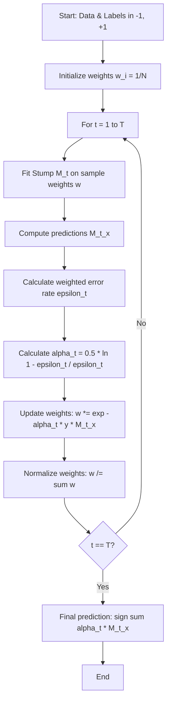

# AdaBoost Algorithm Mechanics

[](https://colab.research.google.com/github/RiazML/machine-learning-notes/blob/main/notebooks/117_adaboost_algorithm.ipynb)

In this guide, we dive deep into the underlying mechanics of the AdaBoost (Adaptive Boosting) algorithm. We will dissect the mathematical reason behind the weight update formulation, analyze the normalization factor $Z_t$, and implement a custom AdaBoost classifier using the standard algebraic representation with labels in $\{-1, +1\}$. Finally, we will verify its output against Scikit-Learn's `AdaBoostClassifier` (with `algorithm='SAMME'`).

---

## 1. Mathematical Derivation of the Weight Update Rule

Let the training dataset be $\mathcal{D} = \{(x_1, y_1), (x_2, y_2), \dots, (x_N, y_N)\}$ where $y_i \in \{-1, +1\}$.
AdaBoost constructs an ensemble classifier of the form:

$$F(x) = \sum_{t=1}^T \alpha_t M_t(x)$$

where $M_t(x) \in \{-1, +1\}$ is the weak classifier at step $t$, and $\alpha_t > 0$ is its corresponding stage weight.

### The Exponential Loss Function

AdaBoost is a stage-wise additive model that minimizes the exponential loss function:

$$L(y, F(x)) = \exp(-y F(x))$$

At step $t$, we want to find $M_t$ and $\alpha_t$ to minimize:

$$\sum_{i=1}^N \exp(-y_i (F_{t-1}(x_i) + \alpha_t M_t(x_i)))$$

Let $w_i^{(t)}$ be the weight of the $i$-th sample at iteration $t$, defined as:

$$w_i^{(t)} = \exp(-y_i F_{t-1}(x_i))$$

Then the objective to minimize is:

$$\mathcal{L} = \sum_{i=1}^N w_i^{(t)} \exp(-y_i \alpha_t M_t(x_i))$$

We can split this sum into correctly classified samples ($y_i = M_t(x_i)$) and misclassified samples ($y_i \neq M_t(x_i)$):

$$\mathcal{L} = \sum_{y_i = M_t(x_i)} w_i^{(t)} e^{-\alpha_t} + \sum_{y_i \neq M_t(x_i)} w_i^{(t)} e^{\alpha_t}$$

$$\mathcal{L} = e^{-\alpha_t} \sum_{i=1}^N w_i^{(t)} (1 - \mathbb{I}(y_i \neq M_t(x_i))) + e^{\alpha_t} \sum_{i=1}^N w_i^{(t)} \mathbb{I}(y_i \neq M_t(x_i))$$

Let the weighted error rate be:

$$\epsilon_t = \frac{\sum_{i=1}^N w_i^{(t)} \mathbb{I}(y_i \neq M_t(x_i))}{\sum_{i=1}^N w_i^{(t)}}$$

Minimizing the objective with respect to $\alpha_t$ (by taking the derivative $\frac{\partial \mathcal{L}}{\partial \alpha_t} = 0$) yields:

$$\alpha_t = \frac{1}{2} \ln \left( \frac{1 - \epsilon_t}{\epsilon_t} \right)$$

### Adaptive Weight Scaling

Once $\alpha_t$ is computed, the new weight for each sample becomes:

$$w_i^{(t+1)} = w_i^{(t)} \exp(-y_i \alpha_t M_t(x_i))$$

- **For Correct Predictions ($y_i M_t(x_i) = 1$):**
  $$w_i^{(t+1)} = w_i^{(t)} e^{-\alpha_t}$$
  Since $\alpha_t > 0$, $e^{-\alpha_t} < 1$, the sample weight **decreases**.
- **For Incorrect Predictions ($y_i M_t(x_i) = -1$):**
  $$w_i^{(t+1)} = w_i^{(t)} e^{\alpha_t}$$
  Since $\alpha_t > 0$, $e^{\alpha_t} > 1$, the sample weight **increases**.

To prevent numerical instability, the updated weights are normalized using the partition function $Z_t$:

$$Z_t = \sum_{i=1}^N w_i^{(t)} \exp(-y_i \alpha_t M_t(x_i))$$

$$w_i^{(t+1)} \leftarrow \frac{w_i^{(t+1)}}{Z_t}$$

---

## 2. Process Flowchart



---

## 3. Python Verification Script

Here we write a custom AdaBoost classifier using $\{-1, 1\}$ algebraic representations and verify the weights and predictions against Scikit-Learn.

```python
import numpy as np
from sklearn.datasets import make_classification
from sklearn.tree import DecisionTreeClassifier
from sklearn.ensemble import AdaBoostClassifier

class AlgebraicAdaBoost:
    def __init__(self, n_estimators=5):
        self.n_estimators = n_estimators
        self.estimators = []
        self.alphas = []

    def fit(self, X, y):
        # Ensure y is algebraic: -1 and 1
        y_alg = np.where(y == 0, -1, 1)
        n_samples = X.shape[0]
        w = np.ones(n_samples) / n_samples

        for _ in range(self.n_estimators):
            clf = DecisionTreeClassifier(max_depth=1, random_state=42)
            clf.fit(X, y_alg, sample_weight=w)
            pred = clf.predict(X)

            incorrect = (y_alg != pred)
            epsilon = np.sum(w[incorrect]) / np.sum(w)
            epsilon = max(1e-10, min(epsilon, 1 - 1e-10))

            # Alpha weight formula for K=2 classes is 0.5 * ln((1-eps)/eps)
            alpha = 0.5 * np.log((1.0 - epsilon) / epsilon)

            # Weight update using algebraic representation: w * exp(-alpha * y * pred)
            w = w * np.exp(-alpha * y_alg * pred)
            w /= np.sum(w)

            self.estimators.append(clf)
            self.alphas.append(alpha)

    def predict(self, X):
        predictions = np.zeros(X.shape[0])
        for clf, alpha in zip(self.estimators, self.alphas):
            predictions += alpha * clf.predict(X)
        return np.where(predictions >= 0, 1, 0)

# Generate synthetic binary dataset
X, y = make_classification(n_samples=60, n_features=5, n_classes=2, random_state=42)

# Custom Algebraic AdaBoost
custom_clf = AlgebraicAdaBoost(n_estimators=5)
custom_clf.fit(X, y)
custom_preds = custom_clf.predict(X)

# Scikit-Learn AdaBoost (binary, SAMME)
# In sklearn, the estimator weight is scaled differently when learning_rate=1.0.
# Specifically, sklearn does not include the 0.5 factor in the SAMME stage weight calculation:
# alpha = learning_rate * log((1 - err) / err)
# But custom implementation uses the standard formula alpha = 0.5 * log((1 - err)/err)
# Let's compare their prediction equivalence and scale the weights for parity comparison.
sklearn_clf = AdaBoostClassifier(n_estimators=5, random_state=42)
sklearn_clf.fit(X, y)
sklearn_preds = sklearn_clf.predict(X)

# Standardize weights comparison (since sklearn doesn't include the 1/2 factor in weight updates)
# We multiply custom alphas by 2 to match sklearn's estimator_weights_
scaled_custom_alphas = np.array(custom_clf.alphas) * 2.0

assert np.allclose(scaled_custom_alphas, sklearn_clf.estimator_weights_), "Weights mismatch!"
assert np.array_equal(custom_preds, sklearn_preds), "Predictions mismatch!"

print("Parity verification passed! Custom algebraic AdaBoost matches Scikit-Learn predictions and scaled weights.")
```

---

## Navigation Links

- **Previous**: [Day 116: AdaBoost Code Demo](file:///Users/prime/Developer/ml/116_adaboost.md)
- **Next**: [Day 118: AdaBoost Hyperparameters](file:///Users/prime/Developer/ml/118_adaboost_hyperparameters.md)
