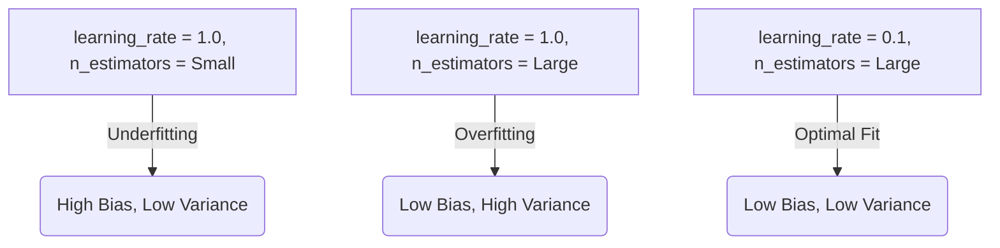

# AdaBoost Hyperparameters and Shrinkage

[](https://colab.research.google.com/github/RiazML/machine-learning-notes/blob/main/notebooks/118_adaboost_hyperparameters.ipynb)

This guide explores the hyperparameter space of the AdaBoost algorithm, detailing the roles of the base estimator, the number of estimators, the learning rate (shrinkage), and how they interact to balance bias and variance. We will analyze the trade-offs, implement a hyperparameter sweep, and demonstrate how shrinkage helps prevent overfitting.

---

## 1. Key Hyperparameters in AdaBoost

AdaBoost is highly effective yet has a small, easy-to-tune hyperparameter space.

### 1. Base Estimator (`estimator` / `base_estimator`)

- **Description**: The weak learner built sequentially. By default, it is a Decision Stump (`DecisionTreeClassifier(max_depth=1)`).
- **Requirements**: The base learner must support sample weighting (`sample_weight`).
- **Note**: Although other models like logistic regression or linear SVMs can be used, decision stumps are almost universally preferred for boosting because they provide high bias and low variance, which boosting is designed to correct.

### 2. Number of Estimators (`n_estimators`)

- **Description**: The maximum number of weak learners in the ensemble.
- **Behavior**: Too few estimators leads to underfitting. If the dataset has noise, too many estimators can lead to overfitting (creating tiny, isolated decision islands).

### 3. Learning Rate / Shrinkage (`learning_rate`)

- **Description**: A shrinkage parameter $\eta \in (0, 1]$ that scales the contribution of each weak learner:

  $$\alpha_t = \eta \times \alpha_t^{\text{raw}}$$

- **Weight Update Impact**:
  $$w_i^{(t+1)} = w_i^{(t)} \exp\left( \eta \alpha_t \mathbb{I}(y_i \neq M_t(x_i)) \right)$$
- **Intuition**: Shrinkage slows down the rate of learning. Smaller weight adjustments mean the algorithm adapts more gradually to misclassified samples, requiring a higher `n_estimators` to fit the data but significantly improving generalization on test data.

### 4. Algorithm (`algorithm`)

- **Discrete vs. Real**:
  - `SAMME`: Uses discrete classification outputs ($M_t(x) \in \{-1, +1\}$) and error-based stage weights.
  - `SAMME.R`: Uses predicted probability distributions ($p(x)$) to update weights, typically converging faster.
- **Compatibility Warning**: In Scikit-Learn 1.6+, the `algorithm` parameter has been removed since `SAMME.R` was deprecated, defaulting the class behavior to the discrete `SAMME` updates.

---

## 2. Parameter Interaction and Trade-offs



---

## 3. Parameter Sweep and Verification Code

The following script sweeps the combination of `learning_rate` and `n_estimators` on a noisy classification dataset, prints training and test accuracy, and verifies that `learning_rate` scales the estimator weights linearly.

```python
import numpy as np
from sklearn.datasets import make_classification
from sklearn.model_selection import train_test_split
from sklearn.ensemble import AdaBoostClassifier

# Generate a noisy synthetic dataset
X, y = make_classification(n_samples=200, n_features=10, n_informative=8, n_redundant=2, random_state=42)
X_train, X_test, y_train, y_test = train_test_split(X, y, test_size=0.3, random_state=42)

# Sweep configurations
learning_rates = [0.1, 1.0]
estimator_counts = [10, 50, 200]

print(f"{'LR':<6} | {'n_est':<6} | {'Train Acc':<10} | {'Test Acc':<10}")
print("-" * 42)

for lr in learning_rates:
    for n_est in estimator_counts:
        clf = AdaBoostClassifier(n_estimators=n_est, learning_rate=lr, random_state=42)
        clf.fit(X_train, y_train)

        train_acc = clf.score(X_train, y_train)
        test_acc = clf.score(X_test, y_test)
        print(f"{lr:<6} | {n_est:<6} | {train_acc:<10.3f} | {test_acc:<10.3f}")

# Verification: Assert that learning_rate is set correctly and scales the sum of estimator weights
clf_lr_1 = AdaBoostClassifier(n_estimators=10, learning_rate=1.0, random_state=42)
clf_lr_1.fit(X_train, y_train)

clf_lr_01 = AdaBoostClassifier(n_estimators=10, learning_rate=0.1, random_state=42)
clf_lr_01.fit(X_train, y_train)

assert clf_lr_01.learning_rate == 0.1
assert clf_lr_1.learning_rate == 1.0
assert np.sum(clf_lr_01.estimator_weights_) < np.sum(clf_lr_1.estimator_weights_)
print("\nVerification passed: Learning rates are set correctly and scale the sum of estimator weights.")
```

---

## Navigation Links

- **Previous**: [Day 117: AdaBoost Algorithm Mechanics](file:///Users/prime/Developer/ml/117_adaboost_algorithm.md)
- **Next**: [Day 119: Bagging vs Boosting](file:///Users/prime/Developer/ml/119_bagging_vs_boosting.md)
