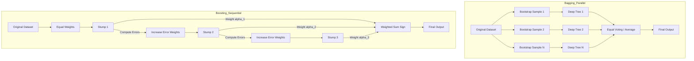

# Bagging vs Boosting

[](https://colab.research.google.com/github/RiazML/machine-learning-notes/blob/main/notebooks/119_bagging_vs_boosting.ipynb)

This guide provides a comprehensive, head-to-head comparison between Bagging (Bootstrap Aggregating) and Boosting, focusing on how they address the bias-variance trade-off. We will analyze their training processes, aggregation strategies, base learner requirements, and verify their empirical behavior using a Python comparison script.

---

## 1. Core Differences

| Feature                        | Bagging (e.g., Random Forest)                                         | Boosting (e.g., AdaBoost, Gradient Boosting)                                                           |
| :----------------------------- | :-------------------------------------------------------------------- | :----------------------------------------------------------------------------------------------------- |
| **Base Model Characteristics** | **Low Bias, High Variance** (e.g., Deep, fully-grown Decision Trees). | **High Bias, Low Variance** (e.g., Shallow Decision Trees, Stumps of depth 1).                         |
| **Ensemble Goal**              | Reduces variance by averaging independent models.                     | Reduces bias sequentially by focusing on errors of previous models.                                    |
| **Training Scheme**            | **Parallel**: Base learners are trained independently in parallel.    | **Sequential**: Base learners are trained sequentially in series.                                      |
| **Aggregation Rule**           | **Equal Voting**: Every estimator has an equal weight (democracy).    | **Weighted Voting**: Estimators are weighted based on their individual training accuracy ($\alpha_t$). |
| **Sensitivity to Outliers**    | Robust to outliers and noisy labels.                                  | Highly sensitive to outliers because they receive progressively larger weights.                        |

---

## 2. Structural Architecture



---

## 3. Empirical Comparison Code

The following script compares a single Decision Tree (high variance), a Bagging ensemble of deep trees (variance reduction), and an AdaBoost ensemble of stumps (bias reduction) on a synthetic noisy classification task.

```python
import numpy as np
from sklearn.datasets import make_classification
from sklearn.model_selection import train_test_split
from sklearn.tree import DecisionTreeClassifier
from sklearn.ensemble import BaggingClassifier, AdaBoostClassifier

# Generate a complex classification dataset with noise
X, y = make_classification(
    n_samples=500, n_features=20, n_informative=15, n_classes=2, flip_y=0.1, random_state=42
)
X_train, X_test, y_train, y_test = train_test_split(X, y, test_size=0.3, random_state=42)

# 1. Single Decision Tree (Overfits - Low Bias, High Variance)
dt = DecisionTreeClassifier(random_state=42)
dt.fit(X_train, y_train)
dt_train_acc = dt.score(X_train, y_train)
dt_test_acc = dt.score(X_test, y_test)

# 2. Bagging Classifier (Reduces Variance)
bag = BaggingClassifier(estimator=DecisionTreeClassifier(), n_estimators=100, random_state=42)
bag.fit(X_train, y_train)
bag_train_acc = bag.score(X_train, y_train)
bag_test_acc = bag.score(X_test, y_test)

# 3. Boosting Classifier (Reduces Bias Sequentially)
boost = AdaBoostClassifier(n_estimators=100, random_state=42)
boost.fit(X_train, y_train)
boost_train_acc = boost.score(X_train, y_train)
boost_test_acc = boost.score(X_test, y_test)

print("Performance Comparison:")
print(f"Single Tree -> Train: {dt_train_acc:.3f}, Test: {dt_test_acc:.3f}")
print(f"Bagging     -> Train: {bag_train_acc:.3f}, Test: {bag_test_acc:.3f}")
print(f"AdaBoost    -> Train: {boost_train_acc:.3f}, Test: {boost_test_acc:.3f}")

# Assertions to verify the bias-variance properties:
# A single deep tree overfits the training set but generalizes worse than the Bagging ensemble
assert dt_train_acc > dt_test_acc
assert bag_test_acc > dt_test_acc, "Bagging should improve generalization accuracy over a single overfitted tree!"

# AdaBoost should achieve high training performance showing that sequential stumps can reduce bias effectively
assert boost_train_acc > 0.85, "Boosting should achieve high training accuracy by sequentially reducing bias!"
```

---

## Navigation Links

- **Previous**: [Day 118: AdaBoost Hyperparameters](file:///Users/prime/Developer/ml/118_adaboost_hyperparameters.md)
- **Next**: [Day 120: Gradient Boosting Explained](file:///Users/prime/Developer/ml/120_gradient_boosting_explained.md)
