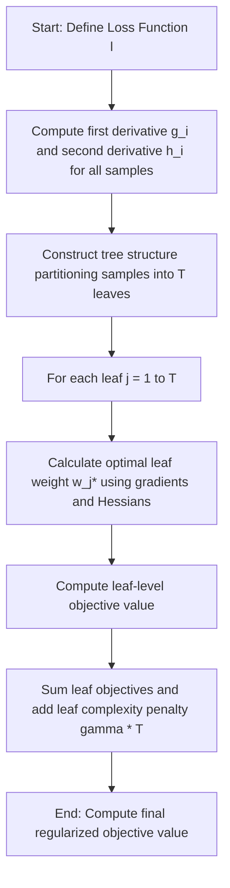

# Introduction to XGBoost

[](https://colab.research.google.com/github/RiazML/machine-learning-notes/blob/main/notebooks/123_introduction_to_xgboost.ipynb)

XGBoost (Extreme Gradient Boosting) is a highly optimized, scalable, and flexible implementation of the Gradient Boosting framework. In this guide, we introduce the core concepts of XGBoost, its regularized objective function, and explain how it differs from traditional Gradient Boosting. We also implement a script to calculate the regularized objective value and demonstrate how the leaf penalties ($\gamma, \lambda$) affect tree complexity.

---

## 1. Mathematical Formulation

Unlike traditional gradient boosting, which relies on heuristic tree pruning and line search, XGBoost formalizes regularization directly within the objective function.

Let the objective function at step $t$ be:

$$\mathcal{L}^{(t)} = \sum_{i=1}^n l\left(y_i, \hat{y}_i^{(t-1)} + f_t(x_i)\right) + \Omega(f_t)$$

where:

- $l$ is the differentiable loss function between the target $y_i$ and the prediction at step $t$: $\hat{y}_i^{(t)} = \hat{y}_i^{(t-1)} + f_t(x_i)$
- $\Omega(f_t)$ is the regularization term penalizing tree complexity:

$$\Omega(f_t) = \gamma T + \frac{1}{2}\lambda \sum_{j=1}^T w_j^2$$

Here, $T$ is the number of leaves in the tree, $w_j$ is the output weight of leaf $j$, $\gamma$ is the complexity penalty (pruning threshold), and $\lambda$ is the L2 regularization parameter on leaf weights.

### Second-Order Taylor Approximation

To optimize the objective function for any arbitrary differentiable loss, XGBoost uses a second-order Taylor expansion:

$$\mathcal{L}^{(t)} \approx \sum_{i=1}^n \left[ l(y_i, \hat{y}_i^{(t-1)}) + g_i f_t(x_i) + \frac{1}{2}h_i f_t^2(x_i) \right] + \gamma T + \frac{1}{2}\lambda \sum_{j=1}^T w_j^2$$

where:

- $g_i = \left[ \frac{\partial l(y_i, \hat{y}_i)}{\partial \hat{y}_i} \right]_{\hat{y}_i = \hat{y}_i^{(t-1)}}$ is the first-order gradient.
- $h_i = \left[ \frac{\partial^2 l(y_i, \hat{y}_i)}{\partial \hat{y}_i^2} \right]_{\hat{y}_i = \hat{y}_i^{(t-1)}}$ is the second-order gradient (Hessian).

Since $l(y_i, \hat{y}_i^{(t-1)})$ is constant with respect to the new tree $f_t(x_i)$, the simplified objective function at step $t$ is:

$$\tilde{\mathcal{L}}^{(t)} = \sum_{i=1}^n \left[ g_i f_t(x_i) + \frac{1}{2}h_i f_t^2(x_i) \right] + \gamma T + \frac{1}{2}\lambda \sum_{j=1}^T w_j^2$$

### Leaf-wise Form

Let $I_j = \{i \mid q(x_i) = j\}$ be the set of indices of training samples mapped to leaf $j$. We can rewrite the summation over samples as a summation over leaves:

$$\tilde{\mathcal{L}}^{(t)} = \sum_{j=1}^T \left[ \left(\sum_{i \in I_j} g_i\right) w_j + \frac{1}{2} \left(\sum_{i \in I_j} h_i + \lambda\right) w_j^2 \right] + \gamma T$$

---

## 2. Process Flowchart



---

## 3. Python Verification Script

```python
import numpy as np
from scipy.optimize import minimize

def calculate_analytical_objective(g, h, lmbda, gamma, T):
    # g and h are lists of gradients and hessians for each leaf
    # T is the number of leaves
    leaf_objectives = []
    for j in range(T):
        G_j = np.sum(g[j])
        H_j = np.sum(h[j])
        w_opt = -G_j / (H_j + lmbda)
        # Leaf objective: G_j * w + 0.5 * (H_j + lambda) * w^2
        leaf_obj = G_j * w_opt + 0.5 * (H_j + lmbda) * (w_opt ** 2)
        leaf_objectives.append(leaf_obj)

    return np.sum(leaf_objectives) + gamma * T

# Simulate 3 leaves with synthetic gradients and hessians
np.random.seed(42)
T = 3
g = [np.random.normal(0, 1, 10) for _ in range(T)]
h = [np.random.uniform(0.5, 1.5, 10) for _ in range(T)]  # Hessians must be positive

# Regularization parameters
lmbda = 1.5
gamma = 0.5

# Calculate optimal objective analytically
analytical_obj = calculate_analytical_objective(g, h, lmbda, gamma, T)

# Numerically optimize weights to verify Taylor expansion objective minimization
def numerical_objective(w):
    obj = 0.0
    for j in range(T):
        G_j = np.sum(g[j])
        H_j = np.sum(h[j])
        obj += G_j * w[j] + 0.5 * (H_j + lmbda) * (w[j] ** 2)
    return obj + gamma * T

initial_w = np.zeros(T)
res = minimize(numerical_objective, initial_w, method='BFGS')

# Assert numerical optimization matches analytical derivation
assert np.allclose(res.fun, analytical_obj), f"Objective mismatch! Numerical: {res.fun}, Analytical: {analytical_obj}"

print("Parity verification passed! Numerical minimization of the Taylor-approximated objective matches the analytical formula.")
print(f"Optimal objective value (including complexity penalty): {analytical_obj:.6f}")
print(f"Optimal weights found: {res.x}")
```

---

## Navigation Links

- **Previous**: [Day 122: Gradient Boosting for Classification](file:///Users/prime/Developer/ml/122_gradient_boosting_for_classification.md)
- **Next**: [Day 124: XGBoost for Regression](file:///Users/prime/Developer/ml/124_xgboost_for_regression.md)
