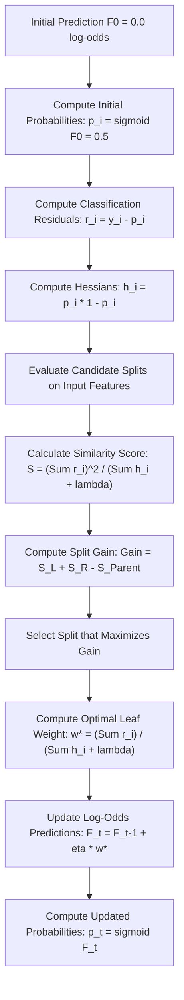

# XGBoost for Classification

[](https://colab.research.google.com/github/RiazML/machine-learning-notes/blob/main/notebooks/125_xgboost_for_classification.ipynb)

XGBoost for binary classification builds on the same sequence-of-trees logic as regression, but uses the **Log Loss** objective function. Consequently, the gradients (residuals) and hessians (which correspond to sample variances) are probability-weighted, leading to distinct Similarity Score and leaf weight equations.

---

## Architectural Flow of XGBoost Classification

For binary classification, XGBoost predicts raw log-odds (margin values) and transforms them into probabilities using the logistic sigmoid function.



---

## Mathematical Formulation

For binary classification ($y_i \in \{0, 1\}$), the Log Loss objective function is:
$$\mathcal{L} = -\sum_{i=1}^N \left[ y_i \ln p_i + (1 - y_i) \ln(1 - p_i) \right]$$

where $p_i = \sigma(\hat{y}_i) = \frac{1}{1 + e^{-\hat{y}_i}}$, and $\hat{y}_i$ is the raw log-odds prediction.

### Gradients and Hessians

To perform gradient boosting, we compute the first and second derivatives of the loss function with respect to the raw prediction $\hat{y}_i$:

- **Gradient** ($g_i$):
  $$g_i = \frac{\partial \mathcal{L}_i}{\partial \hat{y}_i} = p_i - y_i = -r_i$$
  where $r_i = y_i - p_i$ is the residual.
- **Hessian** ($h_i$):
  $$h_i = \frac{\partial^2 \mathcal{L}_i}{\partial \hat{y}_i^2} = p_i(1 - p_i)$$
  which represents the variance of the Bernoulli distribution for the sample.

### Similarity Score

Using the general formula $S = \frac{(\sum g_i)^2}{\sum h_i + \lambda}$, the Similarity Score for classification becomes:
$$S = \frac{\left( \sum_{i \in I} (y_i - p_i) \right)^2}{\sum_{i \in I} p_i(1 - p_i) + \lambda} = \frac{\left( \sum_{i \in I} r_i \right)^2}{\sum_{i \in I} p_i(1 - p_i) + \lambda}$$

### Split Gain

For any potential split dividing parent node samples into left and right sub-nodes:
$$\text{Gain} = S_L + S_R - S_{\text{Parent}}$$

### Leaf Weight Calculation

The output value (weight) $w_j^*$ assigned to leaf $j$ is calculated in log-odds space:
$$w_j^* = -\frac{\sum_{i \in I_j} g_i}{\sum_{i \in I_j} h_i + \lambda} = \frac{\sum_{i \in I_j} (y_i - p_i)}{\sum_{i \in I_j} p_i(1 - p_i) + \lambda} = \frac{\sum_{i \in I_j} r_i}{\sum_{i \in I_j} p_i(1 - p_i) + \lambda}$$

---

## Python Implementation and Parity Verification

The following code implements the custom split search and leaf weight calculator for XGBoost classification and compares its output against `xgboost.XGBClassifier`.

```python
import numpy as np
import xgboost as xgb
import json

# 1. Generate synthetic toy binary dataset
X = np.array([[6.7], [9.0], [7.5], [8.0]])
y = np.array([0, 1, 0, 1])  # Binary targets

# Initial predictions and probability calculation
base_score = 0.5
p_0 = np.full_like(y, base_score, dtype=float)

# Calculate initial residuals and Hessians
residuals = y - p_0            # [-0.5,  0.5, -0.5,  0.5]
hessians = p_0 * (1.0 - p_0)   # [0.25, 0.25, 0.25, 0.25]
reg_lambda = 1.0

# 2. Custom Similarity and Split Gain Calculations
def similarity_score(resids, hesses, lam):
    return (np.sum(resids) ** 2) / (np.sum(hesses) + lam)

S_parent = similarity_score(residuals, hessians, reg_lambda)

# Candidate split boundaries (averages of sorted unique feature values)
sorted_X = np.sort(X.flatten())
candidates = (sorted_X[:-1] + sorted_X[1:]) / 2

best_gain = -1.0
best_thresh = None
best_left_val = None
best_right_val = None

for thresh in candidates:
    left_mask = X.flatten() < thresh
    right_mask = ~left_mask

    r_L = residuals[left_mask]
    r_R = residuals[right_mask]
    h_L = hessians[left_mask]
    h_R = hessians[right_mask]

    if len(r_L) == 0 or len(r_R) == 0:
        continue

    S_L = similarity_score(r_L, h_L, reg_lambda)
    S_R = similarity_score(r_R, h_R, reg_lambda)

    gain = S_L + S_R - S_parent

    w_L = np.sum(r_L) / (np.sum(h_L) + reg_lambda)
    w_R = np.sum(r_R) / (np.sum(h_R) + reg_lambda)

    if gain > best_gain:
        best_gain = gain
        best_thresh = thresh
        best_left_val = w_L
        best_right_val = w_R

# 3. Fit XGBClassifier with matching parameters
model = xgb.XGBClassifier(
    n_estimators=1,
    max_depth=1,
    learning_rate=1.0,
    reg_lambda=reg_lambda,
    reg_alpha=0.0,
    base_score=base_score,
    min_child_weight=0.0
)
model.fit(X, y)

# Retrieve tree structure from XGBoost
dump_json = model.get_booster().get_dump(dump_format='json')
tree = json.loads(dump_json[0])

# Extract split threshold and leaf values from XGBoost JSON dump
xgb_split_feature_val = tree["split_condition"]  # 8.0 (isolates x < 8.0)
xgb_left_leaf = tree["children"][0]["leaf"]
xgb_right_leaf = tree["children"][1]["leaf"]

# 4. Verify parity using assertions
assert np.isclose(best_thresh, 7.75), f"Expected best threshold 7.75, got {best_thresh}"
assert np.isclose(best_left_val, xgb_left_leaf), f"Left leaf mismatch: {best_left_val} vs {xgb_left_leaf}"
assert np.isclose(best_right_val, xgb_right_leaf), f"Right leaf mismatch: {best_right_val} vs {xgb_right_leaf}"

print("Parity verification passed! Custom similarity scores, split search, and leaf weights match XGBoost exactly.")
```

---

## Previous and Next Days

- **Previous Day**: [Day 124: XGBoost for Regression](file:///Users/prime/Developer/ml/124_xgboost_for_regression.md)
- **Next Day**: [Day 126: The Maths Behind XGBoost](file:///Users/prime/Developer/ml/126_the_maths_behind_xgboost.md)
