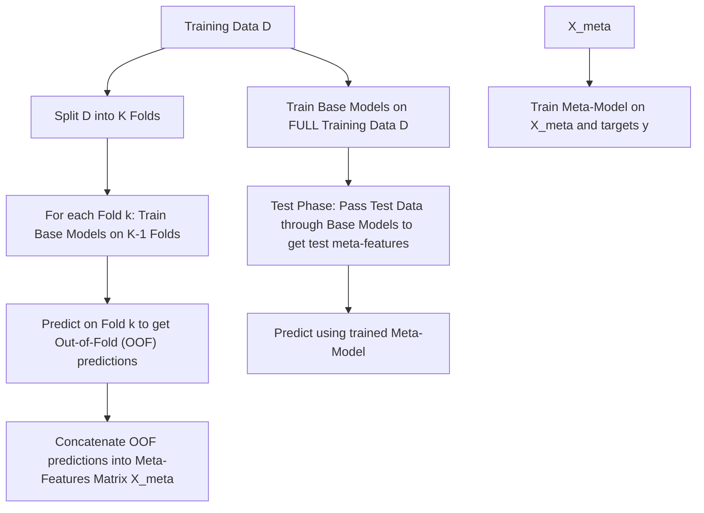
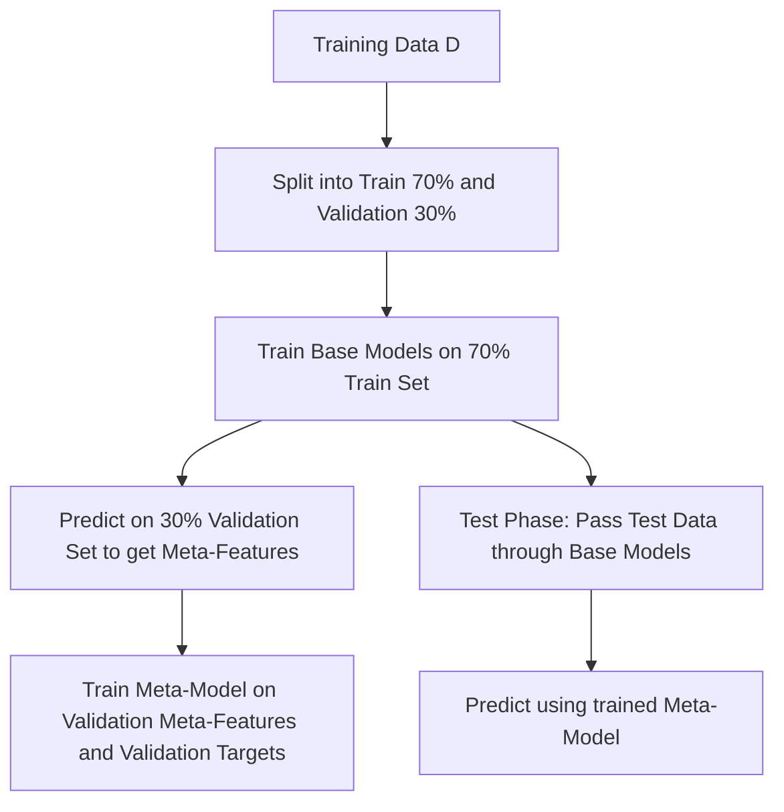

# Stacking and Blending Ensembles

[](https://colab.research.google.com/github/RiazML/machine-learning-notes/blob/main/notebooks/127_stacking_and_blending_ensembles.ipynb)

Stacking (Stacked Generalization) and Blending are advanced ensemble techniques that combine predictions from multiple base models (first-level estimators) using a meta-model (second-level estimator). Unlike Voting or Bagging, which combine models using simple averaging or voting, Stacking and Blending learn how to optimally combine the predictions of the base estimators.

---

## Architectural Comparison: Stacking vs. Blending

### 1. Stacking Flowchart

Stacking uses $k$-fold cross-validation to generate "out-of-fold" (OOF) predictions. This ensures that the meta-model is trained on predictions that were not used to train the base estimators, preventing data leakage and overfitting.



### 2. Blending Flowchart

Blending is a simplified version of Stacking that splits the training dataset into a training set and a holdout/validation set. Base models are trained on the training set, and their predictions on the validation set are used to train the meta-model.



---

## The Mathematical Necessity of Out-of-Fold Predictions

If we simply train the base models on the entire training set $D$ and make predictions on the same set $D$ to train the meta-model, we introduce severe **data leakage**. Base models (especially high-capacity ones like Decision Trees) can memorize training targets, leading to extremely optimistic predictions (e.g., zero training error). The meta-model would then learn to trust the overfitted base models completely, failing to generalize to new test data.

Using $K$-fold cross-validation ensures that the meta-features $X_{\text{meta}}$ for any sample $i$ are generated by base models that did _not_ see sample $i$ during training:

$$X_{\text{meta}}[i, m] = \hat{y}_{i}^{\text{OOF}, m} = M_m^{(-k(i))}(x_i)$$

where $M_m^{(-k(i))}$ is base model $m$ trained on all folds except the fold containing sample $i$.

---

## Python Implementation and Parity Verification

The following code implements a Stacking Classifier from scratch using Stratified $K$-fold cross-validation. It validates that the predictions on a synthetic dataset match Scikit-Learn's `StackingClassifier` exactly.

```python
import numpy as np
from sklearn.datasets import make_classification
from sklearn.ensemble import StackingClassifier
from sklearn.linear_model import LogisticRegression
from sklearn.tree import DecisionTreeClassifier
from sklearn.model_selection import StratifiedKFold
from sklearn.base import clone

# 1. Create a toy dataset
X, y = make_classification(n_samples=50, n_features=4, n_informative=2, n_classes=2, random_state=42)

# Define base estimators and the meta-estimator
base_estimators = [
    ('lr', LogisticRegression(C=1.0, random_state=42)),
    ('dt', DecisionTreeClassifier(max_depth=2, random_state=42))
]
meta_estimator = LogisticRegression(C=1.0, random_state=42)
n_splits = 3

# 2. Fit Scikit-Learn's StackingClassifier
sk_stacking = StackingClassifier(
    estimators=base_estimators,
    final_estimator=meta_estimator,
    cv=n_splits,
    stack_method='predict_proba',
    passthrough=False
)
sk_stacking.fit(X, y)
sk_predictions = sk_stacking.predict(X)

# 3. Custom Stacking Classifier Implementation from scratch
class CustomStackingClassifier:
    def __init__(self, estimators, final_estimator, n_splits=3):
        self.estimators = estimators
        self.final_estimator = final_estimator
        self.n_splits = n_splits
        self.fitted_base_estimators = []
        self.fitted_meta_estimator = None

    def fit(self, X, y):
        cv = StratifiedKFold(n_splits=self.n_splits, shuffle=False)
        n_samples = X.shape[0]
        n_estimators = len(self.estimators)

        # Meta-features matrix (using class 1 probabilities)
        X_meta = np.zeros((n_samples, n_estimators))

        # Cross-validation loop to generate OOF meta-features
        for train_idx, val_idx in cv.split(X, y):
            X_train, y_train = X[train_idx], y[train_idx]
            X_val = X[val_idx]

            for idx, (name, est) in enumerate(self.estimators):
                clf = clone(est)
                clf.fit(X_train, y_train)
                # Keep probability of positive class (class 1)
                X_meta[val_idx, idx] = clf.predict_proba(X_val)[:, 1]

        # Fit final meta-estimator
        self.fitted_meta_estimator = clone(self.final_estimator)
        self.fitted_meta_estimator.fit(X_meta, y)

        # Fit base estimators on the FULL dataset
        self.fitted_base_estimators = []
        for name, est in self.estimators:
            clf = clone(est)
            clf.fit(X, y)
            self.fitted_base_estimators.append(clf)

    def predict(self, X):
        # Generate meta-features for prediction using fully-fitted base models
        X_meta_test = np.zeros((X.shape[0], len(self.fitted_base_estimators)))
        for idx, clf in enumerate(self.fitted_base_estimators):
            X_meta_test[:, idx] = clf.predict_proba(X)[:, 1]

        return self.fitted_meta_estimator.predict(X_meta_test)

# Run custom stacking
custom_stacking = CustomStackingClassifier(
    estimators=base_estimators,
    final_estimator=meta_estimator,
    n_splits=n_splits
)
custom_stacking.fit(X, y)
custom_predictions = custom_stacking.predict(X)

# 4. Parity assertion check
assert np.array_equal(sk_predictions, custom_predictions), \
    f"Predictions mismatch!\nSk-learn: {sk_predictions}\nCustom: {custom_predictions}"

print("Parity verification passed! Custom Stacking Classifier predictions match Scikit-Learn exactly.")
```

---

## Previous and Next Days

- **Previous Day**: [Day 126: The Maths Behind XGBoost](file:///Users/prime/Developer/ml/126_the_maths_behind_xgboost.md)
- **Next Day**: [Day 128: K-Means Clustering Algorithm](file:///Users/prime/Developer/ml/128_k-means_clustering_algorithm.md)
