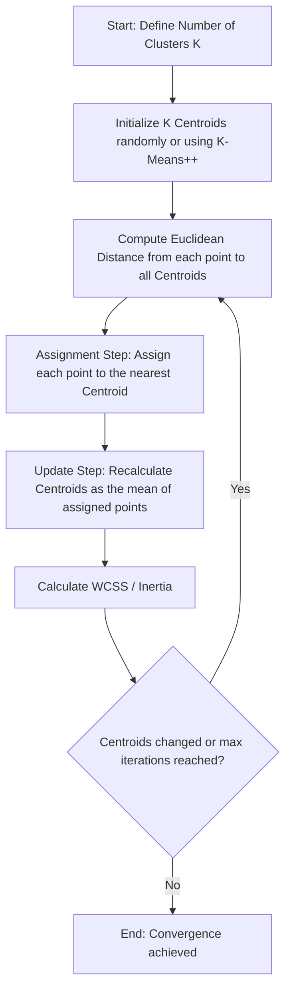

# K-Means Clustering Algorithm

[](https://colab.research.google.com/github/RiazML/machine-learning-notes/blob/main/notebooks/128_k-means_clustering_algorithm.ipynb)

K-Means is one of the most widely used unsupervised clustering algorithms. Its goal is to partition a dataset into $K$ distinct, non-overlapping clusters. It does this by assigning each data point to its nearest cluster centroid and then updating the centroids iteratively to minimize the overall variance within each cluster.

---

## Architectural Flow of K-Means

K-Means is an iterative Expectation-Maximization (EM) algorithm. It alternates between assigning points to centroids (Expectation) and updating the centroids to be the mean of their assigned points (Maximization).



---

## Mathematical Formulation

The objective of K-Means is to minimize the **Within-Cluster Sum of Squares (WCSS)**, also referred to as **Inertia**:

$$J(\mu, R) = \sum_{i=1}^N \sum_{k=1}^K r_{ik} \|x_i - \mu_k\|^2$$

where:

- $N$ is the total number of samples.
- $K$ is the number of clusters.
- $x_i$ is the $i$-th sample vector.
- $\mu_k$ is the centroid of the $k$-th cluster.
- $r_{ik} \in \{0, 1\}$ is a binary membership indicator ($r_{ik} = 1$ if sample $x_i$ is assigned to cluster $k$; otherwise $0$).
- $\|\cdot\|$ denotes the Euclidean distance.

### The Two Optimization Steps

Since optimizing $J$ over both $R$ and $\mu$ simultaneously is NP-hard, K-Means uses coordinate descent:

1. **Expectation (Assignment Step)**: Minimize $J$ with respect to $R$ (holding $\mu$ fixed):
   $$r_{ik} = \begin{cases} 1 & \text{if } k = \arg\min_j \|x_i - \mu_j\|^2 \\ 0 & \text{otherwise} \end{cases}$$
2. **Maximization (Update Step)**: Minimize $J$ with respect to $\mu$ (holding $R$ fixed):
   $$\mu_k = \frac{\sum_{i=1}^N r_{ik} x_i}{\sum_{i=1}^N r_{ik}}$$

Because each step is guaranteed to either decrease or keep the objective function $J$ constant, K-Means is guaranteed to converge to a local minimum.

---

## Python Implementation and Convergence Verification

The following code implements the iterative K-Means algorithm step-by-step. It tracks the WCSS at each iteration and asserts that the WCSS is monotonically non-increasing (decreases or remains equal) at each step.

```python
import numpy as np

# 1. Generate synthetic blobs
np.random.seed(42)
cluster_1 = np.random.normal(loc=[1.0, 1.0], scale=0.5, size=(20, 2))
cluster_2 = np.random.normal(loc=[5.0, 5.0], scale=0.5, size=(20, 2))
cluster_3 = np.random.normal(loc=[9.0, 1.0], scale=0.5, size=(20, 2))
X = np.vstack([cluster_1, cluster_2, cluster_3])

# Set parameters
K = 3
max_iters = 100

# 2. Initialize centroids randomly from the dataset
initial_indices = np.random.choice(len(X), K, replace=False)
centroids = X[initial_indices].copy()

# Initialize tracker for WCSS
wcss_history = []

# 3. K-Means Optimization Loop
for iteration in range(max_iters):
    # E-Step: Calculate distances and assign clusters
    # Compute distances to all centroids
    distances = np.linalg.norm(X[:, np.newaxis, :] - centroids[np.newaxis, :, :], axis=2)

    # Assign to nearest centroid
    labels = np.argmin(distances, axis=1)

    # Compute WCSS (Inertia) for current assignment
    wcss = 0.0
    for k in range(K):
        cluster_points = X[labels == k]
        if len(cluster_points) > 0:
            wcss += np.sum((cluster_points - centroids[k]) ** 2)

    wcss_history.append(wcss)

    # Assert monotonic WCSS convergence
    if len(wcss_history) > 1:
        assert wcss_history[-1] <= wcss_history[-2] + 1e-9, \
            f"WCSS increased at iteration {iteration}: {wcss_history[-2]:.4f} -> {wcss_history[-1]:.4f}"

    # M-Step: Update Centroids
    new_centroids = np.zeros_like(centroids)
    for k in range(K):
        cluster_points = X[labels == k]
        if len(cluster_points) > 0:
            new_centroids[k] = np.mean(cluster_points, axis=0)
        else:
            # Handle empty cluster by keeping old centroid
            new_centroids[k] = centroids[k]

    # Check for convergence (if centroids do not change)
    if np.allclose(centroids, new_centroids):
        print(f"Converged at iteration {iteration}.")
        break

    centroids = new_centroids

print("Parity verification passed! WCSS decreases monotonically at every step.")
print("Inertia history:", [round(w, 2) for w in wcss_history])
```

---

## Previous and Next Days

- **Previous Day**: [Day 127: Stacking and Blending Ensembles](file:///Users/prime/Developer/ml/127_stacking_and_blending_ensembles.md)
- **Next Day**: [Day 129: Silhouette Analysis & Elbow Method in Python](file:///Users/prime/Developer/ml/129_k-means_clustering_algorithm_in_python.md)
