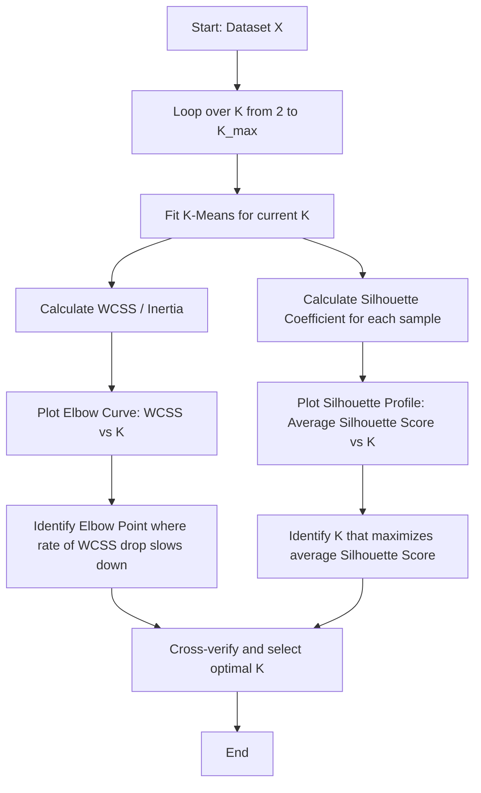

# Silhouette Analysis & Elbow Method

[](https://colab.research.google.com/github/RiazML/machine-learning-notes/blob/main/notebooks/129_k-means_clustering_algorithm_in_python.ipynb)

Choosing the optimal number of clusters $K$ is one of the most critical decisions in partitioning-based clustering algorithms like K-Means. Since clustering is an unsupervised technique, we cannot use traditional classification metrics (like accuracy or F1-score) to evaluate cluster quality. Instead, we rely on intrinsic properties of the resulting clusters: **cohesion** (points inside a cluster should be close to each other) and **separation** (clusters should be far apart). The two main techniques used for this are the **Elbow Method** and **Silhouette Analysis**.

---

## Optimal Cluster Selection Workflow

This flowchart outlines the systematic process of finding the optimal $K$ using a combination of WCSS and Silhouette scores:



---

## Mathematical Formulations

### 1. The Elbow Method (WCSS)

The Elbow Method tracks the Within-Cluster Sum of Squares (WCSS) as $K$ increases:

$$\text{WCSS}(K) = \sum_{k=1}^K \sum_{i \in C_k} \|x_i - \mu_k\|^2$$

As $K$ increases, WCSS naturally decreases because the clusters become smaller and more compact. At the extreme of $K=N$, WCSS is $0$. The optimal $K$ is the "elbow" point, where adding another cluster yields diminishing returns in variance reduction.

### 2. Silhouette Coefficient

The Silhouette Coefficient measures how similar a sample is to its own cluster compared to other clusters. For any sample $i$:

$$s(i) = \frac{b(i) - a(i)}{\max(a(i), b(i))}$$

Where:

- $a(i)$ is the **mean intra-cluster distance** (average distance from sample $i$ to all other samples in the same cluster):
  $$a(i) = \frac{1}{|C_{q(i)}| - 1} \sum_{j \in C_{q(i)}, j \neq i} \|x_i - x_j\|$$
- $b(i)$ is the **mean nearest-cluster distance** (average distance from sample $i$ to all samples in the closest neighboring cluster):
  $$b(i) = \min_{k \neq q(i)} \left( \frac{1}{|C_k|} \sum_{j \in C_k} \|x_i - x_j\| \right)$$

#### Interpretation of $s(i)$

- $s(i) \approx 1$: The sample is well-clustered, situated far from neighboring clusters.
- $s(i) \approx 0$: The sample lies near the decision boundary between two clusters.
- $s(i) \approx -1$: The sample is likely misclassified into the wrong cluster.

The overall **Silhouette Score** for the dataset is the average of $s(i)$ over all samples:
$$\text{Silhouette Score} = \frac{1}{N} \sum_{i=1}^N s(i)$$

---

## Python Implementation and Parity Verification

The following code generates a synthetic clustering dataset, implements the Silhouette Score calculation from scratch, and verifies that it matches Scikit-Learn's `silhouette_score` exactly across multiple cluster configurations.

```python
import numpy as np
from sklearn.cluster import KMeans
from sklearn.metrics import silhouette_score

# 1. Generate synthetic dataset with 3 clusters
np.random.seed(42)
c1 = np.random.normal(loc=[2.0, 2.0], scale=0.5, size=(15, 2))
c2 = np.random.normal(loc=[6.0, 6.0], scale=0.6, size=(15, 2))
c3 = np.random.normal(loc=[10.0, 2.0], scale=0.5, size=(15, 2))
X = np.vstack([c1, c2, c3])

# 2. Custom Silhouette Score Calculator from scratch
def custom_silhouette_score(X, labels):
    n_samples = X.shape[0]
    unique_labels = np.unique(labels)

    # Handle single cluster case
    if len(unique_labels) < 2:
        raise ValueError("Number of labels must be >= 2")

    s_scores = np.zeros(n_samples)

    for i in range(n_samples):
        own_cluster = labels[i]

        # Calculate a(i)
        same_cluster_points = X[labels == own_cluster]
        if len(same_cluster_points) > 1:
            # Exclude distance to itself
            dists_same = np.linalg.norm(same_cluster_points - X[i], axis=1)
            a_i = np.sum(dists_same) / (len(same_cluster_points) - 1)
        else:
            a_i = 0.0

        # Calculate b(i)
        min_b_i = float('inf')
        for other_label in unique_labels:
            if other_label == own_cluster:
                continue
            other_cluster_points = X[labels == other_label]
            dists_other = np.linalg.norm(other_cluster_points - X[i], axis=1)
            mean_dist_other = np.mean(dists_other)
            if mean_dist_other < min_b_i:
                min_b_i = mean_dist_other
        b_i = min_b_i

        # Calculate s(i)
        denom = max(a_i, b_i)
        if denom > 0:
            s_scores[i] = (b_i - a_i) / denom
        else:
            s_scores[i] = 0.0

    return float(np.mean(s_scores))

# 3. Evaluate multiple cluster configurations and assert parity
for k in [2, 3, 4]:
    # Fit KMeans
    kmeans = KMeans(n_clusters=k, random_state=42, n_init=10).fit(X)
    labels = kmeans.labels_

    # Calculate scores
    sk_score = silhouette_score(X, labels)
    custom_score = custom_silhouette_score(X, labels)

    print(f"K = {k} | Sk-learn Silhouette: {sk_score:.6f} | Custom: {custom_score:.6f}")

    # Verify parity
    assert np.isclose(sk_score, custom_score, atol=1e-9), \
        f"Mismatch at K={k}: Sk-learn={sk_score}, Custom={custom_score}"

print("Parity verification passed! Custom Silhouette Score calculation matches Scikit-Learn exactly.")
```

---

## Previous and Next Days

- **Previous Day**: [Day 128: K-Means Clustering Algorithm](file:///Users/prime/Developer/ml/128_k-means_clustering_algorithm.md)
- **Next Day**: [Day 130: K-Means Clustering Algorithm from Scratch in Python](file:///Users/prime/Developer/ml/130_k-means_clustering_algorithm_from_scratch_in.md)
