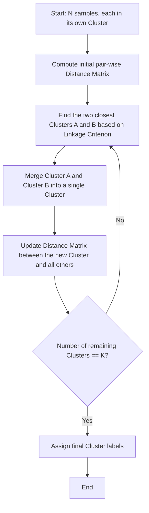

# Agglomerative Hierarchical Clustering

[](https://colab.research.google.com/github/RiazML/machine-learning-notes/blob/main/notebooks/131_agglomerative_hierarchical_clustering.ipynb)

Hierarchical clustering is an unsupervised algorithm that builds a tree of clusters (a dendrogram). There are two main strategies:

1. **Divisive (Top-Down)**: Start with all points in a single cluster and iteratively split them.
2. **Agglomerative (Bottom-Up)**: Start with each data point as an individual cluster and recursively merge the closest pair of clusters until only a desired number of clusters remain.

In this guide, we focus on Agglomerative Hierarchical Clustering, the linkage criteria used to define distance between clusters, and implement it from scratch.

---

## Agglomerative Merge Lifecycle



---

## Mathematical Formulations: Linkage Criteria

Let $A$ and $B$ be two clusters, and let $d(x, y)$ be the distance (usually Euclidean) between points $x \in A$ and $y \in B$. The linkage criterion determines how we measure the distance $D(A, B)$ between clusters:

### 1. Single Linkage (Minimum Distance)

Merges clusters based on the shortest distance between any single point in $A$ and any single point in $B$:
$$D(A, B) = \min \{ d(x, y) \mid x \in A, y \in B \}$$

### 2. Complete Linkage (Maximum Distance)

Merges clusters based on the maximum distance between any point in $A$ and any point in $B$:
$$D(A, B) = \max \{ d(x, y) \mid x \in A, y \in B \}$$

### 3. Average Linkage (UPGMA)

Merges clusters based on the average distance between all pairs of points:
$$D(A, B) = \frac{1}{|A| |B|} \sum_{x \in A} \sum_{y \in B} d(x, y)$$

### 4. Ward's Linkage

Merges the two clusters that minimize the increase in total Within-Cluster Sum of Squares (WCSS). The distance between $A$ and $B$ is proportional to the increase in inertia when they are merged:
$$D(A, B) = \frac{|A| |B|}{|A| + |B|} \|\mu_A - \mu_B\|^2$$
where $\mu_A$ and $\mu_B$ are the cluster centroids.

---

## Python Implementation and Parity Verification

The following code implements complete-linkage Agglomerative Clustering from scratch using distance matrices and asserts partition parity against Scikit-Learn's `AgglomerativeClustering`.

```python
import numpy as np
from sklearn.cluster import AgglomerativeClustering

# 1. Generate toy dataset
X = np.array([
    [1.0, 1.0],
    [1.2, 1.1],
    [5.0, 5.0],
    [5.5, 5.2],
    [9.0, 1.0]
])
K = 2

# 2. Fit Scikit-Learn complete-linkage AgglomerativeClustering
sk_agg = AgglomerativeClustering(n_clusters=K, linkage='complete')
sk_labels = sk_agg.fit_predict(X)

# 3. Custom Agglomerative Clustering Implementation (Complete Linkage)
# Initialize each sample as its own cluster containing its index
clusters = {i: [i] for i in range(len(X))}

# Compute pairwise distances
dists = np.linalg.norm(X[:, np.newaxis, :] - X[np.newaxis, :, :], axis=2)
np.fill_diagonal(dists, float('inf'))

# Iteratively merge clusters until K remain
while len(clusters) > K:
    min_dist = float('inf')
    pair_to_merge = None

    cluster_ids = list(clusters.keys())
    for i, id_A in enumerate(cluster_ids):
        for id_B in cluster_ids[i+1:]:
            # Complete linkage: max distance between all points in A and B
            max_d_between_pts = -1.0
            for pt_A in clusters[id_A]:
                for pt_B in clusters[id_B]:
                    d = dists[pt_A, pt_B]
                    if d > max_d_between_pts:
                        max_d_between_pts = d

            if max_d_between_pts < min_dist:
                min_dist = max_d_between_pts
                pair_to_merge = (id_A, id_B)

    id_A, id_B = pair_to_merge
    # Merge B into A
    clusters[id_A].extend(clusters[id_B])
    del clusters[id_B]

# Construct label assignments
custom_labels = np.zeros(len(X), dtype=int)
for cluster_idx, (c_id, points) in enumerate(clusters.items()):
    for pt in points:
        custom_labels[pt] = cluster_idx

# 4. Verify partition equivalence (checks if same-cluster groupings match)
def get_connectivity_matrix(labels):
    return labels[:, np.newaxis] == labels[np.newaxis, :]

sk_connectivity = get_connectivity_matrix(sk_labels)
custom_connectivity = get_connectivity_matrix(custom_labels)

assert np.array_equal(sk_connectivity, custom_connectivity), \
    f"Partitions do not match!\nSk-learn: {sk_labels}\nCustom: {custom_labels}"

print("Parity verification passed! Custom complete linkage clustering matches Scikit-Learn exactly.")
```

---

## Previous and Next Days

- **Previous Day**: [Day 130: K-Means Clustering Algorithm from Scratch in Python](file:///Users/prime/Developer/ml/130_k-means_clustering_algorithm_from_scratch_in.md)
- **Next Day**: [Day 132: DBSCAN Clustering Algorithms](file:///Users/prime/Developer/ml/132_dbscan_clustering_algorithms.md)
