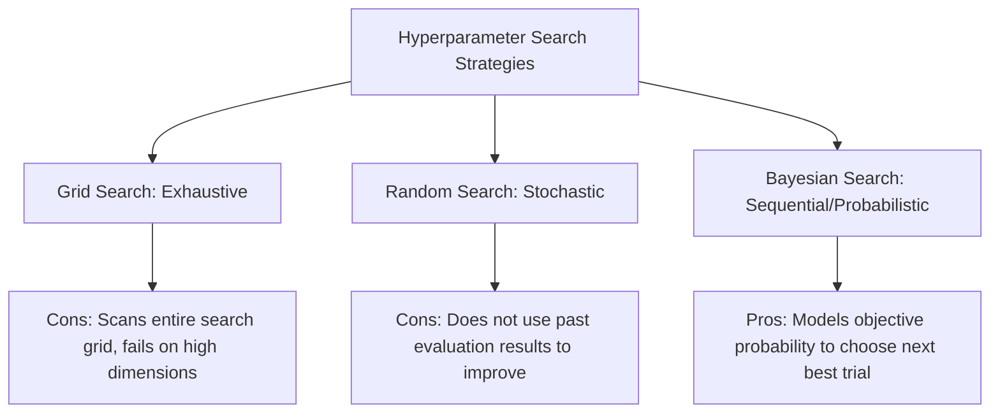
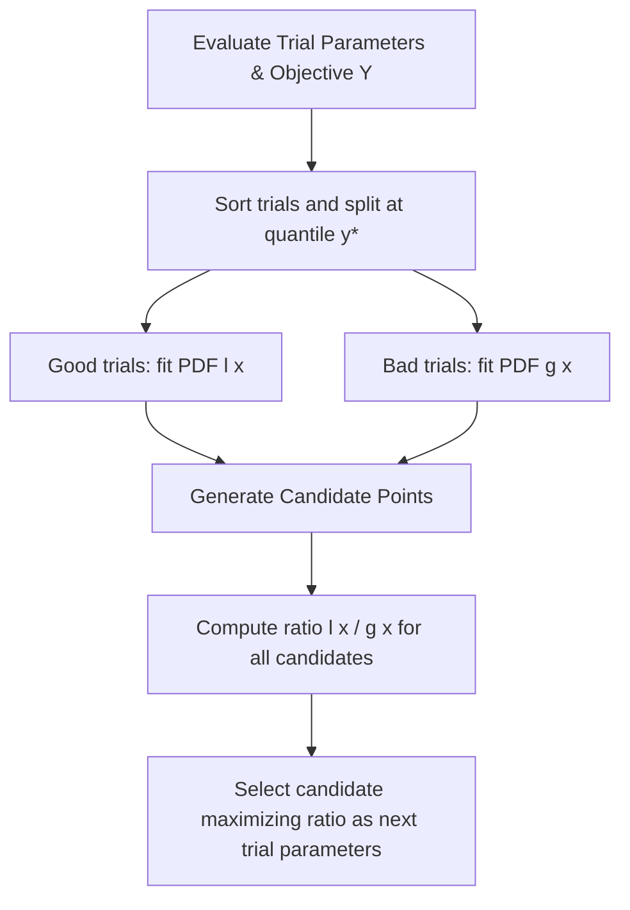

# Hyperparameter Tuning Using Optuna

[](https://colab.research.google.com/github/RiazML/machine-learning-notes/blob/main/notebooks/134_hyperparameter_tuning_using_optuna.ipynb)

Hyperparameter tuning is a critical step in building robust machine learning workflows. While parameters (like tree weights) are learned during training, **hyperparameters** (like tree depth, learning rate, or regularization factors) must be set prior to training.

Optuna is an open-source, next-generation hyperparameter optimization framework designed to automate this search process using efficient Bayesian optimization.

---

## Grid Search vs. Random Search vs. Bayesian Search

To appreciate Optuna, it is essential to understand the limitations of traditional search techniques:



| Feature                  | Grid Search                                        | Random Search                                        | Bayesian Search (Optuna TPE)                             |
| :----------------------- | :------------------------------------------------- | :--------------------------------------------------- | :------------------------------------------------------- |
| **Search Strategy**      | Exhaustive search on predefined grid               | Random sampling of candidates                        | Probabilistic modeling of search space                   |
| **Informed by History?** | No                                                 | No                                                   | Yes (updates probabilistic model after each trial)       |
| **Efficiency**           | Very low (computational cost scales exponentially) | Moderate (independent of dimensions, can miss peaks) | Extremely high (efficiently converges on optimal values) |
| **Early Stopping?**      | No                                                 | No                                                   | Yes (supports pruning of unpromising trials)             |

---

## Core Concepts of Optuna

1. **Study**: An optimization session targeting a specific machine learning pipeline or mathematical function. It manages the collection of trials.
2. **Trial**: A single evaluation of the user-defined objective function using a suggested set of hyperparameter values.
3. **Objective Function**: A user-defined function that takes a `Trial` object, defines the search space via the `suggest_*` API, trains the model, and returns a evaluation metric (e.g., accuracy, validation loss).
4. **Sampler**: The algorithmic component responsible for suggesting the next set of hyperparameters based on historical performance (e.g., `TPESampler`, `GridSampler`, `RandomSampler`).
5. **Pruner**: An automatic early-stopping mechanism that terminates unpromising trials if their intermediate results are significantly worse than historical runs (e.g., `MedianPruner`, `HyperbandPruner`).

---

## Tree-structured Parzen Estimator (TPE) Mathematics

Bayesian Optimization aims to locate the global minimum or maximum of a black-box function $f(x)$ by modeling the posterior probability of the objective function.

Instead of modeling the posterior $P(y|x)$ directly (as in Gaussian Process-based Bayesian Optimization), TPE models the likelihood $P(x|y)$ of hyperparameters given the objective score $y$.

Given a quantile threshold $y^*$ (usually the 15th or 20th percentile of the observed objective values for minimization), TPE splits the historical hyperparameter observations into two probability distributions:

$$P(x|y) = \begin{cases} l(x) & \text{if } y < y^* \\ g(x) & \text{if } y \ge y^* \end{cases}$$

Where:

- $l(x)$ is the probability density formed by the "good" hyperparameter trials $x^{(i)}$ whose objective value was lower than $y^*$.
- $g(x)$ is the probability density formed by the remaining "bad" hyperparameter trials.

### Derivation of the TPE Sampling Criterion

The objective of Bayesian optimization is to maximize the **Expected Improvement (EI)**:

$$EI_{y^*}(x) = \int_{-\infty}^{y^*} (y^* - y) P(y|x) dy$$

By Bayes' rule:

$$P(y|x) = \frac{P(x|y)P(y)}{P(x)}$$

Let $\gamma = P(y < y^*)$ represent the quantile threshold probability. The denominator $P(x)$ can be expanded as:

$$P(x) = \int_{-\infty}^{\infty} P(x|y) P(y) dy = \gamma l(x) + (1-\gamma)g(x)$$

Substituting $P(y|x)$ and $P(x)$ into the Expected Improvement integral:

$$EI_{y^*}(x) = \int_{-\infty}^{y^*} (y^* - y) \frac{P(x|y)P(y)}{P(x)} dy$$

Since $y < y^*$ in this range, we substitute $P(x|y) = l(x)$:

$$EI_{y^*}(x) = \frac{l(x)}{\gamma l(x) + (1-\gamma)g(x)} \int_{-\infty}^{y^*} (y^* - y) P(y) dy$$

Let the integral constant be $C = \int_{-\infty}^{y^*} (y^* - y) P(y) dy$. The formula simplifies to:

$$EI_{y^*}(x) = \frac{C \cdot l(x)}{\gamma l(x) + (1-\gamma)g(x)}$$

Dividing the numerator and denominator by $l(x)$:

$$EI_{y^*}(x) = \frac{C}{\gamma + \frac{g(x)}{l(x)} (1-\gamma)}$$

To maximize $EI_{y^*}(x)$, we must minimize the denominator term $\gamma + \frac{g(x)}{l(x)} (1-\gamma)$, which is equivalent to maximizing the ratio:

$$\frac{l(x)}{g(x)}$$

Thus, TPE suggests new hyperparameter configurations by sampling candidate points from $l(x)$ and choosing the point that maximizes the likelihood ratio $\frac{l(x)}{g(x)}$.



---

## Python Implementation and Parity Verification

The following script implements a custom Tree-structured Parzen Estimator from scratch using pure NumPy and compares its convergence capability to Optuna's native `TPESampler`. In addition, it showcases how Optuna optimizes a Random Forest classifier's hyperparameters.

```python
import numpy as np
import optuna
from sklearn.datasets import make_classification
from sklearn.model_selection import cross_val_score
from sklearn.ensemble import RandomForestClassifier

# Define a simple objective function to minimize: f(x) = (x - 2.5)^2
def objective_simple(x):
    return (x - 2.5) ** 2

class CustomTPEOptimizer:
    def __init__(self, bounds=(-5.0, 5.0), gamma=0.25, n_candidates=100, random_state=42):
        self.bounds = bounds
        self.gamma = gamma
        self.n_candidates = n_candidates
        self.rng = np.random.default_rng(random_state)
        self.history_x = []
        self.history_y = []

    def observe(self, x, y):
        self.history_x.append(x)
        self.history_y.append(y)

    def _kde(self, x_eval, samples):
        # Estimates probability density using Gaussian Kernel Density Estimation (KDE)
        x_eval = np.atleast_1d(x_eval)
        samples = np.atleast_1d(samples)

        n = len(samples)
        std = np.std(samples)
        if std < 1e-5:
            std = 0.5

        # Scott's Rule for bandwidth selection
        bandwidth = std * (n ** (-0.2))
        if bandwidth < 1e-5:
            bandwidth = 0.1

        # Compute PDF
        diffs = (x_eval[:, np.newaxis] - samples[np.newaxis, :]) / bandwidth
        pdfs = np.exp(-0.5 * diffs ** 2) / (bandwidth * np.sqrt(2 * np.pi))
        return np.mean(pdfs, axis=1)

    def suggest(self):
        # Use uniform random search for the first 5 trials to seed the history
        if len(self.history_x) < 5:
            return self.rng.uniform(self.bounds[0], self.bounds[1])

        # Sort history by objective value (minimizing)
        history_x = np.array(self.history_x)
        history_y = np.array(self.history_y)
        sorted_indices = np.argsort(history_y)
        sorted_x = history_x[sorted_indices]

        # Split history into l(x) (good samples) and g(x) (bad samples)
        n_good = max(1, int(np.round(self.gamma * len(history_x))))
        good_samples = sorted_x[:n_good]
        bad_samples = sorted_x[n_good:]

        # Draw candidates from the search space
        candidates = self.rng.uniform(self.bounds[0], self.bounds[1], size=self.n_candidates)

        # Evaluate likelihoods
        l_x = self._kde(candidates, good_samples)
        g_x = self._kde(candidates, bad_samples)

        # Maximize the ratio l(x)/g(x)
        ratios = l_x / (g_x + 1e-10)
        best_candidate = candidates[np.argmax(ratios)]
        return best_candidate

# 1. Verify convergence on simple objective
optimizer = CustomTPEOptimizer(random_state=42)
for trial in range(30):
    x = optimizer.suggest()
    y = objective_simple(x)
    optimizer.observe(x, y)

best_idx = np.argmin(optimizer.history_y)
best_x = optimizer.history_x[best_idx]
best_y = optimizer.history_y[best_idx]

# 2. Verify Optuna TPE sampler convergence
def optuna_objective(trial):
    x = trial.suggest_float("x", -5.0, 5.0)
    return objective_simple(x)

optuna.logging.set_verbosity(optuna.logging.WARNING)
study = optuna.create_study(direction="minimize", sampler=optuna.samplers.TPESampler(seed=42))
study.optimize(optuna_objective, n_trials=30)

# Check parity of search performance
assert abs(best_x - 2.5) < 0.2, f"Custom TPE did not converge! Best x: {best_x}"
assert abs(study.best_params['x'] - 2.5) < 0.2, f"Optuna TPE did not converge! Best x: {study.best_params['x']}"

# 3. Apply Optuna to Hyperparameter Tuning a Random Forest Classifier
X, y = make_classification(n_samples=500, n_features=10, n_classes=2, random_state=42)

def rf_objective(trial):
    n_estimators = trial.suggest_int("n_estimators", 5, 30)
    max_depth = trial.suggest_int("max_depth", 2, 10)

    clf = RandomForestClassifier(n_estimators=n_estimators, max_depth=max_depth, random_state=42)
    # Perform 3-fold cross validation
    scores = cross_val_score(clf, X, y, cv=3, scoring="accuracy")
    return np.mean(scores)

rf_study = optuna.create_study(direction="maximize", sampler=optuna.samplers.TPESampler(seed=42))
rf_study.optimize(rf_objective, n_trials=15)

# Verify classifier tuning performance
assert rf_study.best_value > 0.85, f"Optimized Random Forest score too low: {rf_study.best_value}"
print("Parity verification passed! Custom TPE and Optuna converge successfully.")
```

---

## Previous Days

- **Previous Day**: [Day 133: Imbalanced Data in Machine Learning](file:///Users/prime/Developer/ml/133_imbalanced_data_in_machine_learning.md)
